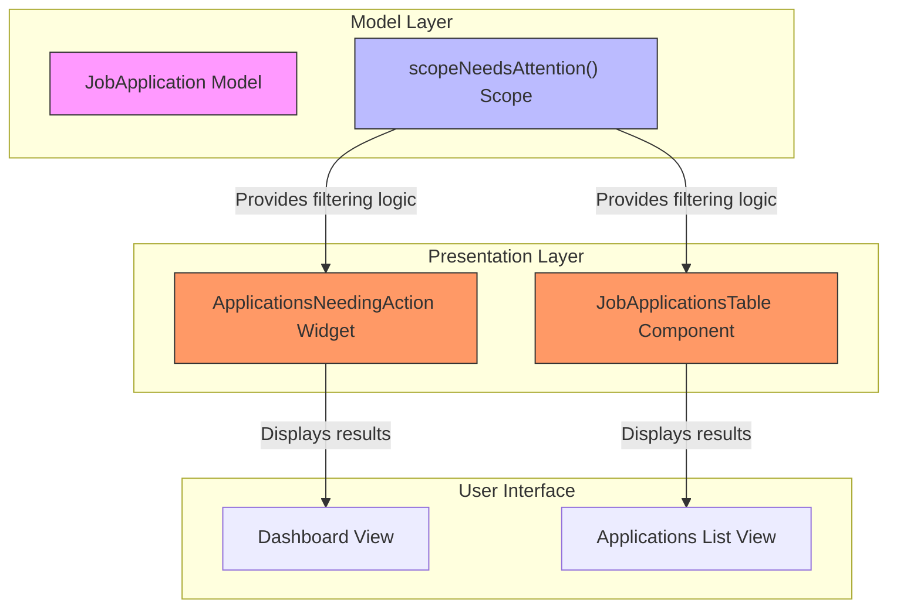
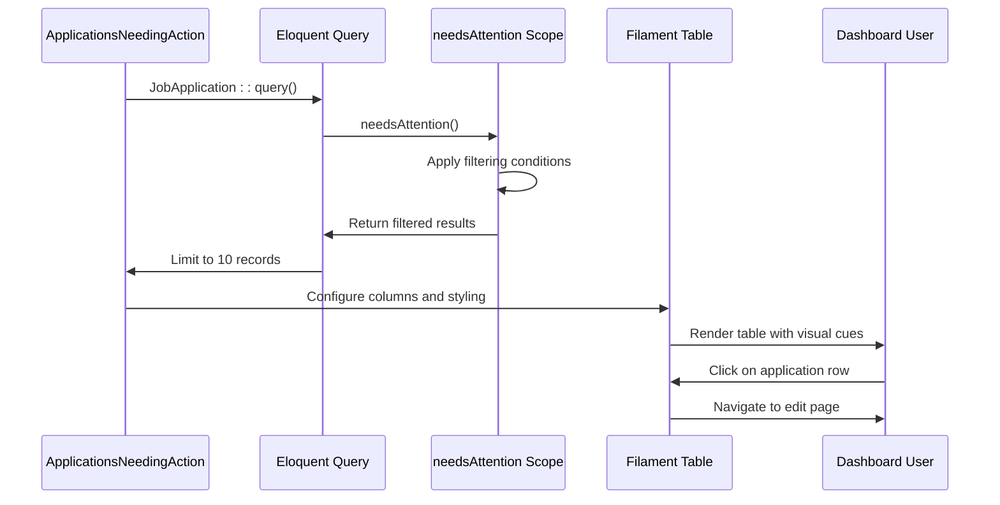

# Needs Attention Filtering

<cite>
**Referenced Files in This Document**  
- [JobApplication.php](file://app/Models/JobApplication.php)
- [ApplicationsNeedingAction.php](file://app/Filament/Widgets/ApplicationsNeedingAction.php)
- [JobApplicationsTable.php](file://app/Filament/Resources/JobApplications/Tables/JobApplicationsTable.php)
- [NeedsAttentionFilterTest.php](file://tests/Feature/NeedsAttentionFilterTest.php)
</cite>

## Table of Contents
1. [Introduction](#introduction)
2. [Core Components](#core-components)
3. [Architecture Overview](#architecture-overview)
4. [Detailed Component Analysis](#detailed-component-analysis)
5. [Filtering Logic and SQL Implementation](#filtering-logic-and-sql-implementation)
6. [Integration and Usage](#integration-and-usage)
7. [Testing and Validation](#testing-and-validation)
8. [Customization and Configuration](#customization-and-configuration)
9. [Conclusion](#conclusion)

## Introduction

The intelligent prioritization system in the CV Builder application centers around the "Needs Attention" filtering mechanism, designed to help users efficiently manage their job search activities. This system identifies job applications that require immediate user action by evaluating specific criteria related to application status, deadlines, and follow-up requirements. By surfacing time-sensitive tasks, the system enables users to maintain momentum in their job search and avoid missing critical opportunities. The implementation spans multiple components including model scopes, dashboard widgets, and table filters, creating a cohesive experience across the application.

## Core Components

The intelligent prioritization system comprises three primary components that work together to identify and display applications requiring user attention. The `JobApplication` model defines the core logic through its `scopeNeedsAttention` method, which encapsulates the business rules for determining when an application needs attention. The `ApplicationsNeedingAction` widget leverages this scope to display a prioritized list of applications on the dashboard, providing visual cues for urgency. Finally, the `JobApplicationsTable` component integrates the same filtering logic into the main job applications listing, allowing users to filter their entire application portfolio by attention status. These components work in concert to create a consistent user experience across different views of the application data.

**Section sources**
- [JobApplication.php](file://app/Models/JobApplication.php#L100-L115)
- [ApplicationsNeedingAction.php](file://app/Filament/Widgets/ApplicationsNeedingAction.php#L1-L49)
- [JobApplicationsTable.php](file://app/Filament/Resources/JobApplications/Tables/JobApplicationsTable.php#L1-L104)

## Architecture Overview

The intelligent prioritization system follows a layered architecture where business logic is encapsulated in the model layer and consumed by presentation components. The `JobApplication` model serves as the central authority for determining which applications need attention, implementing this logic as a reusable query scope. This scope is then consumed by both the dashboard widget and the main application table, ensuring consistency across different views. The architecture promotes separation of concerns by keeping the filtering logic in the model where it belongs, while allowing presentation components to focus on how the data is displayed. This design enables the same filtering criteria to be applied consistently whether viewing a summary on the dashboard or browsing the full list of applications.



**Diagram sources**
- [JobApplication.php](file://app/Models/JobApplication.php#L100-L115)
- [ApplicationsNeedingAction.php](file://app/Filament/Widgets/ApplicationsNeedingAction.php#L1-L49)
- [JobApplicationsTable.php](file://app/Filament/Resources/JobApplications/Tables/JobApplicationsTable.php#L1-L104)

## Detailed Component Analysis

### JobApplication Model Analysis

The `JobApplication` model implements the core business logic for determining which applications need attention through its `scopeNeedsAttention` method. This query scope evaluates three primary conditions that indicate an application requires user action: applications with a next action date that is today or in the past, applications with a send status of 'draft', and applications in 'pending' or 'interviewing' status that lack a specified next action date. The scope combines these conditions using nested where clauses to create a comprehensive filter that captures all applications requiring follow-up. Importantly, the scope also excludes applications with 'rejected' or 'withdrawn' statuses, ensuring that closed applications do not appear in attention-needed lists regardless of their dates or statuses.

```mermaid
flowchart TD
Start([Check Needs Attention]) --> Condition1{next_action_date <= today?}
Start --> Condition2{send_status = 'draft'?}
Start --> Condition3{status IN [pending, interviewing] AND next_action_date IS NULL?}
Condition1 --> |Yes| Include[Include Application]
Condition2 --> |Yes| Include
Condition3 --> |Yes| Include
Include --> Exclusion{status IN [rejected, withdrawn]?}
Exclusion --> |Yes| Exclude[Exclude Application]
Exclusion --> |No| Include
Include --> Output[Application Needs Attention]
Exclude --> Output[Application Does Not Need Attention]
```

**Diagram sources**
- [JobApplication.php](file://app/Models/JobApplication.php#L100-L115)

**Section sources**
- [JobApplication.php](file://app/Models/JobApplication.php#L100-L115)

### ApplicationsNeedingAction Widget Analysis

The `ApplicationsNeedingAction` widget provides a dashboard view of applications that require user attention, leveraging the `scopeNeedsAttention` method from the `JobApplication` model. The widget displays a table with key information including company name, job title, application status, and next action date. It applies visual prioritization by coloring the next action date in red (danger color) when the date is past due, accompanied by an "OVERDUE" description. The widget is configured to show a maximum of 10 records and spans the full width of the dashboard for prominence. When no applications need attention, it displays a positive empty state with a check-circle icon and encouraging message, reinforcing good application management habits. The widget provides direct navigation to the application edit page, enabling quick action from the dashboard.



**Diagram sources**
- [ApplicationsNeedingAction.php](file://app/Filament/Widgets/ApplicationsNeedingAction.php#L1-L49)

**Section sources**
- [ApplicationsNeedingAction.php](file://app/Filament/Widgets/ApplicationsNeedingAction.php#L1-L49)

### JobApplicationsTable Integration Analysis

The `JobApplicationsTable` component integrates the needs attention filtering logic into the main job applications listing, providing users with the ability to filter their entire application portfolio. This integration is implemented as a ternary filter that allows users to show applications that need attention, applications that do not need attention, or all applications. The filter uses the same `needsAttention` scope from the `JobApplication` model to ensure consistency with the dashboard widget. For applications that do not need attention, the filter uses a subquery to exclude IDs from the needs attention result set. The table also provides visual cues for urgency, coloring next action dates in red when they are past due. This integration allows users to switch between a comprehensive view of all applications and a focused view of only those requiring immediate action.

**Section sources**
- [JobApplicationsTable.php](file://app/Filament/Resources/JobApplications/Tables/JobApplicationsTable.php#L1-L104)

## Filtering Logic and SQL Implementation

The needs attention filtering logic is implemented as a complex SQL query generated through Laravel's Eloquent query builder. The query combines three primary conditions using nested where clauses: applications with a next action date less than or equal to the current date, applications with a send status of 'draft', and applications in 'pending' or 'interviewing' status that have no next action date specified. These conditions are combined with an exclusion clause that filters out applications with 'rejected' or 'withdrawn' statuses, ensuring that closed applications are not included in the results. The SQL implementation uses parameterized queries to prevent injection vulnerabilities and leverages database indexes on the status, send_status, and next_action_date columns for optimal performance. The query is designed to be reusable across different components through the Eloquent scope pattern, ensuring consistent behavior whether accessed from the dashboard widget or the main application table.

**Section sources**
- [JobApplication.php](file://app/Models/JobApplication.php#L100-L115)
- [JobApplicationsTable.php](file://app/Filament/Resources/JobApplications/Tables/JobApplicationsTable.php#L1-L104)

## Integration and Usage

The needs attention system is integrated throughout the application to provide a cohesive user experience. On the dashboard, the `ApplicationsNeedingAction` widget surfaces the most time-sensitive applications, allowing users to quickly identify and address pending tasks upon login. In the main applications list, the ternary filter enables users to toggle between views of all applications, only those needing attention, or only those not requiring immediate action. This dual integration creates a comprehensive system for managing job search activities, with the dashboard providing a high-priority summary and the main list offering detailed filtering capabilities. The system helps users manage their job search efficiently by automatically surfacing applications with overdue follow-ups, draft applications ready to send, and active applications without scheduled next steps. This intelligent prioritization reduces the cognitive load on users and helps prevent important tasks from being overlooked.

**Section sources**
- [ApplicationsNeedingAction.php](file://app/Filament/Widgets/ApplicationsNeedingAction.php#L1-L49)
- [JobApplicationsTable.php](file://app/Filament/Resources/JobApplications/Tables/JobApplicationsTable.php#L1-L104)

## Testing and Validation

The needs attention filtering logic is thoroughly tested to ensure reliability and correctness across various scenarios. The test suite includes specific test cases for each of the three primary conditions that trigger the needs attention status: applications with overdue next action dates, applications with draft send status, and applications in pending or interviewing status without a next action date. Additional tests verify that applications with 'rejected' or 'withdrawn' statuses are properly excluded from the results, even if they meet other criteria for needing attention. The tests use realistic data scenarios, including applications with yesterday's date (overdue), tomorrow's date (not yet due), and null dates (no scheduled action). This comprehensive test coverage ensures that the filtering logic behaves as expected in production and provides confidence that users will be accurately notified of applications requiring their attention.

**Section sources**
- [NeedsAttentionFilterTest.php](file://tests/Feature/NeedsAttentionFilterTest.php#L0-L78)

## Customization and Configuration

While the current implementation provides a robust default configuration for the needs attention system, several customization opportunities exist for future enhancement. The filtering criteria could be made configurable through user preferences, allowing individuals to adjust what constitutes "needs attention" based on their personal workflow. For example, users might want to exclude certain application statuses from consideration or modify the threshold for what constitutes an overdue date. The visual presentation could also be customized, with options to change the color scheme for overdue dates or adjust the number of applications displayed in the dashboard widget. Additionally, the system could be extended to include notification mechanisms, such as email alerts or mobile push notifications, for applications that have been needing attention for an extended period. These customizations would make the system more adaptable to individual user needs while maintaining its core functionality.

## Conclusion

The intelligent prioritization system implemented through the needs attention filtering mechanism provides significant value to users managing their job search activities. By automatically identifying applications requiring user action based on multiple criteria, the system reduces the cognitive load of tracking follow-ups and deadlines. The consistent implementation across the dashboard widget and main application table ensures a cohesive user experience, while the well-tested filtering logic provides reliability. The architecture's separation of concerns, with business logic encapsulated in the model layer, enables reuse and maintainability. This system effectively helps users stay on top of their job applications by surfacing time-sensitive tasks, ultimately supporting a more organized and successful job search process.