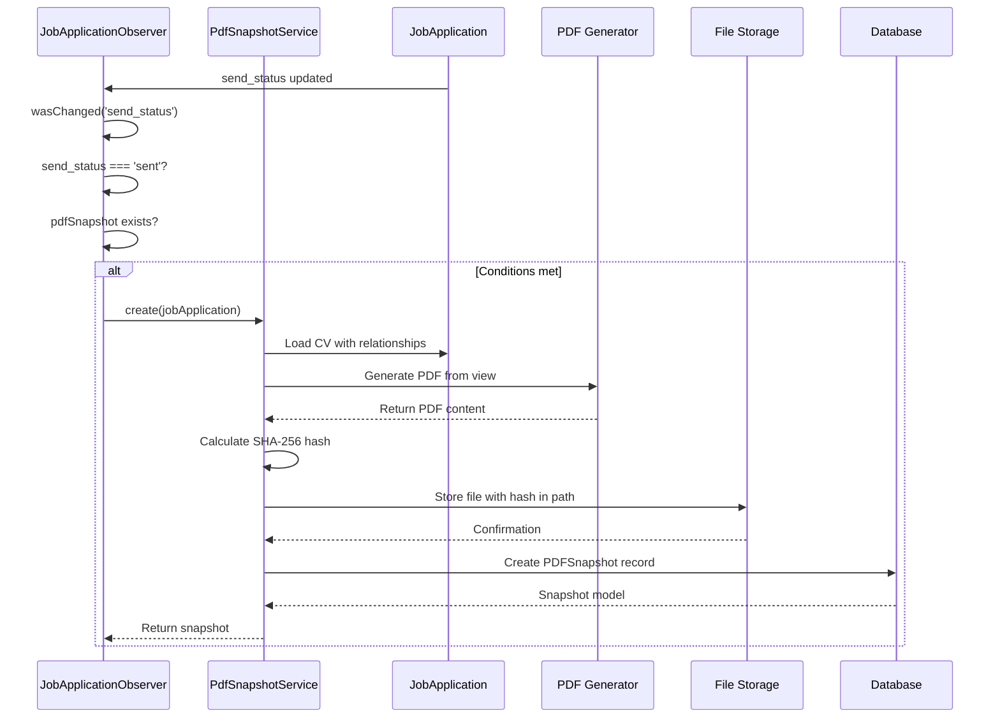
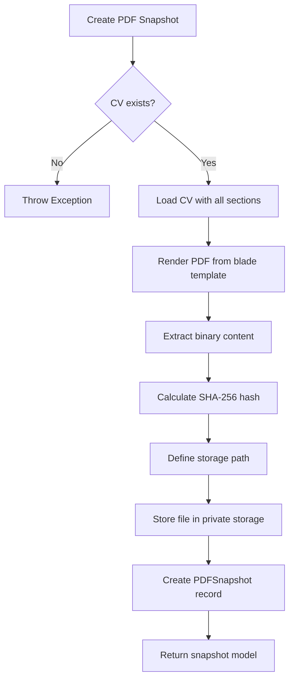

# PDF Snapshot Creation on Send

<cite>
**Referenced Files in This Document**   
- [JobApplicationObserver.php](file://app/Observers/JobApplicationObserver.php)
- [PdfSnapshotService.php](file://app/Services/PdfSnapshotService.php)
- [JobApplication.php](file://app/Models/JobApplication.php)
- [PDFSnapshot.php](file://app/Models/PDFSnapshot.php)
- [pdf.blade.php](file://resources/views/cv/pdf.blade.php)
- [filesystems.php](file://config/filesystems.php)
</cite>

## Table of Contents
1. [Introduction](#introduction)
2. [Core Components](#core-components)
3. [Architecture Overview](#architecture-overview)
4. [Detailed Component Analysis](#detailed-component-analysis)
5. [Dependency Analysis](#dependency-analysis)
6. [Performance Considerations](#performance-considerations)
7. [Troubleshooting Guide](#troubleshooting-guide)
8. [Conclusion](#conclusion)

## Introduction
This document details the automated PDF snapshot creation process in the CV Builder application when a job application's send status changes to 'sent'. The system uses Laravel's observer pattern to detect model changes and trigger PDF generation, ensuring a permanent, immutable record of the CV at the time of application submission. This documentation covers the complete workflow from event detection to file storage, including error handling and security considerations.

## Core Components

The PDF snapshot system consists of two primary components: the `JobApplicationObserver` which listens for model events, and the `PdfSnapshotService` which handles PDF generation and storage. These components work together to create a verifiable, tamper-evident record of job applications at the moment they are sent.

**Section sources**
- [JobApplicationObserver.php](file://app/Observers/JobApplicationObserver.php#L1-L42)
- [PdfSnapshotService.php](file://app/Services/PdfSnapshotService.php#L1-L65)

## Architecture Overview



**Diagram sources**
- [JobApplicationObserver.php](file://app/Observers/JobApplicationObserver.php#L24-L35)
- [PdfSnapshotService.php](file://app/Services/PdfSnapshotService.php#L15-L60)

## Detailed Component Analysis

### Job Application Observer Analysis

The `JobApplicationObserver` listens for the `updated` event on the `JobApplication` model and triggers PDF snapshot creation when specific conditions are met. This observer pattern decouples the snapshot creation logic from the core application flow.

```mermaid
flowchart TD
A[Job Application Updated] --> B{send_status changed?}
B --> |No| C[Exit]
B --> |Yes| D{send_status = 'sent'?}
D --> |No| C
D --> |Yes| E{Snapshot exists?}
E --> |Yes| C
E --> |No| F[Call PdfSnapshotService::create()]
F --> G[Handle exceptions]
G --> H[Log error if failed]
H --> I[Continue application flow]
```

**Diagram sources**
- [JobApplicationObserver.php](file://app/Observers/JobApplicationObserver.php#L24-L35)

**Section sources**
- [JobApplicationObserver.php](file://app/Observers/JobApplicationObserver.php#L1-L42)

### PDF Snapshot Service Analysis

The `PdfSnapshotService` is responsible for generating the PDF, calculating its cryptographic hash, storing the file, and creating the database record. This service ensures data integrity and provides a verifiable record of the application state.



**Diagram sources**
- [PdfSnapshotService.php](file://app/Services/PdfSnapshotService.php#L15-L60)

**Section sources**
- [PdfSnapshotService.php](file://app/Services/PdfSnapshotService.php#L1-L65)

## Dependency Analysis

```mermaid
classDiagram
class JobApplication {
+int id
+int cv_id
+string send_status
+hasOne pdfSnapshot()
}
class PDFSnapshot {
+int id
+int job_application_id
+int cv_id
+string file_path
+string hash
+belongsTo jobApplication()
+belongsTo cv()
}
class PdfSnapshotService {
+create(JobApplication) PDFSnapshot
}
class JobApplicationObserver {
+updated(JobApplication) void
}
class Cv {
+int id
+string title
+hasMany pdfSnapshots()
}
JobApplicationObserver --> PdfSnapshotService : "uses"
PdfSnapshotService --> JobApplication : "processes"
PdfSnapshotService --> PDFSnapshot : "creates"
JobApplication --> PDFSnapshot : "has one"
Cv --> PDFSnapshot : "has many"
PdfSnapshotService --> "cv.pdf" : "renders from"
```

**Diagram sources**
- [JobApplication.php](file://app/Models/JobApplication.php#L1-L66)
- [PDFSnapshot.php](file://app/Models/PDFSnapshot.php#L1-L44)
- [PdfSnapshotService.php](file://app/Services/PdfSnapshotService.php#L1-L65)
- [JobApplicationObserver.php](file://app/Observers/JobApplicationObserver.php#L1-L42)

## Performance Considerations

The PDF generation process occurs synchronously during the job application update, which could impact response time for users. The system loads the complete CV with all related sections and subsections, which may result in significant database queries for complex CVs. However, this ensures the snapshot captures the complete state of the CV at the time of sending. The file storage uses the local private disk, avoiding external service latency but relying on server storage capacity.

## Troubleshooting Guide

Common issues include PDF generation failures due to missing CV data, file storage permission problems, or template rendering errors. The system logs errors when PDF creation fails but does not interrupt the job application update process. The SHA-256 hash verification ensures file integrity, and the immutable nature of snapshots prevents accidental modification. If a snapshot fails to create, the observer will not attempt recreation for the same job application, preventing duplicate processing.

**Section sources**
- [JobApplicationObserver.php](file://app/Observers/JobApplicationObserver.php#L30-L35)
- [PdfSnapshotService.php](file://app/Services/PdfSnapshotService.php#L15-L20)

## Conclusion

The automated PDF snapshot system provides a reliable, secure method for preserving job applications at the moment of submission. By leveraging Laravel's observer pattern and cryptographic hashing, the system ensures data integrity while maintaining application performance. The implementation links snapshots to both the job application and the specific CV version used, creating a verifiable audit trail. Future enhancements could include asynchronous processing for improved performance and cloud storage integration for enhanced durability.