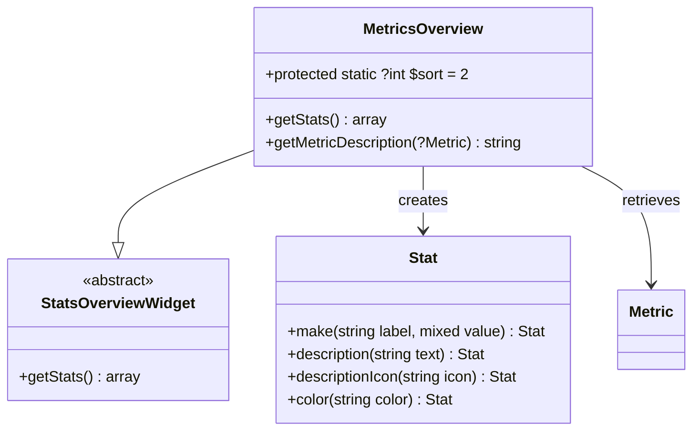
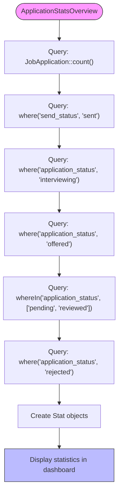
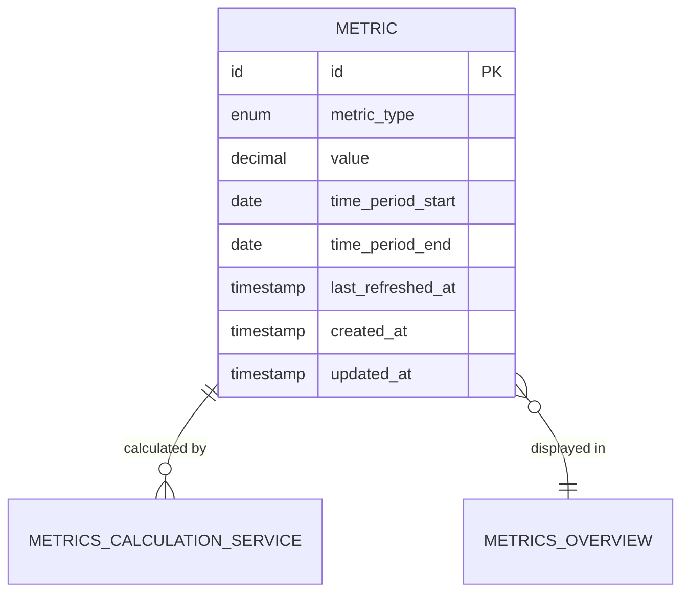

# Dashboard Widgets

<cite>
**Referenced Files in This Document**   
- [MetricsOverview.php](file://app/Filament/Widgets/MetricsOverview.php)
- [ApplicationStatsOverview.php](file://app/Filament/Widgets/ApplicationStatsOverview.php)
- [Metric.php](file://app/Models/Metric.php)
- [MetricsCalculationService.php](file://app/Services/MetricsCalculationService.php)
- [create_metrics_table.php](file://database/migrations/2025_10_04_100003_create_metrics_table.php)
</cite>

## Table of Contents
1. [Introduction](#introduction)
2. [Core Components](#core-components)
3. [Metrics Overview Widget](#metrics-overview-widget)
4. [Application Stats Overview Widget](#application-stats-overview-widget)
5. [Data Retrieval and Storage](#data-retrieval-and-storage)
6. [Stat Object Configuration](#stat-object-configuration)
7. [Data Freshness and Timestamps](#data-freshness-and-timestamps)
8. [Widget Configuration and Layout](#widget-configuration-and-layout)
9. [Responsive Design and Accessibility](#responsive-design-and-accessibility)
10. [Customization and Extension](#customization-and-extension)

## Introduction
The dashboard widgets in the CV Builder application provide visual representations of key application metrics and job application statistics. These widgets leverage Filament's StatsOverviewWidget component to display pre-calculated metric values in an accessible, responsive format. The system is designed to present both high-level performance metrics and detailed application status information, enabling users to track their job search progress effectively.

## Core Components
The dashboard widget system consists of two primary components: the MetricsOverview widget for performance metrics and the ApplicationStatsOverview widget for application status tracking. Both widgets extend Filament's StatsOverviewWidget and utilize Stat objects to define their visual presentation. The metrics are pre-calculated by the MetricsCalculationService and stored in the database for efficient retrieval.

**Section sources**
- [MetricsOverview.php](file://app/Filament/Widgets/MetricsOverview.php)
- [ApplicationStatsOverview.php](file://app/Filament/Widgets/ApplicationStatsOverview.php)

## Metrics Overview Widget
The MetricsOverview widget displays key performance indicators for the job application process. It retrieves pre-calculated metric values from the database and presents them in a standardized format. The widget shows five primary metrics: Applications per Week, Response Rate, Interview Conversion, Offer Rate, and Median Days to Response. Each metric is retrieved by querying the Metric model for the latest value based on the time_period_start field.

The widget is configured with a sort order of 2, positioning it appropriately within the dashboard layout. It retrieves the most recent metric values using the latest() query scope and handles cases where metrics may not be available by providing default values.

**Diagram sources**
- [MetricsOverview.php](file://app/Filament/Widgets/MetricsOverview.php)
- [Metric.php](file://app/Models/Metric.php)

**Section sources**
- [MetricsOverview.php](file://app/Filament/Widgets/MetricsOverview.php)

## Application Stats Overview Widget
The ApplicationStatsOverview widget provides a comprehensive view of job application status across different stages of the application process. Unlike the MetricsOverview widget, which displays pre-calculated performance metrics, this widget calculates statistics in real-time by querying the JobApplication model directly. It displays six key statistics: Total Applications, Sent Applications, Interviewing, Offers, Pending Response, and Rejected applications.

The widget uses database queries to count applications based on their send_status and application_status fields. Each statistic is represented as a Stat object with appropriate icons, descriptions, and color coding to indicate the nature of the metric. The color scheme uses primary, success, info, warning, gray, and danger colors to provide visual cues about the application status.

**Diagram sources**
- [ApplicationStatsOverview.php](file://app/Filament/Widgets/ApplicationStatsOverview.php)

**Section sources**
- [ApplicationStatsOverview.php](file://app/Filament/Widgets/ApplicationStatsOverview.php)

## Data Retrieval and Storage
The metrics system follows a pre-calculation pattern where metrics are computed periodically and stored in the database for efficient retrieval. The Metric model represents a database table with fields for metric_type, value, time_period_start, time_period_end, and last_refreshed_at. The metrics table has a unique constraint on the combination of metric_type and time_period_start, ensuring that each metric type has only one record per time period.

The MetricsCalculationService is responsible for calculating and storing all metrics. It provides methods for calculating each metric type, including Applications per Week, Response Rate, Interview Conversion Rate, Offer Rate, and Median Days to First Response. The service uses a time period parameter (e.g., '30d') to define the calculation window and stores the results with appropriate start and end dates.

**Diagram sources**
- [Metric.php](file://app/Models/Metric.php)
- [MetricsCalculationService.php](file://app/Services/MetricsCalculationService.php)
- [create_metrics_table.php](file://database/migrations/2025_10_04_100003_create_metrics_table.php)

**Section sources**
- [Metric.php](file://app/Models/Metric.php)
- [MetricsCalculationService.php](file://app/Services/MetricsCalculationService.php)

## Stat Object Configuration
Both dashboard widgets use Filament's Stat objects to define the visual presentation of each metric. The Stat class provides methods for configuring the label, value, description, icon, and color of each statistic. The configuration options include:

- **Label**: The descriptive text displayed above the value
- **Value**: The numeric or formatted value to display
- **Description**: Additional context or explanatory text
- **Description Icon**: A Heroicon icon displayed alongside the description
- **Color**: Visual indicator using predefined color schemes (success, info, warning, danger, gray, primary)

The MetricsOverview widget formats percentage values by appending '%' to the numeric value, while numeric values like days are rounded to whole numbers. The ApplicationStatsOverview widget uses descriptive text for its descriptions, providing context about what each statistic represents.

**Section sources**
- [MetricsOverview.php](file://app/Filament/Widgets/MetricsOverview.php)
- [ApplicationStatsOverview.php](file://app/Filament/Widgets/ApplicationStatsOverview.php)

## Data Freshness and Timestamps
The system includes robust data freshness indicators to inform users when metrics were last updated. The MetricsOverview widget displays this information in the description of each stat, using the last_refreshed_at timestamp from the Metric model. The getMetricDescription method formats this timestamp using Laravel's diffForHumans() method, which converts timestamps into human-readable relative time expressions (e.g., "2 hours ago", "yesterday", "3 days ago").

When a metric is not available, the widget displays "No data available" as the description. For valid metrics, the description combines the time period ("Last 30 days") with the freshness information ("Updated X time ago"). This dual information provides context about both the calculation period and how recently the metric was refreshed.

The MetricsCalculationService updates the last_refreshed_at field to the current timestamp whenever a metric is calculated or updated, ensuring that the freshness information is always accurate.

**Section sources**
- [MetricsOverview.php](file://app/Filament/Widgets/MetricsOverview.php)
- [MetricsCalculationService.php](file://app/Services/MetricsCalculationService.php)

## Widget Configuration and Layout
The dashboard widgets support various configuration options to control their appearance and behavior. The MetricsOverview widget is configured with a sort order of 2, which determines its position relative to other widgets in the dashboard. This sort value is implemented through the protected static $sort property.

Both widgets inherit responsive layout capabilities from Filament's StatsOverviewWidget, automatically adjusting their column layout based on screen size. The widgets display statistics in a grid format that adapts from multiple columns on desktop to a single column on mobile devices.

The widgets do not currently support user-configurable sorting or filtering, as they are designed to present a standardized view of the most important metrics. However, the underlying Stat objects could be extended to support additional configuration options if needed.

**Section sources**
- [MetricsOverview.php](file://app/Filament/Widgets/MetricsOverview.php)

## Responsive Design and Accessibility
The dashboard widgets are designed with responsive principles and accessibility in mind. They inherit responsive behavior from Filament's component library, automatically adjusting their layout based on screen size. On larger screens, the statistics are displayed in multiple columns to maximize information density, while on smaller screens they stack vertically for easier reading.

The widgets use semantic HTML and ARIA attributes to ensure accessibility for users with assistive technologies. Color is used as a secondary indicator, with icons and text providing the primary information. This ensures that the widgets remain usable for users with color vision deficiencies.

The Stat components include proper focus states and keyboard navigation support, allowing users to interact with the widgets using keyboard controls. The use of standard HTML elements and ARIA roles ensures compatibility with screen readers and other assistive technologies.

**Section sources**
- [MetricsOverview.php](file://app/Filament/Widgets/MetricsOverview.php)
- [ApplicationStatsOverview.php](file://app/Filament/Widgets/ApplicationStatsOverview.php)

## Customization and Extension
The dashboard widgets can be customized and extended for different use cases. Developers can create additional Stat objects to display new metrics or modify existing ones to change their appearance or behavior. The widgets could be extended to support user preferences, such as choosing which metrics to display or configuring the time period for calculations.

To add new metrics, developers would need to:
1. Add the new metric type to the database migration
2. Implement calculation logic in the MetricsCalculationService
3. Add a new Stat object to the getStats method of the MetricsOverview widget
4. Update the database seeders and factories to include test data

The widgets could also be extended to support filtering by date range or other criteria, allowing users to view metrics for specific time periods. Additionally, the widgets could be enhanced with interactive features, such as the ability to click on a statistic to view more detailed information.

**Section sources**
- [MetricsOverview.php](file://app/Filament/Widgets/MetricsOverview.php)
- [MetricsCalculationService.php](file://app/Services/MetricsCalculationService.php)