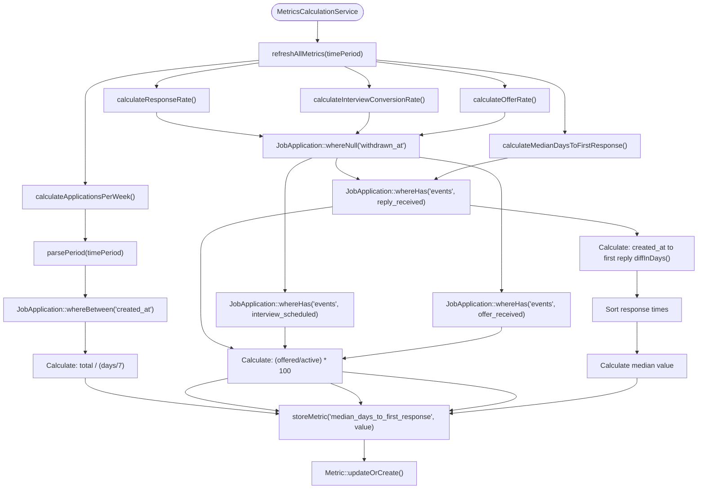
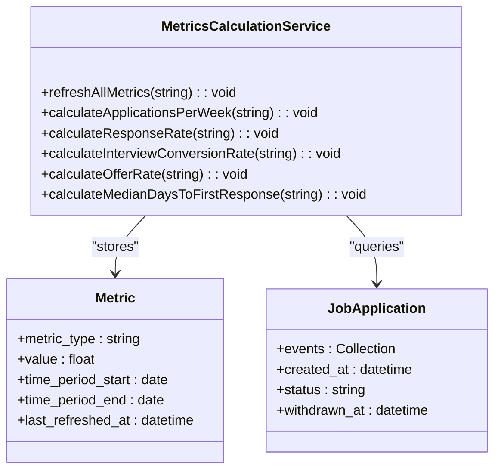

# Key Performance Indicators

<cite>
**Referenced Files in This Document**  
- [MetricsCalculationService.php](file://app/Services/MetricsCalculationService.php)
- [Metric.php](file://app/Models/Metric.php)
- [JobApplication.php](file://app/Models/JobApplication.php)
- [ApplicationEvent.php](file://app/Models/ApplicationEvent.php)
- [create_metrics_table.php](file://database/migrations/2025_10_04_100003_create_metrics_table.php)
- [MetricsCalculationTest.php](file://tests/Feature/MetricsCalculationTest.php)
- [console.php](file://routes/console.php)
</cite>

## Table of Contents
1. [Introduction](#introduction)
2. [Core KPIs Overview](#core-kpis-overview)
3. [Applications Per Week](#applications-per-week)
4. [Response Rate](#response-rate)
5. [Interview Conversion Rate](#interview-conversion-rate)
6. [Offer Rate](#offer-rate)
7. [Median Days to First Response](#median-days-to-first-response)
8. [Data Handling and Edge Cases](#data-handling-and-edge-cases)
9. [Time Period Processing](#time-period-processing)
10. [Data Retention and Update Frequency](#data-retention-and-update-frequency)
11. [Practical Applications](#practical-applications)

## Introduction

The MetricsCalculationService provides a comprehensive analytics framework for tracking job application performance through five key performance indicators (KPIs). These metrics are designed to help users evaluate the effectiveness of their job search strategy by providing quantifiable insights into application outcomes. The system calculates metrics based on job application data stored in the database, with careful consideration for data accuracy, edge cases, and meaningful interpretation. Each KPI serves a specific purpose in the job search journey, from measuring application volume to tracking progression through the hiring pipeline.

**Section sources**
- [MetricsCalculationService.php](file://app/Services/MetricsCalculationService.php#L7-L169)
- [MetricsCalculationTest.php](file://tests/Feature/MetricsCalculationTest.php#L10-L204)

## Core KPIs Overview

The MetricsCalculationService computes five primary performance indicators that collectively provide a comprehensive view of job search effectiveness. These KPIs are calculated for a configurable time period (default: 30 days) and stored in the database for dashboard display and historical tracking. The service follows a consistent pattern across all calculations: parsing the time period, querying relevant job applications, applying business rules, performing the specific calculation, and storing the result. The calculations are designed to be robust, handling edge cases gracefully and preventing mathematical errors. All metrics exclude withdrawn applications to ensure accurate performance measurement, as these represent applications the user has intentionally removed from consideration.

**Diagram sources**
- [MetricsCalculationService.php](file://app/Services/MetricsCalculationService.php#L7-L169)
- [MetricsCalculationTest.php](file://tests/Feature/MetricsCalculationTest.php#L10-L204)

**Section sources**
- [MetricsCalculationService.php](file://app/Services/MetricsCalculationService.php#L7-L169)
- [MetricsCalculationTest.php](file://tests/Feature/MetricsCalculationTest.php#L10-L204)
- [create_metrics_table.php](file://database/migrations/2025_10_04_100003_create_metrics_table.php#L1-L42)

## Applications Per Week

The applications per week metric measures the average number of job applications submitted per week over the specified time period. This KPI helps users track their application volume and consistency, which is a critical factor in job search success. The calculation begins by counting all job applications created within the time period, regardless of their current status. The system then calculates the number of days in the period and converts this to weeks using `ceil($days / 7)` to ensure partial weeks are counted as full weeks. To prevent division by zero errors, the system uses `max(1, ceil($days / 7))`, guaranteeing that the denominator is never zero even for very short periods. The final result is rounded to two decimal places for readability. This metric provides insight into the user's application frequency and can help identify periods of high or low activity.

**Section sources**
- [MetricsCalculationService.php](file://app/Services/MetricsCalculationService.php#L20-L38)

## Response Rate

The response rate metric calculates the percentage of job applications that received a reply from employers. This KPI is a key indicator of initial engagement and helps users understand how effectively their applications are capturing employer interest. The calculation considers only active applications (those not withdrawn) to provide an accurate measure of response effectiveness. The system queries for applications that have an "reply_received" event in their application events, which are tracked through the ApplicationEvent model. The response rate is calculated by dividing the number of applications with replies by the total number of active applications, then multiplying by 100 to convert to a percentage. If there are no active applications, the system returns 0 rather than throwing an error, ensuring robustness. This metric helps users assess the effectiveness of their application materials and identify potential areas for improvement.

**Section sources**
- [MetricsCalculationService.php](file://app/Services/MetricsCalculationService.php#L40-L74)
- [JobApplication.php](file://app/Models/JobApplication.php#L80-L85)
- [ApplicationEvent.php](file://app/Models/ApplicationEvent.php#L15-L20)

## Interview Conversion Rate

The interview conversion rate measures the percentage of job applications that progressed to the interview stage. This KPI indicates how effectively applications are moving beyond the initial screening phase and into direct employer engagement. Like the response rate, this calculation considers only active applications (excluding withdrawn ones) to focus on meaningful conversions. The system identifies applications with an "interview_scheduled" event in their application events history. The conversion rate is calculated by dividing the number of applications with scheduled interviews by the total number of active applications, then multiplying by 100. If there are no active applications, the result is 0. This metric helps users evaluate the quality of their applications and their ability to advance in the hiring process, providing insight into how well their qualifications align with employer needs.

**Section sources**
- [MetricsCalculationService.php](file://app/Services/MetricsCalculationService.php#L76-L100)
- [JobApplication.php](file://app/Models/JobApplication.php#L80-L85)
- [ApplicationEvent.php](file://app/Models/ApplicationEvent.php#L15-L20)

## Offer Rate

The offer rate metric tracks the percentage of job applications that resulted in job offers. This KPI represents the ultimate success metric in the job search process, indicating how effectively applications convert into concrete opportunities. The calculation follows the same pattern as other rate-based metrics, considering only active applications and excluding withdrawn ones. The system identifies applications with an "offer_received" event in their application events history. The offer rate is calculated by dividing the number of applications with offers by the total number of active applications, then multiplying by 100. As with other calculations, if there are no active applications, the system returns 0 to prevent division by zero errors. This metric provides a direct measure of job search success and helps users understand their conversion rate from application to offer.

**Section sources**
- [MetricsCalculationService.php](file://app/Services/MetricsCalculationService.php#L102-L128)
- [JobApplication.php](file://app/Models/JobApplication.php#L80-L85)
- [ApplicationEvent.php](file://app/Models/ApplicationEvent.php#L15-L20)

## Median Days to First Response

The median days to first response metric calculates the median number of days between submitting a job application and receiving the first reply from an employer. This KPI provides insight into employer responsiveness and helps users set realistic expectations for follow-up. Unlike mean averages, the median is used to minimize the impact of outliers (extremely long or short response times) and provide a more representative central tendency. The calculation considers all applications that received a reply, regardless of withdrawal status, as the response time is still a relevant data point. For each application with a reply, the system calculates the difference in days between the application creation date and the date of the first reply event. These response times are collected into an array, sorted, and the median value is calculated. If no applications have received replies, the system returns 0. This metric helps users understand typical employer response timelines and identify whether their follow-up strategies need adjustment.

**Section sources**
- [MetricsCalculationService.php](file://app/Services/MetricsCalculationService.php#L130-L169)
- [JobApplication.php](file://app/Models/JobApplication.php#L80-L85)
- [ApplicationEvent.php](file://app/Models/ApplicationEvent.php#L15-L20)

## Data Handling and Edge Cases

The MetricsCalculationService implements robust handling of edge cases to ensure reliable and meaningful metrics. The most critical edge case is division by zero, which is prevented through several mechanisms. For the applications per week calculation, `max(1, ceil($days / 7))` ensures the number of weeks is never zero. For percentage-based metrics (response rate, interview conversion rate, offer rate), the system checks if the denominator (total active applications) is greater than zero before performing division, returning 0 if no active applications exist. Empty datasets are handled gracefully by returning 0 for metrics when no relevant data is available, rather than throwing exceptions. Withdrawn applications are systematically excluded from rate calculations to prevent distortion of performance metrics, as these represent applications the user has intentionally removed from consideration. The median calculation handles empty arrays by returning 0, ensuring the system remains robust even with limited data.

**Section sources**
- [MetricsCalculationService.php](file://app/Services/MetricsCalculationService.php#L20-L169)
- [MetricsCalculationTest.php](file://tests/Feature/MetricsCalculationTest.php#L10-L204)

## Time Period Processing

Time periods for metric calculations are specified using a simple string format (e.g., '30d' for 30 days) and processed by the `parsePeriod` method. This method uses regular expressions to extract the number of days from the input string, defaulting to 30 days if no valid period is specified. The end date is set to the current date and time, while the start date is calculated by subtracting the specified number of days from the end date. This approach allows for flexible time period selection while maintaining consistency in calculations. The parsed dates are used to filter job applications that were created within the specified range, ensuring metrics reflect performance over the desired timeframe. This system enables users to analyze their job search performance over different periods, such as the last 7 days, 30 days, or 90 days, by simply changing the time period parameter.

**Section sources**
- [MetricsCalculationService.php](file://app/Services/MetricsCalculationService.php#L130-L137)

## Data Retention and Update Frequency

Calculated metrics are stored in the database with comprehensive metadata to support historical tracking and data freshness verification. Each metric record includes the metric type, calculated value, time period start and end dates, and a timestamp of when the metric was last refreshed. The system uses `Metric::updateOrCreate()` with a unique constraint on metric type and time period start date, ensuring only one record exists per metric and time period combination. This prevents data duplication and maintains consistency. Metrics are updated daily through a scheduled Artisan command (`metrics:refresh`) that runs at midnight, ensuring data remains current. The daily update frequency balances the need for fresh data with system performance considerations. Historical metrics are retained indefinitely, allowing users to track their job search performance trends over time. The last_refreshed_at timestamp enables users and the system to verify data freshness and identify any potential issues with the update process.

**Diagram sources**
- [MetricsCalculationService.php](file://app/Services/MetricsCalculationService.php)
- [Metric.php](file://app/Models/Metric.php)
- [JobApplication.php](file://app/Models/JobApplication.php)

**Section sources**
- [MetricsCalculationService.php](file://app/Services/MetricsCalculationService.php#L171-L172)
- [Metric.php](file://app/Models/Metric.php#L1-L26)
- [create_metrics_table.php](file://database/migrations/2025_10_04_100003_create_metrics_table.php#L1-L42)
- [console.php](file://routes/console.php#L15-L19)

## Practical Applications

Users can leverage these KPIs to optimize their job search strategy in several ways. A low applications per week metric might indicate the need to increase application volume or streamline the application process. A low response rate despite high application volume could suggest issues with resume quality, cover letters, or targeting inappropriate roles. Users can experiment with different application materials and track whether their response rate improves. A healthy response rate but low interview conversion rate might indicate strong initial appeal but weaknesses in interview preparation or qualification alignment. The median days to first response helps users set realistic expectations for follow-up and determine appropriate times to send polite inquiries about application status. By monitoring these metrics over time, users can identify trends, measure the impact of strategy changes, and make data-driven decisions to improve their job search effectiveness. For example, a user might notice their offer rate increases after focusing on roles that better match their skills, providing validation for their refined targeting approach.