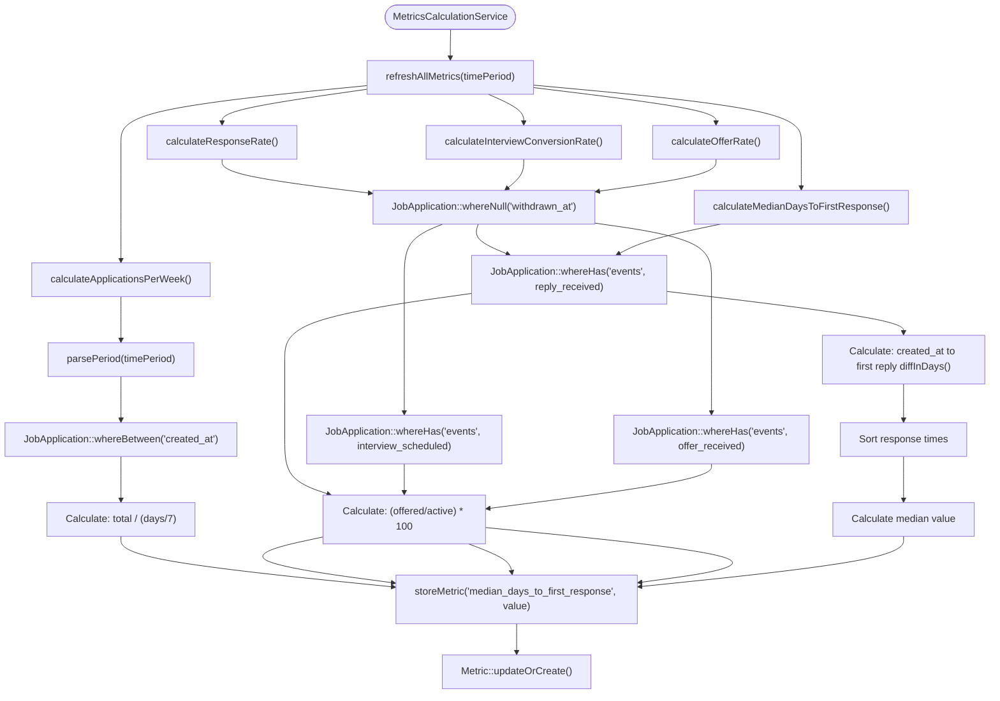
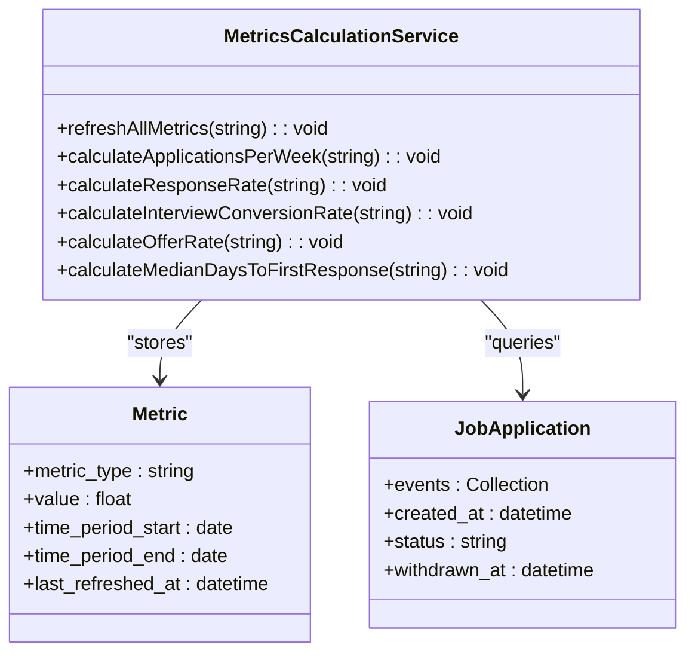
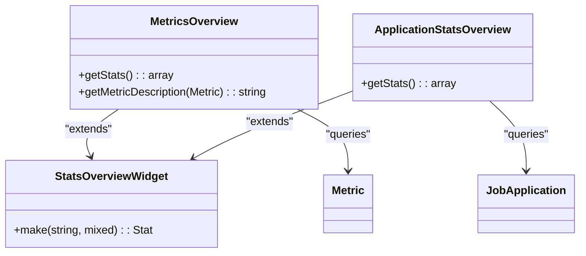
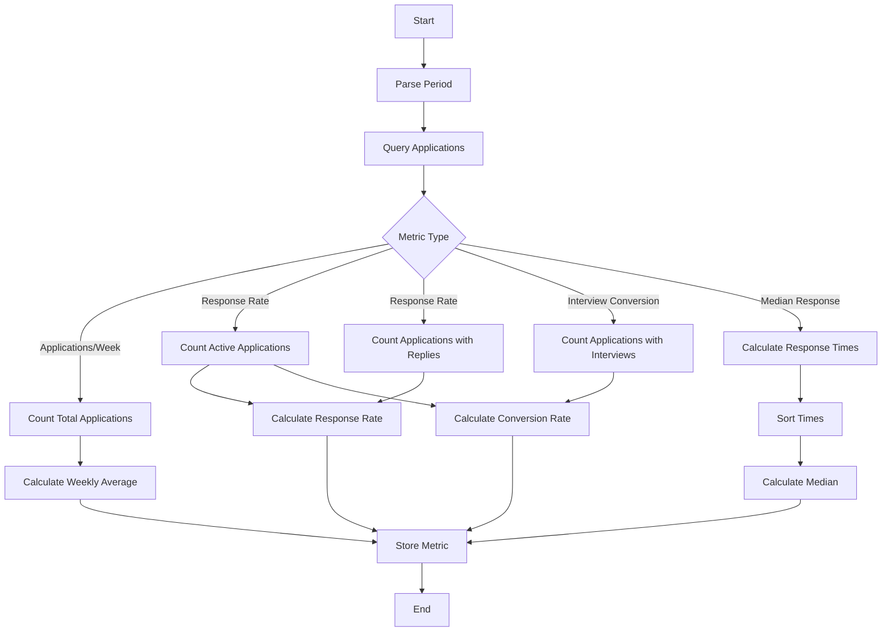

# Metrics & Analytics

<cite>
**Referenced Files in This Document**   
- [MetricsCalculationService.php](file://app/Services/MetricsCalculationService.php)
- [Metric.php](file://app/Models/Metric.php)
- [MetricsOverview.php](file://app/Filament/Widgets/MetricsOverview.php)
- [ApplicationStatsOverview.php](file://app/Filament/Widgets/ApplicationStatsOverview.php)
- [create_metrics_table.php](file://database/migrations/2025_10_04_100003_create_metrics_table.php)
- [console.php](file://routes/console.php)
</cite>

## Table of Contents
1. [Metrics Calculation Service](#metrics-calculation-service)
2. [Metric Model and Storage](#metric-model-and-storage)
3. [Dashboard Widgets](#dashboard-widgets)
4. [Data Aggregation and Calculation](#data-aggregation-and-calculation)
5. [Event-Driven Metric Updates](#event-driven-metric-updates)
6. [Data Retention and Privacy](#data-retention-and-privacy)
7. [User Applications and Strategy](#user-applications-and-strategy)

## Metrics Calculation Service

The MetricsCalculationService is responsible for computing key performance indicators (KPIs) for job applications. This service provides comprehensive analytics by calculating metrics over configurable time periods, with a default of 30 days. The service follows a consistent pattern across all calculation methods: parsing the time period, querying relevant application data, applying business rules, performing calculations, and storing results.

The service exposes several calculation methods:
- `calculateApplicationsPerWeek()`: Computes the average number of applications submitted per week
- `calculateResponseRate()`: Calculates the percentage of applications that received a reply
- `calculateInterviewConversionRate()`: Determines the percentage of applications that progressed to the interview stage
- `calculateOfferRate()`: Measures the percentage of applications that resulted in job offers
- `calculateMedianDaysToFirstResponse()`: Computes the median number of days between application submission and first response

The service includes robust error handling and edge case management. For example, in the `calculateApplicationsPerWeek()` method, the code uses `max(1, ceil($days / 7))` to ensure the number of weeks is never zero, preventing division-by-zero errors. The service returns 0 for metrics when no data is available rather than throwing exceptions, making it resilient and easy to integrate.

The `refreshAllMetrics()` method provides a convenient way to update all metrics simultaneously, which is used by the scheduled Artisan command. This method calls each individual calculation method to ensure all KPIs are current.

**Diagram sources**
- [MetricsCalculationService.php](file://app/Services/MetricsCalculationService.php#L7-L169)

**Section sources**
- [MetricsCalculationService.php](file://app/Services/MetricsCalculationService.php#L7-L169)

## Metric Model and Storage

The Metric model represents a single performance metric stored in the database. It contains essential fields for tracking KPIs over time, including the metric type, value, time period, and last refresh timestamp. The model uses database casts to ensure proper data typing for date, datetime, and float fields.

The metrics table is designed with appropriate indexes to optimize query performance. Key indexes include:
- An index on `metric_type` for fast lookups by metric category
- A composite index on `time_period_start` and `time_period_end` for date range queries
- A unique constraint on `metric_type` and `time_period_start` to prevent duplicate metrics for the same time period

This storage design enables efficient retrieval of metrics for dashboard display while maintaining data integrity. The use of `updateOrCreate()` in the MetricsCalculationService ensures that only one record exists per metric type and time period, preventing data duplication.

**Diagram sources**
- [Metric.php](file://app/Models/Metric.php)
- [create_metrics_table.php](file://database/migrations/2025_10_04_100003_create_metrics_table.php)

**Section sources**
- [Metric.php](file://app/Models/Metric.php#L1-L27)
- [create_metrics_table.php](file://database/migrations/2025_10_04_100003_create_metrics_table.php#L1-L42)

## Dashboard Widgets

The application provides two primary dashboard widgets for visualizing job application metrics: MetricsOverview and ApplicationStatsOverview.

The **MetricsOverview** widget displays the key performance indicators calculated by the MetricsCalculationService. It retrieves the most recent values for each metric type from the database and presents them in a clean, informative format. Each stat includes a description showing the last refresh time using Laravel's `diffForHumans()` method for user-friendly timestamp display.

The **ApplicationStatsOverview** widget provides a broader view of application status distribution. It counts applications by their current status (pending, interviewing, offered, rejected) and displays these as statistics. This widget helps users understand the current state of their job search pipeline.

Both widgets use Filament's StatsOverviewWidget component, providing a consistent and professional appearance. The widgets are designed to load quickly since they retrieve pre-calculated metrics rather than performing on-demand calculations.

**Diagram sources**
- [MetricsOverview.php](file://app/Filament/Widgets/MetricsOverview.php)
- [ApplicationStatsOverview.php](file://app/Filament/Widgets/ApplicationStatsOverview.php)

**Section sources**
- [MetricsOverview.php](file://app/Filament/Widgets/MetricsOverview.php#L1-L72)
- [ApplicationStatsOverview.php](file://app/Filament/Widgets/ApplicationStatsOverview.php#L1-L53)

## Data Aggregation and Calculation

The data aggregation process follows a systematic approach to ensure accurate and consistent metrics. For each calculation, the service:

1. Parses the time period parameter (e.g., '30d' for 30 days)
2. Queries the database for relevant job applications within the specified time period
3. Applies business rules (e.g., excluding withdrawn applications)
4. Performs the specific calculation using appropriate mathematical formulas
5. Stores the result using the `storeMetric()` method

Key calculation algorithms include:

**Applications Per Week**: Total applications divided by the number of weeks in the period, with safeguards against division by zero.

**Response Rate**: Percentage of active applications (excluding withdrawn) that received a reply, calculated as (replied applications / total active applications) × 100.

**Interview Conversion Rate**: Percentage of active applications that progressed to the interview stage, calculated similarly to response rate.

**Median Days to First Response**: The median number of days between application submission and first reply. This involves collecting response times for all applications with replies, sorting them, and calculating the median value.

The median calculation handles edge cases gracefully:
- Returns 0 for empty datasets
- Uses proper median calculation for both odd and even count datasets
- Sorts values before calculation to ensure accuracy

**Diagram sources**
- [MetricsCalculationService.php](file://app/Services/MetricsCalculationService.php#L7-L169)

**Section sources**
- [MetricsCalculationService.php](file://app/Services/MetricsCalculationService.php#L7-L169)

## Event-Driven Metric Updates

Metrics are updated through a scheduled process rather than in real-time with each application event. The system uses Laravel's task scheduler to automatically refresh metrics daily at 2:00 AM. This approach balances data freshness with system performance.

The scheduled command is defined in `routes/console.php` and calls the `refreshAllMetrics()` method with a 30-day period. This ensures that users have up-to-date metrics each morning without impacting application performance during peak usage hours.

Users can also manually refresh metrics through the dashboard interface, which triggers an immediate recalculation. This is particularly useful after bulk data imports or when users want to see the most current statistics without waiting for the next scheduled run.

The separation of metric calculation from application events (like status changes) provides several benefits:
- Improved application performance by avoiding calculation overhead on every update
- Consistent metric values that represent a specific time period
- Ability to recalculate historical metrics if business logic changes
- Reduced database load during user interactions

**Section sources**
- [console.php](file://routes/console.php#L15-L18)

## Data Retention and Privacy

The metrics system is designed with data retention and privacy considerations in mind. Metrics are stored as aggregated values rather than raw application data, which enhances privacy by not storing personally identifiable information in the metrics table.

The system retains metrics for historical tracking, allowing users to compare performance across different time periods. However, the primary focus is on recent performance (typically 7, 30, or 90 days), which aligns with the most relevant job search analytics.

The metrics table includes timestamps for when each metric was last refreshed, providing transparency about data freshness. Users can see exactly when metrics were last updated, which builds trust in the accuracy of the analytics.

No personally identifiable information is stored in the metrics table—only aggregated values and time periods. This approach complies with privacy best practices while still providing valuable insights into job search effectiveness.

**Section sources**
- [Metric.php](file://app/Models/Metric.php#L1-L27)
- [create_metrics_table.php](file://database/migrations/2025_10_04_100003_create_metrics_table.php#L1-L42)

## User Applications and Strategy

Users can leverage these metrics to improve their job search strategy and identify trends in their application outcomes. The KPIs provide actionable insights that help users understand the effectiveness of their job search efforts.

**Applications Per Week**: This metric helps users assess their application volume and consistency. A low number might indicate the need to increase application frequency, while a high number could suggest potential quality issues if response rates are low.

**Response Rate**: A key indicator of application effectiveness. Users can experiment with different CV versions, cover letters, or application approaches and monitor changes in their response rate to determine what works best.

**Interview Conversion Rate**: Measures how effectively users progress from application to interview. This metric can help identify strengths in initial screening and areas for improvement in application materials.

**Median Days to First Response**: Provides insight into employer responsiveness and helps users set realistic expectations for follow-up. Trends in this metric might indicate seasonal variations in hiring activity.

By tracking these metrics over time, users can:
- Identify patterns in their job search success
- Measure the impact of changes to their application materials
- Set realistic goals for application volume and response rates
- Adjust their strategy based on data-driven insights
- Recognize when to pivot to different industries or roles

The dashboard widgets make these metrics easily accessible, allowing users to quickly assess their job search performance and make informed decisions about their next steps.

**Section sources**
- [MetricsOverview.php](file://app/Filament/Widgets/MetricsOverview.php#L1-L72)
- [ApplicationStatsOverview.php](file://app/Filament/Widgets/ApplicationStatsOverview.php#L1-L53)
- [MetricsCalculationService.php](file://app/Services/MetricsCalculationService.php#L7-L169)