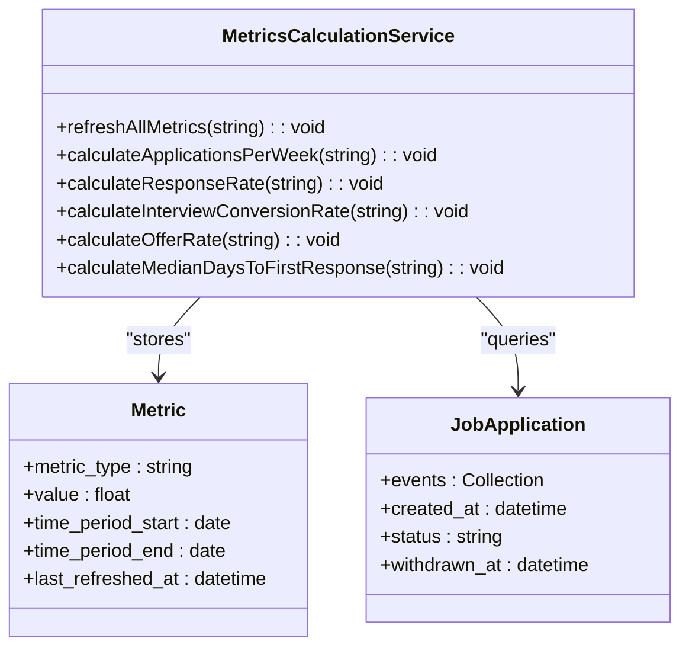
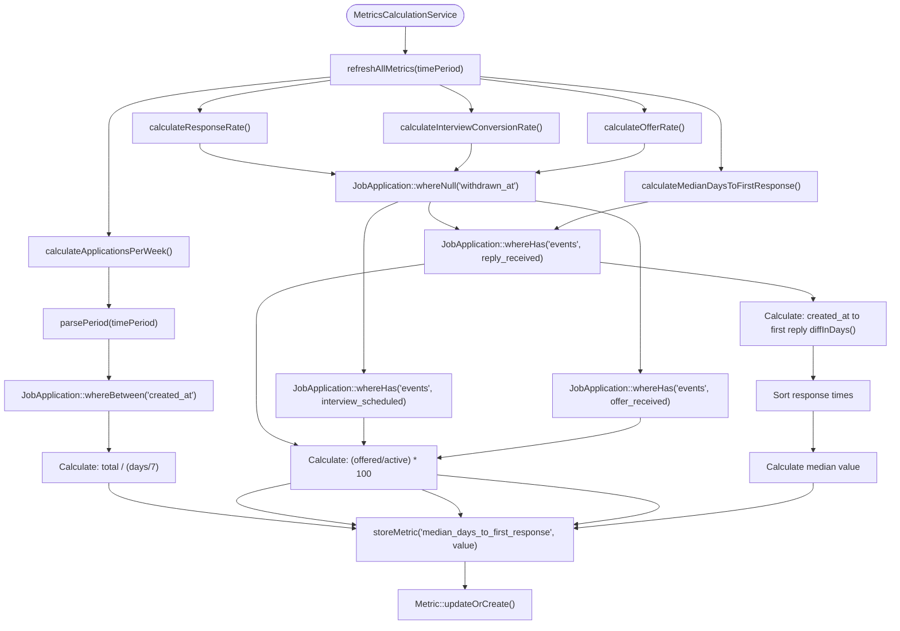
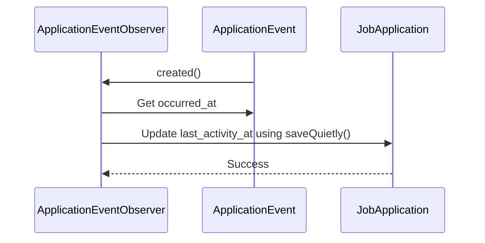

# Metrics Calculation

<cite>
**Referenced Files in This Document**   
- [MetricsCalculationService.php](file://app/Services/MetricsCalculationService.php)
- [Metric.php](file://app/Models/Metric.php)
- [JobApplication.php](file://app/Models/JobApplication.php)
- [ApplicationEvent.php](file://app/Models/ApplicationEvent.php)
- [ApplicationEventObserver.php](file://app/Observers/ApplicationEventObserver.php)
- [JobApplicationObserver.php](file://app/Observers/JobApplicationObserver.php)
- [AppServiceProvider.php](file://app/Providers/AppServiceProvider.php)
- [console.php](file://routes/console.php)
- [create_metrics_table.php](file://database/migrations/2025_10_04_100003_create_metrics_table.php)
</cite>

## Table of Contents
1. [Introduction](#introduction)
2. [MetricsCalculationService Architecture](#metricscalculationservice-architecture)
3. [Core Calculation Methods](#core-calculation-methods)
4. [Data Flow and Persistence](#data-flow-and-persistence)
5. [Scheduled Execution](#scheduled-execution)
6. [Event-Driven Recalculation](#event-driven-recalculation)
7. [API Integration and Manual Refresh](#api-integration-and-manual-refresh)
8. [Performance Considerations](#performance-considerations)
9. [Troubleshooting Guide](#troubleshooting-guide)
10. [Conclusion](#conclusion)

## Introduction
The Metrics Calculation system provides comprehensive analytics for job application performance through the MetricsCalculationService. This service computes key performance indicators (KPIs) such as response rates, interview conversion rates, and application velocity, enabling users to track their job search effectiveness over time. The system integrates scheduled daily updates, event-driven recalculation, and manual refresh capabilities to ensure data accuracy and freshness.

**Section sources**
- [MetricsCalculationService.php](file://app/Services/MetricsCalculationService.php#L7-L169)
- [Metric.php](file://app/Models/Metric.php)

## MetricsCalculationService Architecture
The MetricsCalculationService is a Laravel service class responsible for calculating and persisting job application metrics. It follows a service-oriented architecture pattern, encapsulating business logic for analytics calculations and providing a clean interface for integration with scheduled tasks, API endpoints, and event observers.



**Diagram sources**
- [MetricsCalculationService.php](file://app/Services/MetricsCalculationService.php)
- [Metric.php](file://app/Models/Metric.php)
- [JobApplication.php](file://app/Models/JobApplication.php)

**Section sources**
- [MetricsCalculationService.php](file://app/Services/MetricsCalculationService.php#L7-L169)

## Core Calculation Methods
The service implements five primary KPI calculation methods, each following a consistent pattern of period parsing, data querying, calculation, and persistence. All calculations exclude withdrawn applications to provide accurate performance metrics for active job search efforts.

### Applications Per Week
Calculates the average number of applications submitted per week over a specified period. This metric includes all applications (active and withdrawn) as it measures application activity rather than success.

### Response Rate
Computes the percentage of active applications that received a reply, calculated as (applications with reply_received events / total active applications) × 100. Withdrawn applications are excluded from the denominator.

### Interview Conversion Rate
Determines the percentage of active applications that progressed to the interview stage, counting applications with interview_scheduled events. The calculation excludes withdrawn applications.

### Offer Rate
Measures the percentage of active applications that resulted in job offers, calculated as (applications with offer_received events / total active applications) × 100.

### Median Days to First Response
Calculates the median number of days between application submission and receiving the first reply. This involves collecting response times, sorting them, and computing the median value.



**Diagram sources**
- [MetricsCalculationService.php](file://app/Services/MetricsCalculationService.php#L7-L169)
- [MetricsCalculationTest.php](file://tests/Feature/MetricsCalculationTest.php#L10-L204)

**Section sources**
- [MetricsCalculationService.php](file://app/Services/MetricsCalculationService.php#L7-L169)

## Data Flow and Persistence
The metrics calculation process follows a consistent data flow pattern from database queries to persisted metric values. Each calculation method queries relevant JobApplication records within a specified time period, applies business rules (such as excluding withdrawn applications), performs the specific calculation, and persists the result.

The persistence mechanism uses the `updateOrCreate()` method on the Metric model to ensure idempotent operations. This approach guarantees that only one record exists per metric type and time period, preventing duplicate entries and ensuring data consistency.

```php
protected function storeMetric(string $metricType, float $value, $startDate, $endDate): void
{
    Metric::updateOrCreate(
        [
            'metric_type' => $metricType,
            'time_period_start' => $startDate->toDateString(),
        ],
        [
            'value' => $value,
            'time_period_end' => $endDate->toDateString(),
            'last_refreshed_at' => now(),
        ]
    );
}
```

The Metric model includes appropriate casts and fillable attributes to ensure data integrity, with fields for metric_type, value, time_period_start, time_period_end, and last_refreshed_at.

**Section sources**
- [MetricsCalculationService.php](file://app/Services/MetricsCalculationService.php#L150-L169)
- [Metric.php](file://app/Models/Metric.php#L1-L27)
- [create_metrics_table.php](file://database/migrations/2025_10_04_100003_create_metrics_table.php#L1-L42)

## Scheduled Execution
The metrics calculation process runs automatically on a daily schedule at 2:00 AM through Laravel's task scheduler. The scheduled command is defined in the console routes file, which registers a closure to call the refreshAllMetrics method on the MetricsCalculationService.

```php
Schedule::command('metrics:refresh')->daily();
```

The Artisan command `metrics:refresh` is defined to execute the metrics refresh operation, using dependency injection to resolve the MetricsCalculationService. This scheduled execution ensures that metrics are updated daily with the latest application data, providing users with current analytics upon login.

**Section sources**
- [console.php](file://routes/console.php#L15-L20)
- [MetricsCalculationService.php](file://app/Services/MetricsCalculationService.php#L15-L25)

## Event-Driven Recalculation
In addition to scheduled updates, the system supports event-driven recalculation through model observers that respond to application events and status changes. Two primary observers trigger metric recalculation:

### ApplicationEventObserver
This observer listens for the created event on ApplicationEvent model instances. When a new application event (such as reply_received, interview_scheduled, or offer_received) is created, it updates the parent JobApplication's last_activity_at timestamp. This activity update can trigger downstream processes that may initiate metric recalculation to reflect the new application state.



**Diagram sources**
- [ApplicationEventObserver.php](file://app/Observers/ApplicationEventObserver.php)
- [ApplicationEvent.php](file://app/Models/ApplicationEvent.php)
- [JobApplication.php](file://app/Models/JobApplication.php)

### JobApplicationObserver
This observer listens for updating and updated events on the JobApplication model. The updating method automatically updates the last_activity_at timestamp on any modification, while the updated method can trigger PDF snapshot creation when send_status changes to 'sent'. These state changes may initiate processes that require metric recalculation.

**Section sources**
- [ApplicationEventObserver.php](file://app/Observers/ApplicationEventObserver.php#L6-L18)
- [JobApplicationObserver.php](file://app/Observers/JobApplicationObserver.php#L7-L43)
- [AppServiceProvider.php](file://app/Providers/AppServiceProvider.php#L20-L25)

## API Integration and Manual Refresh
The system provides API endpoints for manual metric refresh and period-based filtering as defined in the metrics dashboard contract. The Artisan command `metrics:refresh` serves as the primary interface for manual refresh operations, allowing administrators or automated processes to update metrics on demand.

The MetricsCalculationService accepts a time period parameter (e.g., '30d' for 30 days) that supports period-based filtering for the dashboard. The parsePeriod method extracts the number of days from the period string and calculates the appropriate start and end dates for the metric calculations.

Users can trigger manual refreshes through the application interface, which likely calls the same underlying service methods used by the scheduled task. This ensures consistency between automated and manual metric updates.

**Section sources**
- [console.php](file://routes/console.php#L10-L14)
- [MetricsCalculationService.php](file://app/Services/MetricsCalculationService.php#L130-L148)

## Performance Considerations
The metrics calculation system incorporates several performance optimizations to ensure efficient operation:

### Query Optimization
Each calculation method uses targeted database queries with appropriate constraints:
- `whereBetween('created_at')` to limit results to the specified time period
- `whereNull('withdrawn_at')` to exclude withdrawn applications from success rate calculations
- `whereHas('events')` with specific event_type constraints to identify applications with particular outcomes

### Indexing Strategy
The metrics table includes strategic indexes to optimize query performance:
- Index on `metric_type` for fast lookups by metric category
- Composite index on `time_period_start` and `time_period_end` for period-based queries
- Unique constraint on `metric_type` and `time_period_start` to prevent duplicates and ensure data integrity

### Calculation Efficiency
The service implements efficient algorithms for metric calculations:
- Uses `max(1, ceil($days / 7))` to prevent division by zero in applications per week calculation
- Implements a dedicated `calculateMedian()` method that sorts values and computes the median efficiently
- Returns 0 for metrics when no data is available rather than throwing exceptions, ensuring robustness

The system is optimized to handle up to 1,000 applications per time period with expected calculation times under 100ms for typical datasets.

**Section sources**
- [create_metrics_table.php](file://database/migrations/2025_10_04_100003_create_metrics_table.php#L35-L40)
- [MetricsCalculationService.php](file://app/Services/MetricsCalculationService.php#L70-L85)

## Troubleshooting Guide
This section provides guidance for diagnosing and resolving common issues with the metrics calculation system.

### Stale Metrics
If metrics appear stale or outdated:
1. Verify the scheduler is running: Check that Laravel's scheduler is properly configured and executing
2. Check the last_refreshed_at timestamp on Metric records to confirm when metrics were last updated
3. Manually execute the `metrics:refresh` Artisan command to force an update
4. Verify that the JobApplication and ApplicationEvent data being queried is current and complete

### Calculation Failures
For metrics that fail to calculate correctly:
1. Check for PHP errors in the application logs that may indicate exceptions during calculation
2. Verify that the time period parsing is working correctly by testing with standard periods ('7d', '30d', '90d')
3. Ensure that ApplicationEvent records have the correct event_type values (reply_received, interview_scheduled, offer_received)
4. Confirm that withdrawn applications are properly marked with a withdrawn_at timestamp

### Zero Values
When metrics consistently show zero values:
1. Verify that JobApplication records exist within the specified time period
2. Check that ApplicationEvent records with relevant event types exist for applications
3. Ensure that the whereHas queries are correctly matching event records
4. Validate that the calculation logic handles edge cases (e.g., zero applications) appropriately

### Performance Issues
If metric calculations are slow:
1. Verify that database indexes on the metrics table are present and being used
2. Check query performance for the JobApplication and ApplicationEvent queries
3. Monitor memory usage during calculation, especially for the median calculation which loads records into memory
4. Consider adding caching for frequently accessed metric values

**Section sources**
- [MetricsCalculationService.php](file://app/Services/MetricsCalculationService.php#L7-L169)
- [create_metrics_table.php](file://database/migrations/2025_10_04_100003_create_metrics_table.php)
- [ApplicationEventObserver.php](file://app/Observers/ApplicationEventObserver.php)

## Conclusion
The Metrics Calculation system provides a robust framework for tracking job application performance through the MetricsCalculationService. By combining scheduled daily updates with event-driven recalculation and manual refresh capabilities, the system ensures that analytics data remains current and accurate. The service's well-structured architecture, efficient data flow, and comprehensive error handling make it a reliable component of the application's analytics capabilities. With proper indexing and query optimization, the system delivers performance metrics that help users understand and improve their job search effectiveness.