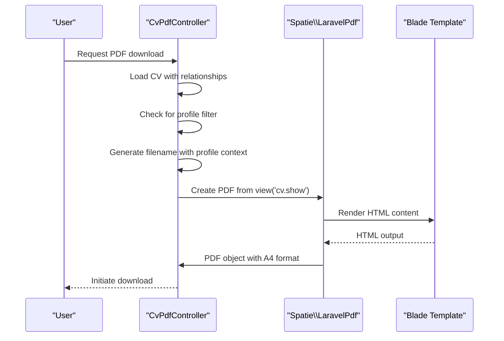
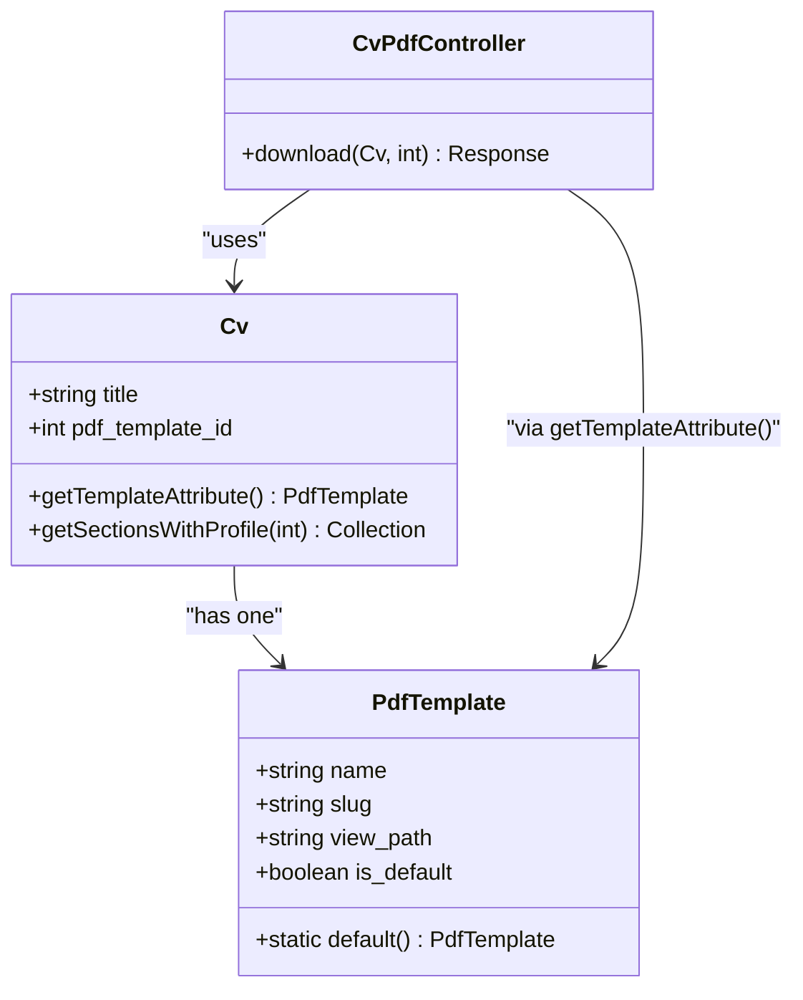

# On-Demand Export

<cite>
**Referenced Files in This Document**   
- [CvPdfController.php](file://app/Http/Controllers/CvPdfController.php)
- [web.php](file://routes/web.php)
- [show.blade.php](file://resources/views/cv/show.blade.php)
- [Cv.php](file://app/Models/Cv.php)
- [PdfTemplate.php](file://app/Models/PdfTemplate.php)
</cite>

## Table of Contents
1. [Introduction](#introduction)
2. [Core Functionality Overview](#core-functionality-overview)
3. [CvPdfController Implementation](#cvpdfcontroller-implementation)
4. [Filename Generation Logic](#filename-generation-logic)
5. [PDF Template Integration](#pdf-template-integration)
6. [Route Configuration](#route-configuration)
7. [Error Handling and Common Issues](#error-handling-and-common-issues)
8. [Performance Optimization](#performance-optimization)
9. [Conclusion](#conclusion)

## Introduction
The on-demand PDF export functionality enables users to generate professional CV documents in PDF format directly from their web application interface. This feature centers around the `CvPdfController` which orchestrates the entire PDF generation process, from data retrieval to file delivery. The system supports customizable templates, profile-based filtering, and standardized naming conventions to ensure consistent and user-friendly output.

## Core Functionality Overview
The PDF export system allows users to initiate CV downloads through a dedicated endpoint that renders the complete CV with all related data into a downloadable PDF file. The process involves loading the CV model with all its relationships, applying template-based styling, and generating a properly formatted A4 document. The system supports optional profile filtering to customize content visibility and ordering based on specific job applications or focus areas.

**Diagram sources**
- [CvPdfController.php](file://app/Http/Controllers/CvPdfController.php#L15-L64)

**Section sources**
- [CvPdfController.php](file://app/Http/Controllers/CvPdfController.php#L15-L64)
- [web.php](file://routes/web.php#L9)
- [show.blade.php](file://resources/views/cv/show.blade.php)

## CvPdfController Implementation
The `CvPdfController::download()` method handles the complete PDF generation workflow. It begins by eager loading all necessary CV relationships including header information, sections, and associated content types. The controller then determines whether to apply profile-based filtering to the sections, which allows for customized CV presentations tailored to specific job applications.

The implementation uses Spatie Laravel-PDF to convert Blade templates into PDF documents, ensuring consistent styling and layout. The generated PDF is automatically formatted to A4 dimensions, which is the standard paper size for professional CVs in most regions.

**Section sources**
- [CvPdfController.php](file://app/Http/Controllers/CvPdfController.php#L15-L64)

## Filename Generation Logic
The filename generation system creates descriptive and organized file names using a consistent pattern: `cv-{slug}-{profile?}-{date}.pdf`. The naming convention incorporates three key elements:

1. **CV Title Slug**: The CV title is converted to a URL-friendly slug using Laravel's `Str::slug()` method
2. **Optional Profile Identifier**: When a profile filter is applied, the profile name is included in the filename
3. **Current Date**: The current date in YYYY-MM-DD format ensures unique filenames across different export dates

This systematic approach prevents filename collisions and makes exported files easily identifiable and sortable by date.

**Section sources**
- [CvPdfController.php](file://app/Http/Controllers/CvPdfController.php#L30-L45)

## PDF Template Integration
The system integrates with Spatie Laravel-PDF to render PDF documents from Blade templates. The template selection process follows a fallback pattern: if a CV has a specific template assigned, that template is used; otherwise, the system defaults to the globally configured default template.

The `Cv` model includes a `getTemplateAttribute()` accessor method that implements this logic, ensuring consistent template resolution throughout the application. Each `PdfTemplate` model contains a `view_path` attribute that specifies which Blade template should be used for rendering, allowing for multiple template designs within the system.

**Diagram sources**
- [Cv.php](file://app/Models/Cv.php#L150-L155)
- [PdfTemplate.php](file://app/Models/PdfTemplate.php#L25-L30)
- [CvPdfController.php](file://app/Http/Controllers/CvPdfController.php#L20-L25)

## Route Configuration
The PDF export functionality is exposed through a RESTful route defined in `web.php`. The route pattern `/cv/{cv}/pdf/{profile?}` accepts a required CV identifier and an optional profile parameter, enabling both standard and profile-filtered exports through the same endpoint.

The route is named `cv.pdf` for easy reference in Laravel's routing system, allowing for convenient URL generation using Laravel's `route()` helper function. This naming convention follows Laravel best practices and ensures consistency with the application's overall routing strategy.

**Section sources**
- [web.php](file://routes/web.php#L9)

## Error Handling and Common Issues
The system may encounter several common issues during PDF generation:

1. **Missing CV Data**: If the requested CV does not exist or has been deleted, Laravel's route model binding will automatically return a 404 response
2. **Template Rendering Failures**: Issues with Blade template syntax or missing relationships can cause rendering errors
3. **Large Content Processing**: CVs with extensive content may exceed memory limits during PDF generation
4. **File System Permissions**: The web server must have write permissions to temporary directories used by the PDF generation library

To mitigate these issues, the application should implement proper validation, error logging, and user feedback mechanisms. The use of eager loading helps prevent N+1 query problems that could impact performance and reliability.

**Section sources**
- [CvPdfController.php](file://app/Http/Controllers/CvPdfController.php#L15-L64)
- [Cv.php](file://app/Models/Cv.php)

## Performance Optimization
For optimal performance when handling large CVs, consider the following recommendations:

1. **Selective Eager Loading**: Only load relationships that are actually used in the template
2. **Caching**: Implement caching for frequently accessed CV data
3. **Memory Management**: Monitor memory usage and adjust PHP limits as needed
4. **Asynchronous Processing**: For very large CVs, consider implementing queued PDF generation
5. **Template Optimization**: Keep Blade templates lean and avoid complex computations in views

The current implementation already uses efficient eager loading patterns and leverages Laravel's built-in optimization features, but additional performance enhancements can be implemented based on specific usage patterns and load requirements.

**Section sources**
- [CvPdfController.php](file://app/Http/Controllers/CvPdfController.php#L15-L64)
- [Cv.php](file://app/Models/Cv.php)

## Conclusion
The on-demand PDF export functionality provides a robust solution for generating professional CV documents from web application data. By leveraging Laravel's ecosystem and the Spatie Laravel-PDF package, the system delivers high-quality PDF outputs with customizable templates and flexible configuration options. The implementation follows Laravel best practices for routing, controller design, and model relationships, ensuring maintainability and scalability as the application grows.