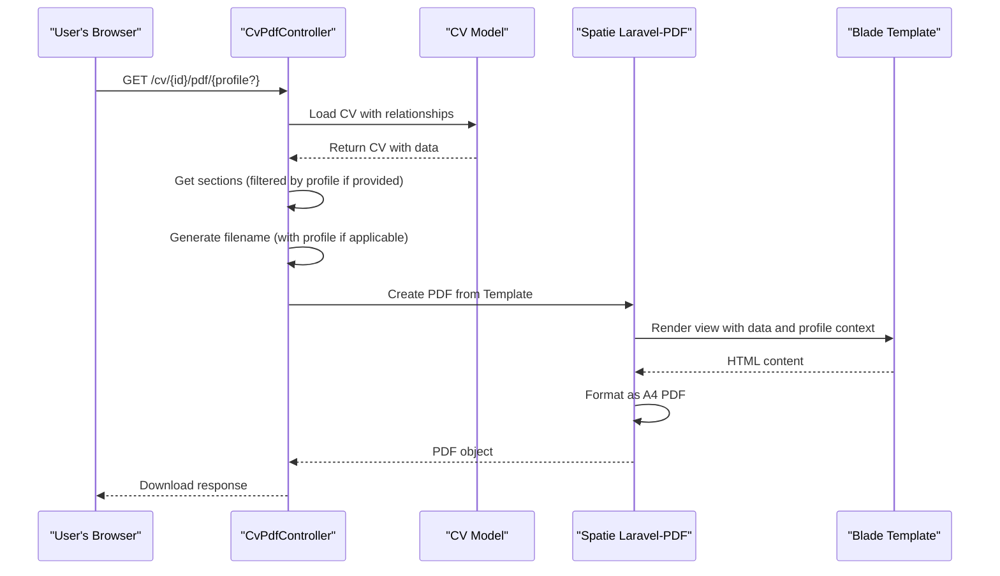

# On-Demand PDF Export

<cite>
**Referenced Files in This Document**   
- [CvPdfController.php](file://app/Http/Controllers/CvPdfController.php) - *Updated with profile filtering in commit 28c598b*
- [show.blade.php](file://resources/views/cv/show.blade.php) - *Updated for profile display in commit 28c598b*
- [web.php](file://routes/web.php) - *Updated route with profile parameter in commit 28c598b*
- [Cv.php](file://app/Models/Cv.php) - *Added profile methods in commit 28c598b*
- [SectionFocusProfile.php](file://app/Models/SectionFocusProfile.php) - *Added in Phase 3 implementation*
</cite>

## Update Summary
**Changes Made**   
- Updated PDF generation process to include profile-based section filtering and reordering
- Enhanced filename generation logic to include profile name when applicable
- Added profile context to PDF rendering process
- Updated controller flow example with new profile parameter
- Added new section on Section Focus Profiles
- Updated common issues and configuration tips with profile considerations

## Table of Contents
1. [Introduction](#introduction)
2. [PDF Generation Process](#pdf-generation-process)
3. [Section Focus Profiles](#section-focus-profiles)
4. [Filename Generation Logic](#filename-generation-logic)
5. [PDF Rendering and Download](#pdf-rendering-and-download)
6. [Controller Flow Example](#controller-flow-example)
7. [Common Issues and Solutions](#common-issues-and-solutions)
8. [Configuration Tips](#configuration-tips)

## Introduction
The on-demand PDF export feature enables users to generate professional PDF versions of their CVs directly from the application interface. This functionality is implemented through the `CvPdfController` which handles PDF generation requests by loading the complete CV with all related sections and rendering them using the Spatie Laravel-PDF package. The system generates downloadable PDFs with proper formatting, filename conventions, and styling preservation.

A key enhancement allows users to apply **Section Focus Profiles** that filter and reorder CV sections based on specific job applications or career focuses. This enables tailored CV exports without modifying the original CV structure.

**Section sources**
- [CvPdfController.php](file://app/Http/Controllers/CvPdfController.php)
- [Cv.php](file://app/Models/Cv.php)

## PDF Generation Process

The PDF generation process begins when a user requests to download their CV as a PDF. The `CvPdfController::download()` method handles this request by first loading the CV model with all its related sections and data. The controller uses eager loading to retrieve all necessary relationships in a single query, ensuring that the complete CV content is available for rendering.

The process involves loading the following relationships:
- Header information (contact details, job title, etc.)
- Summary section
- Skill categories and associated skills
- Work experiences with highlights
- Projects with descriptions and technologies
- Education history
- References
- Custom sections

This comprehensive data loading ensures that the generated PDF contains all the information present in the CV, properly structured and formatted according to the application's design. When a profile parameter is provided, the sections are filtered and reordered according to the specified profile's configuration.

**Section sources**
- [CvPdfController.php](file://app/Http/Controllers/CvPdfController.php#L8-L15)
- [Cv.php](file://app/Models/Cv.php#L123-L146)

## Section Focus Profiles

Section Focus Profiles allow users to create named presets for CV section ordering and visibility without modifying the original CV structure. These profiles enable tailored CV exports for different job applications or career focuses.

### Profile Structure
Each profile contains:
- **Name**: Descriptive name (e.g., "Frontend Focus", "Backend Focus")
- **Included Section IDs**: Array of section IDs to include in the filtered view
- **Section Order**: Array specifying the display order of included sections

### Profile Application
When generating a PDF with a profile:
1. Sections are filtered to only those in the profile's `included_section_ids`
2. Remaining sections are ordered according to the profile's `section_order`
3. The original CV structure remains unchanged (non-destructive)

### Use Cases
- Creating a "Frontend Focus" CV that emphasizes projects and skills relevant to frontend roles
- Generating a "Management Focus" version that highlights leadership experience
- Producing a "Full Stack Focus" variant that balances all sections equally

Profiles are managed through the Filament admin interface and can be applied during PDF export via the optional profile parameter.

**Section sources**
- [SectionFocusProfile.php](file://app/Models/SectionFocusProfile.php)
- [Cv.php](file://app/Models/Cv.php#L148-L175)
- [CvPdfController.php](file://app/Http/Controllers/CvPdfController.php#L17-L22)

## Filename Generation Logic

The system implements a consistent filename generation pattern for exported PDFs. The filename follows the format `cv-{slug}-{profile?}-{date}.pdf`, where:

- `{slug}` is a URL-friendly version of the CV title, generated using Laravel's `Str::slug()` helper
- `{profile}` is an optional URL-friendly version of the profile name (included only when a profile is applied)
- `{date}` is the current date in YYYY-MM-DD format

For example:
- A CV titled "Senior Developer - StickyPiston" created on October 15, 2025: `cv-senior-developer-stickypiston-2025-10-15.pdf`
- The same CV with a "frontend-focus" profile: `cv-senior-developer-stickypiston-frontend-focus-2025-10-15.pdf`

This naming convention provides immediate context about the CV's purpose, focus, and creation date, making it easy to identify and organize exported files. The slug generation removes special characters and converts spaces to hyphens, ensuring compatibility across different operating systems and file systems.

**Section sources**
- [CvPdfController.php](file://app/Http/Controllers/CvPdfController.php#L30-L42)

## PDF Rendering and Download

The PDF rendering process uses the Spatie Laravel-PDF package to convert the Blade template into a properly formatted PDF document. The system renders the `cv.show` Blade template, which is specifically designed for PDF output with Tailwind CSS styling.

Key aspects of the PDF rendering process include:
- A4 page format specification
- Proper font loading and embedding
- Preservation of Tailwind CSS styling
- Direct browser download without intermediate file storage
- Optional profile name display in the header

The generated PDF is served directly to the user's browser as a download, with the appropriate content type headers set to trigger the download dialog. This approach eliminates the need for temporary file storage on the server and provides a seamless user experience.

When a profile is applied, the PDF displays the profile focus in the header section, indicating the tailored nature of the document.

**Section sources**
- [CvPdfController.php](file://app/Http/Controllers/CvPdfController.php#L44-L53)
- [show.blade.php](file://resources/views/cv/show.blade.php#L25-L35)

## Controller Flow Example

The `CvPdfController::download()` method follows a clear and efficient flow:

1. Receive the CV model and optional profile ID as route parameters
2. Eager load all necessary relationships for complete CV data
3. Get sections filtered and reordered by profile (if profile provided), otherwise get all sections
4. Get skills with evidence count for potential display
5. Generate a descriptive filename using the CV title, profile name (if applicable), and current date
6. Render the CV using the Blade template with Spatie Laravel-PDF, passing profile context
7. Configure the PDF format as A4
8. Set the filename for the download
9. Return the PDF response directly to the browser

This flow ensures that the PDF generation process is both efficient and reliable, providing users with a professional-quality CV export in a consistent format.

**Diagram sources**
- [CvPdfController.php](file://app/Http/Controllers/CvPdfController.php#L8-L53)
- [web.php](file://routes/web.php#L10)

**Section sources**
- [CvPdfController.php](file://app/Http/Controllers/CvPdfController.php#L8-L53)

## Common Issues and Solutions

### Missing Tailwind Styling in PDF Output
One common issue is the absence of Tailwind CSS styling in the generated PDF. This typically occurs when the Tailwind CSS is loaded from a CDN in the Blade template. To resolve this:

1. Ensure the Tailwind CSS is properly loaded in the Blade template
2. Use the `tailwind.config.js` file to generate a custom CSS file
3. Include the compiled CSS file in the Blade template rather than relying on CDN
4. Verify that the `tailwind.config.js` includes all necessary classes used in the PDF template

### Font Loading Problems
Font loading issues can result in missing or substituted fonts in the PDF. Solutions include:

1. Use web-safe fonts that are likely to be available on the server
2. Embed custom fonts in the PDF generation process
3. Specify fallback fonts in the CSS
4. Preload fonts in the Blade template
5. Ensure the Poppins font is properly loaded from Google Fonts as specified in the template

### Memory Limits During PDF Generation
Large CVs with extensive content may exceed PHP's memory limit during PDF generation. Mitigation strategies:

1. Increase PHP memory limit in `php.ini` or at runtime
2. Optimize the Blade template to reduce complexity
3. Implement pagination for very long CVs
4. Use streaming PDF generation for large documents
5. Consider the impact of profile filtering on memory usage

**Section sources**
- [CvPdfController.php](file://app/Http/Controllers/CvPdfController.php)
- [show.blade.php](file://resources/views/cv/show.blade.php)

## Configuration Tips

### Optimizing PDF Appearance
To enhance the visual quality of generated PDFs:

1. Use the `@page` CSS rule to control margins and page size
2. Set `print-color-adjust: exact` to preserve colors
3. Use relative units (em, rem) for better scaling
4. Test the PDF output with different content lengths
5. Ensure the accent color (#0369a1) is consistently applied across elements

### Performance Optimization
For improved PDF generation performance:

1. Cache frequently used CV data when possible
2. Optimize database queries with proper indexing
3. Use efficient CSS selectors in the Blade template
4. Minimize external resource loading in the template
5. Consider the performance impact of profile-based filtering on large CVs

### Spatie Laravel-PDF Configuration
The Spatie Laravel-PDF package can be configured in `config/pdf.php` to customize:

1. Default paper size and orientation
2. Font settings and embedding options
3. Header and footer content
4. Security settings for the generated PDF

These configuration options allow fine-tuning of the PDF output to meet specific requirements while maintaining consistency across all generated documents.

**Section sources**
- [CvPdfController.php](file://app/Http/Controllers/CvPdfController.php)
- [show.blade.php](file://resources/views/cv/show.blade.php)