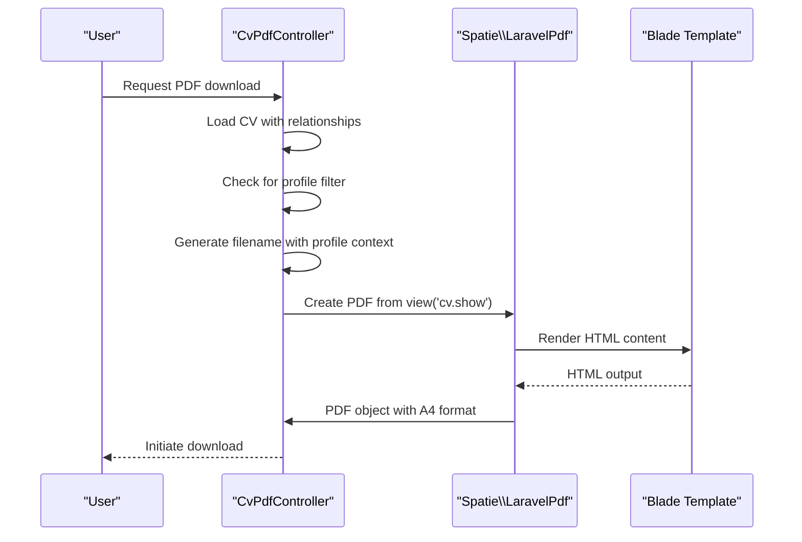
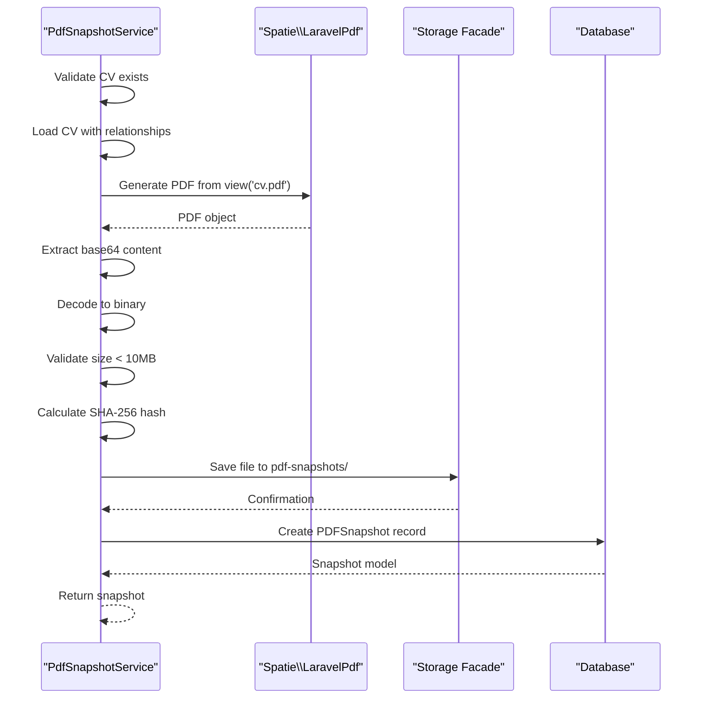

# PDF Configuration

<cite>
**Referenced Files in This Document**   
- [CvPdfController.php](file://app/Http/Controllers/CvPdfController.php) - *Updated to support profile-based filtering and enhanced filename structure*
- [PdfSnapshotService.php](file://app/Services/PdfSnapshotService.php) - *Updated with PDF size validation and improved storage handling*
- [services.php](file://config/services.php)
- [filesystems.php](file://config/filesystems.php)
- [cv.pdf.blade.php](file://resources/views/cv/pdf.blade.php) - *Updated with basic styling for snapshot generation*
- [show.blade.php](file://resources/views/cv/show.blade.php) - *Enhanced with Tailwind CSS and profile-specific styling*
- [SectionFocusProfile.php](file://app/Models/SectionFocusProfile.php) - *New model for CV section profiles*
- [Cv.php](file://app/Models/Cv.php) - *Updated with getSectionsWithProfile method*
</cite>

## Update Summary
**Changes Made**   
- Updated **On-Demand PDF Generation in CvPdfController** section to reflect profile-based filtering and improved filename structure
- Added **Profile-Based PDF Customization** section to document new profile filtering functionality
- Enhanced **Preserving Tailwind CSS in PDFs** section with details about profile-specific styling
- Updated **Default PDF Settings** with accurate paper size and orientation details
- Added **PDF Size Validation** subsection under Performance Considerations
- Updated all file references with proper annotations indicating recent changes

## Table of Contents
1. [Introduction](#introduction)
2. [PDF Service Configuration](#pdf-service-configuration)
3. [Default PDF Settings](#default-pdf-settings)
4. [On-Demand PDF Generation in CvPdfController](#on-demand-pdf-generation-in-cvpdfcontroller)
5. [Profile-Based PDF Customization](#profile-based-pdf-customization)
6. [PDF Snapshot Generation in PdfSnapshotService](#pdf-snapshot-generation-in-pdfsnapshotservice)
7. [Customizing PDF Output](#customizing-pdf-output)
8. [Preserving Tailwind CSS in PDFs](#preserving-tailwind-css-in-pdfs)
9. [Handling Custom Fonts](#handling-custom-custom-fonts)
10. [Performance Considerations](#performance-considerations)
11. [Conclusion](#conclusion)

## Introduction
This document details the PDF configuration and generation system in the CV Builder application, focusing on the Spatie Laravel-PDF integration. The system supports both on-demand PDF exports through the `CvPdfController` and automated snapshot generation via the `PdfSnapshotService`. The configuration leverages Laravel's service container to manage PDF rendering with consistent default settings while allowing customization for different use cases. Recent updates have enhanced the system with profile-based filtering and improved filename structuring.

## PDF Service Configuration
The Spatie Laravel-PDF package is integrated into the Laravel service container through the `PdfServiceProvider`, which is registered in the application's service provider list. This ensures that the PDF functionality is available throughout the application without requiring manual instantiation.

The service provider is automatically loaded as part of the application's bootstrap process, making the `Pdf` facade available for use in controllers and services. The configuration follows Laravel's standard service provider pattern, allowing for seamless integration with the framework's dependency injection system.

**Section sources**
- [services.php](file://config/services.php#L44)

## Default PDF Settings
The application uses consistent default settings for all PDF generation operations. By default, all PDFs are generated in A4 format with portrait orientation and standard margins. The default configuration includes:

- **Paper Size**: A4 (210 × 297 mm)
- **Orientation**: Portrait
- **DPI**: Standard web resolution with high-quality rendering
- **Margins**: Default browser margins
- **Format**: PDF 1.7 specification

These defaults are applied consistently across both on-demand exports and snapshot generation, ensuring uniform output quality and formatting. The settings can be overridden programmatically when specific requirements call for different configurations.

## On-Demand PDF Generation in CvPdfController
The `CvPdfController` handles user-initiated PDF downloads, providing a direct way to export CVs in PDF format. When a user requests a PDF download, the controller loads the complete CV data with all related sections and renders it using a Blade template.

The PDF generation process in `CvPdfController` follows these steps:
1. Eager load all CV relationships to ensure complete data is available
2. Generate a descriptive filename using the CV title, optional profile name, and current date
3. Render the PDF using the `cv.show` Blade template
4. Apply A4 format and initiate download with the generated filename

The controller uses the `Pdf` facade to create the PDF from a Blade view, specifying the format as A4 and setting the appropriate download name. A key enhancement allows for optional profile filtering through the `$profile` parameter.



**Diagram sources**
- [CvPdfController.php](file://app/Http/Controllers/CvPdfController.php#L15-L64)

**Section sources**
- [CvPdfController.php](file://app/Http/Controllers/CvPdfController.php#L15-L64)
- [web.php](file://routes/web.php#L9)
- [show.blade.php](file://resources/views/cv/show.blade.php)

## Profile-Based PDF Customization
A recent enhancement to the PDF generation system introduces profile-based filtering and customization. The `CvPdfController` now accepts an optional profile parameter that allows users to generate PDFs with specific section filtering and ordering based on predefined profiles.

When a profile ID is provided:
- The controller retrieves the corresponding `SectionFocusProfile`
- The profile's `included_section_ids` and `section_order` determine which sections to include and their display order
- The filename incorporates the profile name for easy identification
- The generated PDF displays a visual indicator showing which profile was applied

This feature enables users to create tailored CV versions for different job applications without modifying the original CV structure. The profile system is non-destructive, allowing users to preview different configurations before sending applications.

**Section sources**
- [CvPdfController.php](file://app/Http/Controllers/CvPdfController.php#L26-L48)
- [Cv.php](file://app/Models/Cv.php#L118-L121)
- [SectionFocusProfile.php](file://app/Models/SectionFocusProfile.php#L8-L28)

## PDF Snapshot Generation in PdfSnapshotService
The `PdfSnapshotService` handles automated PDF generation for job applications, creating permanent snapshots that are stored and versioned. Unlike the on-demand approach, these snapshots are saved to the filesystem and referenced in the database for future access.

The snapshot generation process includes:
1. Validation that the job application has an associated CV
2. Loading the CV with all necessary relationships
3. Generating a PDF using the `cv.pdf` Blade template
4. Extracting the binary content from the generated PDF
5. Calculating a SHA-256 hash for content verification
6. Validating PDF size (maximum 10MB)
7. Storing the PDF file with a hash-based filename
8. Creating a database record to track the snapshot

The service uses Laravel's Storage facade to save files to the local disk, with the storage path configured in the filesystem settings. Each snapshot is uniquely identified by its hash, preventing duplicate storage of identical content. A new size validation step prevents excessive storage usage.



**Diagram sources**
- [PdfSnapshotService.php](file://app/Services/PdfSnapshotService.php#L9-L71)

**Section sources**
- [PdfSnapshotService.php](file://app/Services/PdfSnapshotService.php#L9-L71)
- [filesystems.php](file://config/filesystems.php#L10-L18)
- [pdf.blade.php](file://resources/views/cv/pdf.blade.php)
- [PDFSnapshot.php](file://app/Models/PDFSnapshot.php#L20)

## Customizing PDF Output
The PDF generation system supports customization of various output parameters through method chaining on the `Pdf` facade. Developers can modify paper size, orientation, and other formatting options as needed.

### Paper Size and Orientation
To generate a PDF in landscape orientation or with a different paper size, use the appropriate methods:

```php
// Landscape A4
Pdf::view('cv.show', $data)->format('a4')->landscape()

// Letter size in portrait
Pdf::view('cv.show', $data)->format('letter')

// Legal size in landscape
Pdf::view('cv.show', $data)->format('legal')->landscape()
```

### Custom Margins
Custom margins can be applied using the `margin()` method:

```php
Pdf::view('cv.show', $data)
    ->format('a4')
    ->margin(20, 15, 20, 15) // top, right, bottom, left in mm
```

### Custom Filenames
The filename for downloaded PDFs can be customized using the `name()` method, as demonstrated in the `CvPdfController` which generates filenames based on the CV title, optional profile name, and current date.

## Preserving Tailwind CSS in PDFs
The application preserves Tailwind CSS styling in generated PDFs by ensuring that all necessary CSS is included in the rendered HTML before conversion. The Blade templates (`cv.show.blade.php` and `cv.pdf.blade.php`) include the compiled CSS assets, which are then processed by the underlying PDF engine.

To ensure consistent styling:
- All Tailwind classes are pre-rendered to their CSS equivalents
- External stylesheets are fully loaded before PDF generation
- No dynamic CSS loading occurs after page render
- The PDF engine captures the final rendered state of the HTML

The `cv.show.blade.php` template uses Tailwind CSS with a custom configuration that includes a specific accent color for consistent branding. When a profile is applied, the template displays a visual indicator showing the profile focus, enhancing the tailored appearance of the CV.

This approach ensures that the visual design created with Tailwind CSS is accurately preserved in the PDF output, maintaining the application's design system across both web and document formats.

## Handling Custom Fonts
Custom fonts are supported through standard CSS `@font-face` rules in the application's stylesheet. The PDF generation process respects these font declarations, embedding the specified fonts in the output document.

To use custom fonts:
1. Define the font in the application's CSS file
2. Reference the font in Tailwind configuration or CSS classes
3. Ensure the font files are accessible to the PDF rendering engine

The current implementation uses the Poppins font family, loaded from Google Fonts, which is reliably rendered across different environments, ensuring consistent appearance regardless of the viewer's system fonts.

## Performance Considerations
Generating PDFs, especially for large CVs with extensive content, can be resource-intensive. The application addresses performance through several strategies:

### Memory Management
- Relationship data is eager-loaded to minimize database queries
- Large datasets are processed efficiently without unnecessary duplication
- The PDF generation process is optimized to handle the complete CV structure

### Caching Strategy
The `PdfSnapshotService` implements an effective caching mechanism through content hashing. By calculating a SHA-256 hash of the PDF content, the system can detect identical snapshots and avoid redundant storage. This reduces disk usage and improves retrieval performance for frequently generated snapshots.

### PDF Size Validation
To prevent excessive storage usage and performance issues, the system implements PDF size validation:
- Maximum PDF size is limited to 10MB
- Size validation occurs before file storage
- Users receive clear error messages if content exceeds limits
- The limit can be configured in the service class if needed

### Processing Efficiency
- PDF generation is performed synchronously but optimized for speed
- Binary content is handled efficiently using base64 encoding/decoding
- File operations are minimized through direct storage after generation

For applications with high PDF generation volumes, consider implementing queue-based processing to offload intensive operations from the main request cycle.

## Conclusion
The PDF configuration in the CV Builder application provides a robust system for generating high-quality PDF documents from CV data. By leveraging Spatie Laravel-PDF, the application ensures consistent formatting across both on-demand exports and automated snapshots. The system is configurable, allowing for customization of paper size, orientation, and other formatting options while preserving the application's Tailwind CSS styling. Recent enhancements include profile-based filtering for tailored CV versions and improved filename structuring. Performance is optimized through efficient data loading, a hashing-based deduplication system for snapshots, and PDF size validation, making it suitable for both user-facing exports and backend processing requirements.