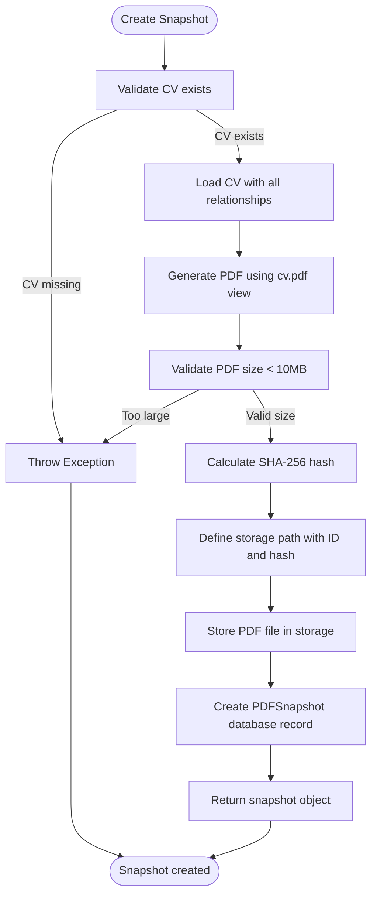
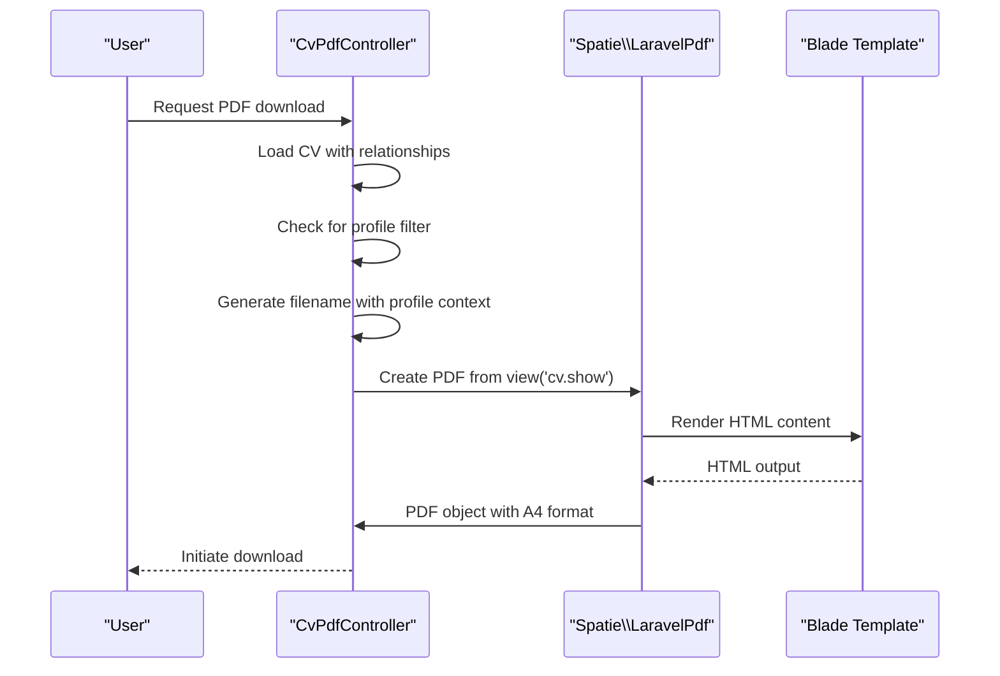
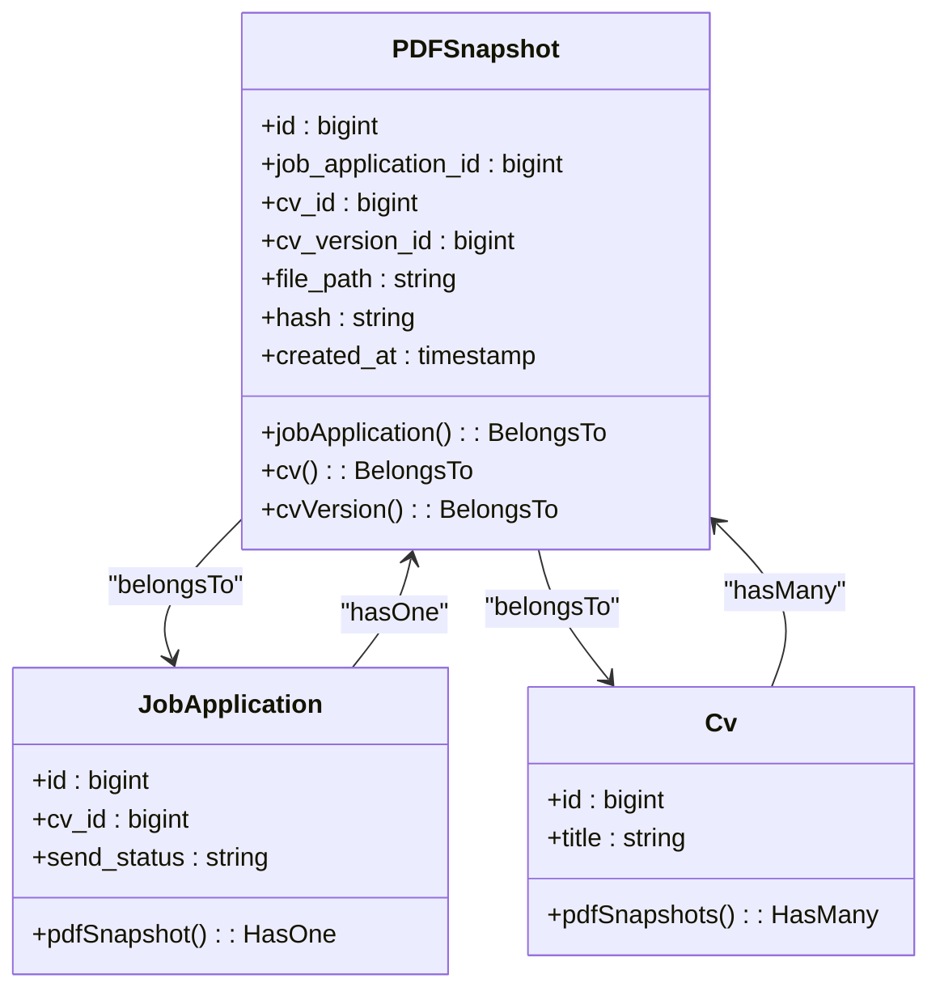
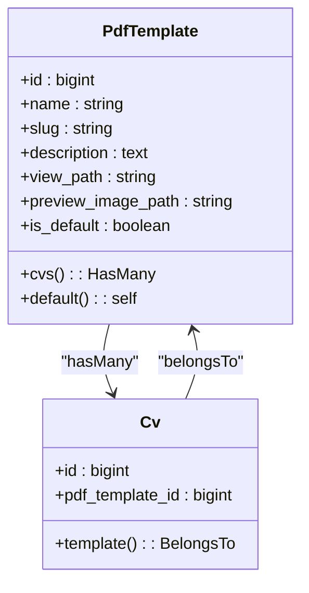
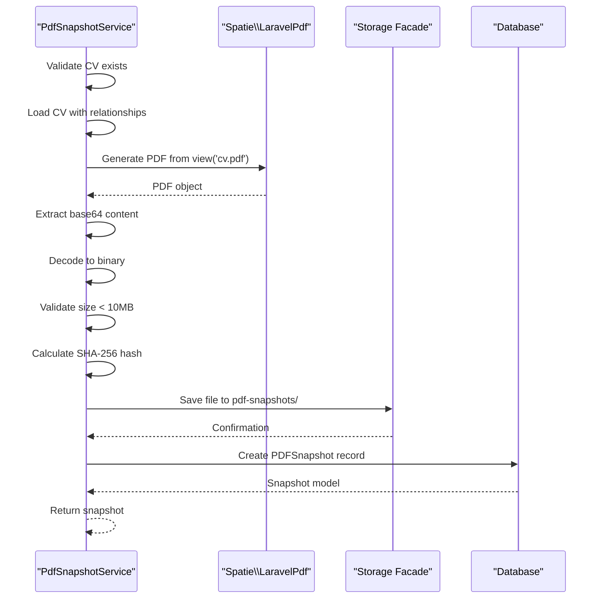
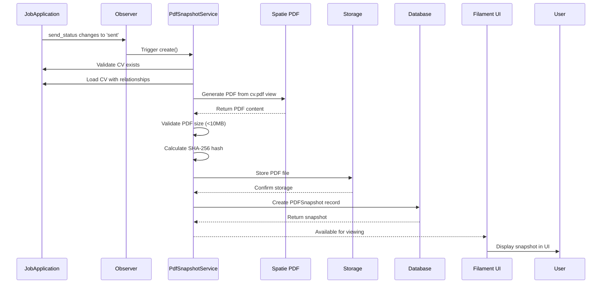

# PDF Generation

<cite>
**Referenced Files in This Document**   
- [PDFSnapshot.php](file://app/Models/PDFSnapshot.php)
- [PdfSnapshotService.php](file://app/Services/PdfSnapshotService.php)
- [CvPdfController.php](file://app/Http/Controllers/CvPdfController.php)
- [JobApplicationObserver.php](file://app/Observers/JobApplicationObserver.php)
- [pdf.blade.php](file://resources/views/cv/pdf.blade.php)
- [default.blade.php](file://resources/views/cv/templates/default.blade.php)
- [classic.blade.php](file://resources/views/cv/templates/classic.blade.php)
- [modern.blade.php](file://resources/views/cv/templates/modern.blade.php)
- [PdfTemplate.php](file://app/Models/PdfTemplate.php)
- [filesystems.php](file://config/filesystems.php)
- [JobApplication.php](file://app/Models/JobApplication.php)
</cite>

## Table of Contents
1. [PDF Snapshot Creation with Integrity Verification](#pdf-snapshot-creation-with-integrity-verification)
2. [On-Demand PDF Export Feature](#on-demand-pdf-export-feature)
3. [PDF Snapshot Model and Relationships](#pdf-snapshot-model-and-relationships)
4. [Template Selection and Customization](#template-selection-and-customization)
5. [File Storage and Retrieval Mechanism](#file-storage-and-retrieval-mechanism)
6. [Performance Considerations](#performance-considerations)
7. [Error Handling Strategies](#error-handling-strategies)
8. [Application Lifecycle Integration](#application-lifecycle-integration)

## PDF Snapshot Creation with Integrity Verification

The PdfSnapshotService is responsible for creating immutable PDF versions of CVs with cryptographic integrity verification. This service ensures that when a job application is marked as "sent", a verifiable snapshot of the CV is permanently preserved.

The service implements a robust workflow that begins with validating the presence of an associated CV. Once validated, it eagerly loads the complete CV with all related sections, experiences, education, skills, and other content to ensure the PDF reflects the exact state of the CV at submission time.

A critical component of the integrity verification process is the calculation of a SHA-256 hash of the generated PDF content. This cryptographic hash serves as a digital fingerprint that can be used to verify the file's integrity at any point in the future. The hash is calculated from the binary PDF content after generation and before storage.



**Diagram sources**
- [PdfSnapshotService.php](file://app/Services/PdfSnapshotService.php#L9-L71)

**Section sources**
- [PdfSnapshotService.php](file://app/Services/PdfSnapshotService.php#L9-L71)

## On-Demand PDF Export Feature

The CvPdfController provides an on-demand PDF export feature that allows users to generate and download PDF versions of their CVs at any time. This controller handles user-initiated requests for PDF downloads and orchestrates the generation process using Laravel's PDF rendering capabilities.

When a user requests a PDF export, the controller first loads the complete CV with all its relationships, including header information, sections, skills, experiences, and education. It then determines the appropriate template to use for rendering, either the user's selected template or the default template if none is selected.

The controller generates a descriptive filename that includes the CV title, optional profile name, and current date to ensure uniqueness and provide context. The PDF is rendered using the selected Blade template with A4 format specifications before being delivered as a downloadable response to the user.



**Diagram sources**
- [CvPdfController.php](file://app/Http/Controllers/CvPdfController.php#L15-L64)

**Section sources**
- [CvPdfController.php](file://app/Http/Controllers/CvPdfController.php#L15-L64)

## PDF Snapshot Model and Relationships

The PDFSnapshot model represents an immutable record of a CV exported as a PDF for a job application. It serves as the data backbone for the PDF snapshot system, storing metadata and references that enable verification and retrieval.

The model has a one-to-one relationship with the JobApplication model, ensuring that each job application can have at most one PDF snapshot. This relationship is enforced at the database level with a unique constraint on the job_application_id field. The model also maintains a belongs-to relationship with the CV model, preserving a reference to the CV that was used to generate the snapshot.

Key attributes of the PDFSnapshot model include the file_path, which stores the relative storage path of the PDF file, and the hash field, which contains the SHA-256 hash of the PDF content for integrity verification. The created_at timestamp records when the snapshot was generated, providing an audit trail of submission events.



**Diagram sources**
- [PDFSnapshot.php](file://app/Models/PDFSnapshot.php#L1-L44)
- [JobApplication.php](file://app/Models/JobApplication.php#L1-L122)
- [Cv.php](file://app/Models/Cv.php#L1-L342)

**Section sources**
- [PDFSnapshot.php](file://app/Models/PDFSnapshot.php#L1-L44)

## Template Selection and Customization

The PDF generation system supports template selection and customization through the PdfTemplate model and associated Blade templates. Users can select from multiple predefined templates or rely on the default template for rendering their CVs as PDFs.

The PdfTemplate model stores metadata about each available template, including its name, description, view_path, and whether it is the default template. The view_path attribute specifies the Blade template file to use when generating PDFs with that template. Three primary templates are available: default, classic, and modern, each offering distinct styling and layout approaches.

When generating a PDF, the system first checks if a specific template is selected for the CV. If no template is selected, it falls back to the default template. This allows users to maintain consistent branding across their applications while providing flexibility for different contexts or preferences.



**Diagram sources**
- [PdfTemplate.php](file://app/Models/PdfTemplate.php#L1-L35)
- [Cv.php](file://app/Models/Cv.php#L1-L342)

**Section sources**
- [PdfTemplate.php](file://app/Models/PdfTemplate.php#L1-L35)

## File Storage and Retrieval Mechanism

The PDF generation system implements a structured file storage and retrieval mechanism that ensures both security and integrity. PDF files are stored in the local disk configuration defined in the filesystems.php configuration file, specifically in the private storage directory.

Files are stored with a deterministic naming convention that incorporates both the job application ID and the SHA-256 hash of the PDF content: `pdf-snapshots/{job_application_id}_{hash}.pdf`. This pattern provides several benefits: predictable file locations, built-in integrity verification through the filename, prevention of duplicate files, and easy identification of the source application.

The retrieval process is handled through Laravel's Storage facade, which abstracts the underlying file system operations. When a user requests to download a PDF snapshot, the system verifies the user's permissions, confirms the file exists in storage, and streams the file to the user with the appropriate MIME type. No temporary files are created on the server during this process.



**Diagram sources**
- [PdfSnapshotService.php](file://app/Services/PdfSnapshotService.php#L9-L71)
- [filesystems.php](file://config/filesystems.php#L10-L18)

**Section sources**
- [PdfSnapshotService.php](file://app/Services/PdfSnapshotService.php#L9-L71)
- [filesystems.php](file://config/filesystems.php#L10-L18)

## Performance Considerations

The PDF generation system includes several performance considerations to ensure efficient operation, particularly when generating large numbers of PDFs. The system is designed to handle the computational intensity of PDF rendering while maintaining responsiveness and preventing resource exhaustion.

A key performance optimization is the 10MB file size limit imposed on generated PDFs. This limit prevents storage exhaustion and ensures that PDFs remain manageable in size for both storage and transmission. The validation occurs after PDF generation but before storage, allowing the system to reject oversized files without consuming storage space.

The system employs eager loading of CV relationships to minimize database queries during PDF generation. By loading all necessary data in a single query, the system reduces the N+1 query problem that could significantly impact performance when rendering complex CVs with many sections and related entities.

Database indexing on the hash field enables fast duplicate detection and verification operations. This optimization is particularly important for the hash verification feature, which needs to quickly compare stored hashes with recalculated values from file content.

**Section sources**
- [PdfSnapshotService.php](file://app/Services/PdfSnapshotService.php#L9-L71)

## Error Handling Strategies

The PDF generation system implements comprehensive error handling strategies to ensure reliability and provide meaningful feedback when issues occur. The system follows a fail-safe approach that prioritizes the completion of primary operations while gracefully handling PDF generation failures.

In the JobApplicationObserver, PDF snapshot creation is wrapped in a try-catch block that logs errors but does not prevent the job application update from completing. This ensures that users can still mark applications as "sent" even if PDF generation fails temporarily due to issues like template rendering errors or storage problems.

The PdfSnapshotService validates critical conditions before proceeding with PDF generation. It checks for the presence of an associated CV and validates the PDF size before storage. If any validation fails, it throws descriptive exceptions that can be caught and handled by calling components.

For file integrity verification, the system provides a hash verification feature that recalculates the SHA-256 hash of the stored PDF content and compares it with the stored hash value. Discrepancies trigger appropriate error notifications, alerting users to potential file corruption or tampering.

```mermaid
flowchart TD
A[Job Application Updated] --> B{send_status changed?}
B --> |No| C[Exit]
B --> |Yes| D{send_status = 'sent'?}
D --> |No| C
D --> |Yes| E{Snapshot exists?}
E --> |Yes| C
E --> |No| F[Call PdfSnapshotService::create()]
F --> G{Success?}
G --> |Yes| H[Continue]
G --> |No| I[Log error]
I --> J[Continue application flow]
```

**Diagram sources**
- [JobApplicationObserver.php](file://app/Observers/JobApplicationObserver.php#L24-L35)

**Section sources**
- [JobApplicationObserver.php](file://app/Observers/JobApplicationObserver.php#L1-L42)

## Application Lifecycle Integration

PDF snapshots are deeply integrated into the job application lifecycle, particularly at the point of submission. The system automatically creates PDF snapshots when job applications are marked as "sent" through an observer pattern that listens for model events.

The JobApplicationObserver monitors the "updated" event on the JobApplication model and triggers PDF snapshot creation when the send_status changes from "draft" to "sent" and no existing snapshot is present. This automation ensures that every submitted application has a verifiable record of the CV content at the time of submission.

This integration serves multiple purposes: it provides proof of submission, preserves the exact state of the CV for future reference, and enables verification of application materials. The immutable nature of the snapshots means that even if a user later modifies their CV, the original version submitted with the application remains preserved and verifiable.

The system also supports manual PDF generation through the CvPdfController, allowing users to export their CVs at any point in the creation process. This on-demand capability complements the automated snapshot creation, giving users flexibility in how and when they generate PDF versions of their CVs.



**Diagram sources**
- [PdfSnapshotService.php](file://app/Services/PdfSnapshotService.php)
- [JobApplicationObserver.php](file://app/Observers/JobApplicationObserver.php)
- [pdf.blade.php](file://resources/views/cv/pdf.blade.php)

**Section sources**
- [JobApplicationObserver.php](file://app/Observers/JobApplicationObserver.php#L1-L42)
- [PdfSnapshotService.php](file://app/Services/PdfSnapshotService.php#L9-L71)