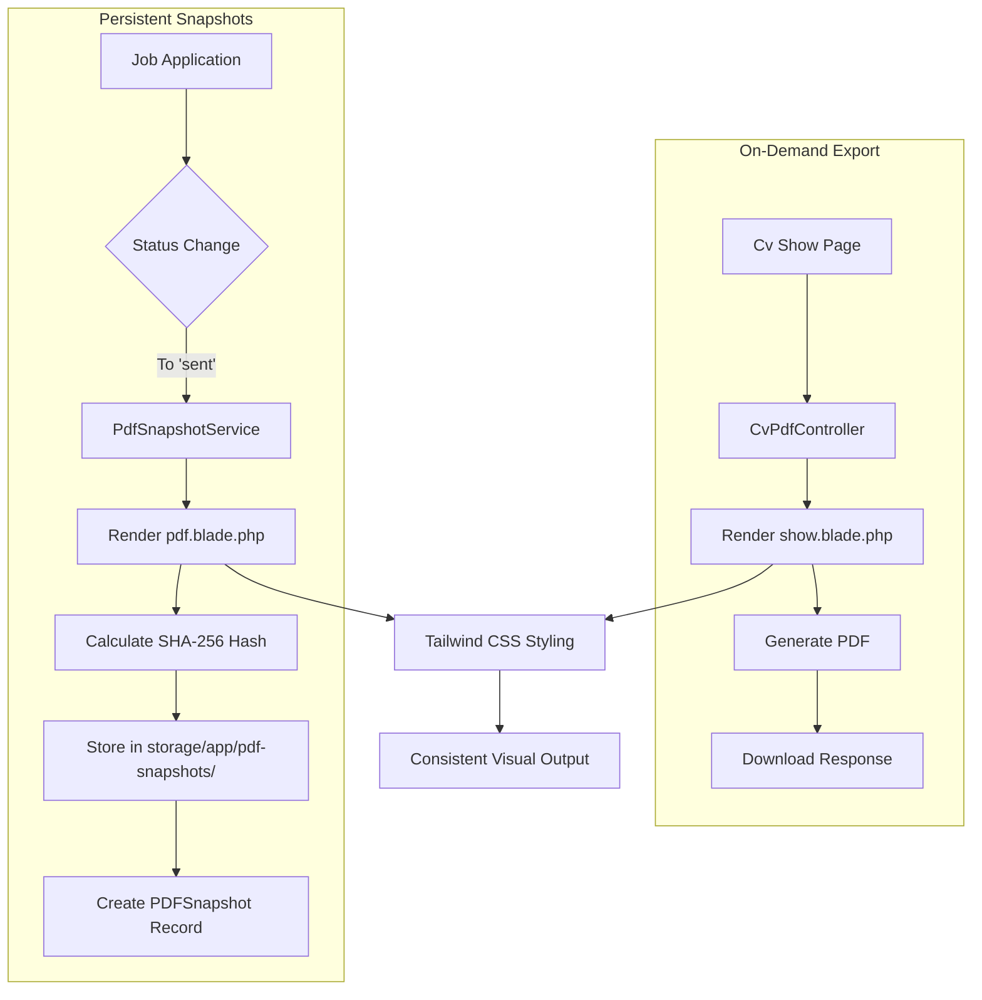
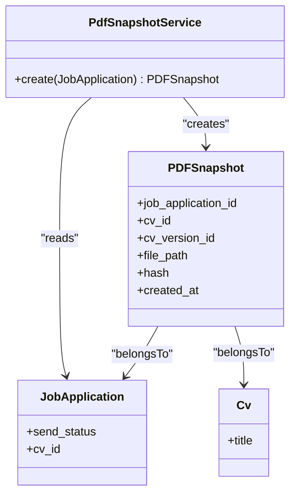
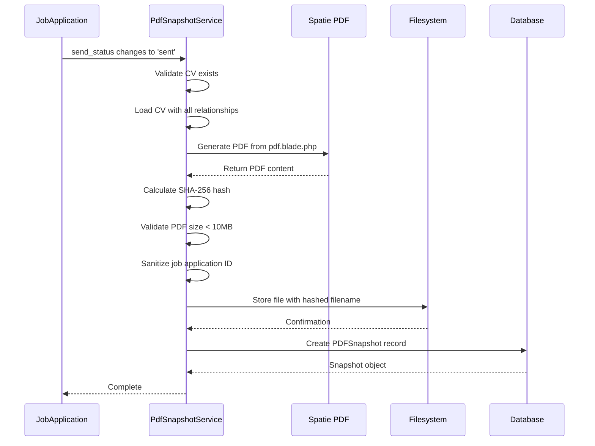
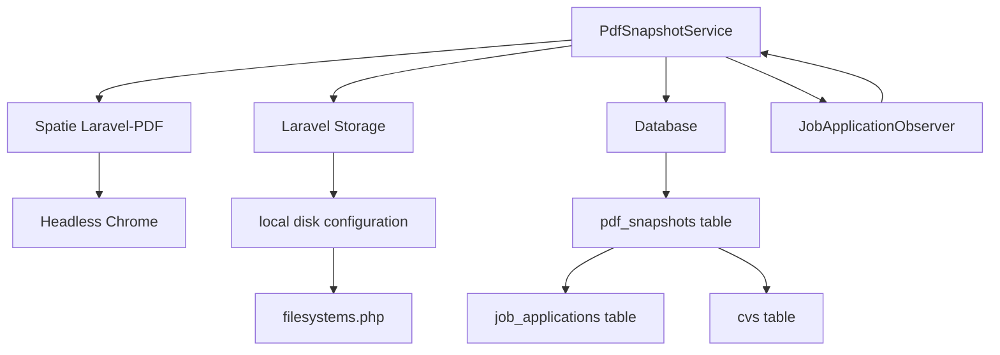

# PDF Generation

<cite>
**Referenced Files in This Document**   
- [CvPdfController.php](file://app/Http/Controllers/CvPdfController.php) - *Updated with profile filtering and enhanced filename structure*
- [PdfSnapshotService.php](file://app/Services/PdfSnapshotService.php) - *Updated with PDF size validation and path sanitization*
- [pdf.blade.php](file://resources/views/cv/pdf.blade.php) - *PDF template with Tailwind CSS styling*
- [PDFSnapshot.php](file://app/Models/PDFSnapshot.php) - *Model for persistent PDF snapshots*
- [create_pdf_snapshots_table.php](file://database/migrations/2025_10_04_002642_create_pdf_snapshots_table.php) - *Migration defining PDF snapshot schema*
- [show.blade.php](file://resources/views/cv/show.blade.php) - *Blade template for on-demand PDF export*
- [PdfSnapshotServiceTest.php](file://tests/Unit/PdfSnapshotServiceTest.php) - *Unit tests for PDF snapshot service*
- [PdfSnapshotCreationTest.php](file://tests/Feature/PdfSnapshotCreationTest.php) - *Feature tests for snapshot creation workflow*
- [filesystems.php](file://config/filesystems.php) - *Filesystem configuration for PDF storage*
- [web.php](file://routes/web.php) - *Route definition for PDF download*
- [JobApplicationObserver.php](file://app/Observers/JobApplicationObserver.php) - *Observer triggering snapshot creation*
- [PDFSnapshotResource.php](file://app/Filament/Resources/PDFSnapshots/PDFSnapshotResource.php) - *Filament resource for snapshot management*
</cite>

## Update Summary
**Changes Made**   
- Updated on-demand PDF export functionality to support profile-based filtering and reordering of sections
- Enhanced filename generation to include profile information when applicable
- Added PDF size validation (10MB limit) and path sanitization in snapshot service
- Updated architecture overview to reflect changes in controller and service logic
- Added new section on profile-based PDF generation
- Updated troubleshooting guide with new validation checks

## Table of Contents
1. [Introduction](#introduction)
2. [Core Components](#core-components)
3. [Architecture Overview](#architecture-overview)
4. [Detailed Component Analysis](#detailed-component-analysis)
5. [Dependency Analysis](#dependency-analysis)
6. [Performance Considerations](#performance-considerations)
7. [Troubleshooting Guide](#troubleshooting-guide)
8. [Conclusion](#conclusion)

## Introduction
The CV Builder application provides robust PDF generation capabilities through two distinct mechanisms: on-demand PDF export via the CvPdfController and persistent PDF snapshots stored as PDFSnapshot model instances. These features enable users to generate professional CV documents either interactively or automatically as part of their job application workflow. The system leverages Spatie Laravel-PDF to render Blade templates with preserved Tailwind CSS styling, ensuring consistent visual presentation across both web and PDF formats.

## Core Components

The PDF generation system consists of two primary use cases: on-demand PDF export via the CvPdfController and automated PDF snapshot creation through the PdfSnapshotService. The on-demand functionality allows users to download a PDF version of their CV directly from the show page, while the snapshot feature automatically generates and stores immutable PDF records when job applications are marked as "sent". Both systems utilize the same underlying rendering engine but serve different purposes within the application workflow.

**Section sources**
- [CvPdfController.php](file://app/Http/Controllers/CvPdfController.php#L8-L64) - *Updated with profile filtering capability*
- [PdfSnapshotService.php](file://app/Services/PdfSnapshotService.php#L9-L71) - *Updated with size validation and sanitization*

## Architecture Overview

The PDF generation architecture follows a clear separation between interactive and automated workflows. The on-demand export path begins with a user request to the CvPdfController, which renders the CV data through a Blade template and returns a downloadable PDF. The automated snapshot process is triggered by changes to job application status, invoking the PdfSnapshotService to create a permanent record stored with cryptographic integrity verification.

**Diagram sources **
- [CvPdfController.php](file://app/Http/Controllers/CvPdfController.php#L8-L64) - *Updated controller logic*
- [PdfSnapshotService.php](file://app/Services/PdfSnapshotService.php#L9-L71) - *Updated service with validation*
- [show.blade.php](file://resources/views/cv/show.blade.php#L0-L279) - *Enhanced template with profile display*
- [pdf.blade.php](file://resources/views/cv/pdf.blade.php#L0-L135) - *Template for snapshot generation*

## Detailed Component Analysis

### On-Demand PDF Export
The CvPdfController handles interactive PDF generation requests from users. When a user requests to download their CV as a PDF, the controller loads all related data including header information, sections, and associated content. It then generates a timestamped filename using the CV title (slugified) and current date in YYYY-MM-DD format. The system uses Spatie Laravel-PDF to render the 'cv.show' Blade template with A4 paper format configuration. The controller now supports optional profile filtering through the $profile parameter, allowing users to generate PDFs with sections filtered and reordered according to predefined focus profiles.

**Section sources**
- [CvPdfController.php](file://app/Http/Controllers/CvPdfController.php#L8-L64) - *Updated with profile parameter and filtering logic*
- [web.php](file://routes/web.php#L0-L10) - *Route definition with optional profile parameter*

### Profile-Based PDF Generation
The enhanced CvPdfController now supports generating PDFs with section filtering and reordering based on SectionFocusProfile selections. When a profile ID is provided, the controller uses the getSectionsWithProfile method to retrieve sections according to the profile's configuration. The filename generation has been updated to include the profile name (slugified) when present, following the pattern: cv-{slug}-{profileName}-{date}.pdf. The show.blade.php template displays the profile name in the header when a profile is applied, providing visual confirmation of the filtering.

**Section sources**
- [CvPdfController.php](file://app/Http/Controllers/CvPdfController.php#L8-L64) - *Profile filtering implementation*
- [show.blade.php](file://resources/views/cv/show.blade.php#L0-L279) - *Profile name display in header*
- [Cv.php](file://app/Models/Cv.php#L0-L100) - *getSectionsWithProfile method (implied)*

### Persistent PDF Snapshots
The PdfSnapshotService manages the creation of immutable PDF records for audit purposes. When a job application's send status changes to 'sent', the service generates a PDF snapshot that serves as a permanent record of the CV at that point in time. Each snapshot includes a SHA-256 hash of the PDF content for integrity verification, stored file path, and references to the associated job application and CV. The service now includes PDF size validation (maximum 10MB) to prevent storage exhaustion and sanitizes the job application ID for file path generation.

**Diagram sources **
- [PdfSnapshotService.php](file://app/Services/PdfSnapshotService.php#L9-L71) - *Updated service with validation*
- [PDFSnapshot.php](file://app/Models/PDFSnapshot.php#L0-L44) - *Snapshot model definition*
- [create_pdf_snapshots_table.php](file://database/migrations/2025_10_04_002642_create_pdf_snapshots_table.php#L0-L33) - *Database schema*

### Template Rendering and Styling
Both PDF generation methods utilize the same rendering pipeline through Spatie Laravel-PDF, which converts HTML and Blade templates into PDF documents. The system preserves Tailwind CSS styling by including the CDN script in the template and configuring the PDF generator to wait for JavaScript execution. The pdf.blade.php template contains dedicated styling for PDF output, including font definitions, spacing, and layout rules optimized for print media. The show.blade.php template uses Tailwind CSS with Poppins font and custom accent colors for enhanced visual presentation.

**Section sources**
- [pdf.blade.php](file://resources/views/cv/pdf.blade.php#L0-L135) - *Basic PDF styling*
- [show.blade.php](file://resources/views/cv/show.blade.php#L0-L279) - *Tailwind CSS implementation*
- [config/filesystems.php](file://config/filesystems.php#L0-L80) - *Storage configuration*

### Service Layer Implementation
The PdfSnapshotService orchestrates the entire snapshot creation process. It first validates that the job application has an associated CV, then loads all related data for complete rendering. The service generates the PDF content, calculates its SHA-256 hash, stores the file in the local filesystem, and creates a database record linking all components. The file path follows a deterministic pattern: "pdf-snapshots/{job_application_id}_{hash}.pdf", ensuring uniqueness and traceability. The service now validates that the generated PDF does not exceed 10MB and sanitizes the job application ID for the file path.

**Diagram sources **
- [PdfSnapshotService.php](file://app/Services/PdfSnapshotService.php#L9-L71) - *Complete service implementation*
- [PDFSnapshot.php](file://app/Models/PDFSnapshot.php#L0-L44) - *Model for database record*
- [JobApplicationObserver.php](file://app/Observers/JobApplicationObserver.php#L7-L43) - *Observer triggering service*

## Dependency Analysis

The PDF generation system depends on several key components and configurations. The Spatie Laravel-PDF package provides the core PDF rendering capability, while Laravel's Storage facade manages file persistence. The system relies on proper configuration of the filesystem disk, with files stored in the 'local' disk at storage_path('app/private'). Database constraints ensure referential integrity between PDF snapshots, job applications, and CVs, with foreign key relationships and unique indexes on critical fields. The JobApplicationObserver listens for status changes and triggers the PdfSnapshotService when appropriate.

**Diagram sources **
- [PdfSnapshotService.php](file://app/Services/PdfSnapshotService.php#L9-L71) - *Service dependencies*
- [filesystems.php](file://config/filesystems.php#L0-L80) - *Disk configuration*
- [create_pdf_snapshots_table.php](file://database/migrations/2025_10_04_002642_create_pdf_snapshots_table.php#L0-L33) - *Database schema*
- [JobApplicationObserver.php](file://app/Observers/JobApplicationObserver.php#L7-L43) - *Observer implementation*

**Section sources**
- [PdfSnapshotService.php](file://app/Services/PdfSnapshotService.php#L9-L71) - *Service implementation*
- [filesystems.php](file://config/filesystems.php#L0-L80) - *Storage configuration*

## Performance Considerations

PDF generation is a resource-intensive operation that requires careful consideration of performance implications. The system loads all CV relationships eagerly to minimize database queries during rendering, but this can result in significant memory usage for complex CVs. Generation time should remain under 3 seconds for typical CVs with up to 10 sections. The automated snapshot process occurs synchronously during job application status updates, so performance directly impacts user experience. File storage operations are optimized through Laravel's filesystem abstraction, with files written directly to the local disk without additional processing. The 10MB size limit prevents excessive resource consumption from overly large CVs.

## Troubleshooting Guide

Common issues with PDF generation typically fall into three categories: styling inconsistencies, file storage problems, and missing dependencies. For styling issues, verify that Tailwind CSS is properly loaded in the template and that all CSS classes are included in the purge configuration. File storage permissions must allow write access to the storage/app/pdf-snapshots directory, and the web server must have appropriate permissions to execute the PDF generation process. If PDF snapshots are not being created automatically, verify that the JobApplication observer is properly registered and that the cv_id is present when send_status changes to 'sent'. Hash verification failures indicate file corruption or modification, requiring recreation of the snapshot. PDFs exceeding 10MB will be rejected by the PdfSnapshotService, requiring content reduction in the CV.

**Section sources**
- [PdfSnapshotServiceTest.php](file://tests/Unit/PdfSnapshotServiceTest.php#L0-L59) - *Unit tests including size validation*
- [PdfSnapshotCreationTest.php](file://tests/Feature/PdfSnapshotCreationTest.php#L0-L83) - *Feature tests for snapshot creation*
- [JobApplicationObserver.php](file://app/Observers/JobApplicationObserver.php#L7-L43) - *Observer error handling*

## Conclusion

The PDF generation system in the CV Builder application provides a comprehensive solution for both interactive and automated document creation. By leveraging Spatie Laravel-PDF and Laravel's robust ecosystem, the system delivers consistent, styled PDF outputs while maintaining data integrity through cryptographic hashing. The dual approach of on-demand exports and persistent snapshots addresses both user-facing and audit requirements, creating a flexible and reliable document generation workflow. Recent enhancements including profile-based filtering, improved filename generation, PDF size validation, and path sanitization have strengthened the system's functionality and security.