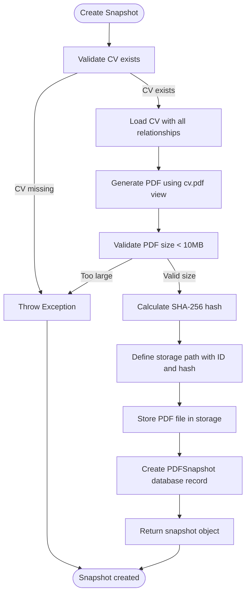
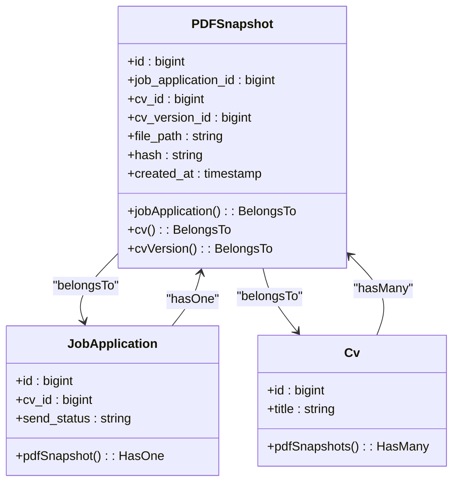
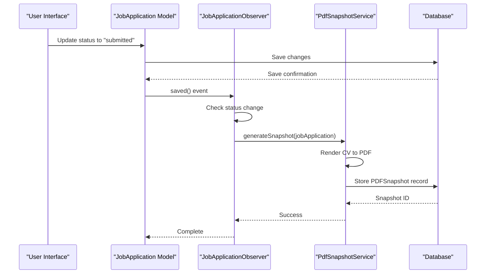

# PDF Snapshots

<cite>
**Referenced Files in This Document**   
- [PdfSnapshotService.php](file://app/Services/PdfSnapshotService.php)
- [PDFSnapshot.php](file://app/Models/PDFSnapshot.php)
- [JobApplicationObserver.php](file://app/Observers/JobApplicationObserver.php)
- [2025_10_04_002642_create_pdf_snapshots_table.php](file://database/migrations/2025_10_04_002642_create_pdf_snapshots_table.php)
- [pdf.blade.php](file://resources/views/cv/pdf.blade.php)
- [PDFSnapshotResource.php](file://app/Filament/Resources/PDFSnapshots/PDFSnapshotResource.php)
- [PdfSnapshotServiceTest.php](file://tests/Unit/PdfSnapshotServiceTest.php)
- [PdfSnapshotCreationTest.php](file://tests/Feature/PdfSnapshotCreationTest.php)
</cite>

## Table of Contents
1. [Introduction](#introduction)
2. [Workflow Overview](#workflow-overview)
3. [PDF Snapshot Model](#pdf-snapshot-model)
4. [Database Schema](#database-schema)
5. [Observer Pattern Implementation](#observer-pattern-implementation)
6. [Error Handling](#error-handling)
7. [Hash Verification](#hash-verification)
8. [Filament Resource Configuration](#filament-resource-configuration)

## Introduction
The automated PDF snapshot system captures immutable records of CVs when job applications are marked as sent. This ensures a verifiable, permanent copy of the application materials at the time of submission. The system leverages Laravel's observer pattern to trigger snapshot creation, ensuring data integrity and auditability throughout the job application lifecycle.

## Workflow Overview
The PDF snapshot creation process follows a structured workflow to ensure reliability and integrity:



**Diagram sources**
- [PdfSnapshotService.php](file://app/Services/PdfSnapshotService.php#L9-L71)

**Section sources**
- [PdfSnapshotService.php](file://app/Services/PdfSnapshotService.php#L9-L71)

The process begins when a job application's status changes to "sent". The `PdfSnapshotService` validates that the application has an associated CV, then loads the complete CV with all related sections, experiences, education, skills, and other content. The CV is rendered to PDF using the `cv.pdf` blade template, and the resulting PDF content is validated for size (maximum 10MB). A SHA-256 hash is calculated from the binary PDF content, and the file is stored with a path incorporating the job application ID and hash. Finally, a database record is created to maintain metadata about the snapshot.

## PDF Snapshot Model
The `PDFSnapshot` model represents an immutable record of a CV exported as a PDF for a job application. It maintains a one-to-one relationship with the `JobApplication` model and a belongs-to relationship with the `Cv` model.



**Diagram sources**
- [PDFSnapshot.php](file://app/Models/PDFSnapshot.php#L1-L44)
- [JobApplication.php](file://app/Models/JobApplication.php#L1-L122)
- [Cv.php](file://app/Models/Cv.php#L1-L342)

**Section sources**
- [PDFSnapshot.php](file://app/Models/PDFSnapshot.php#L1-L44)

Key fields include:
- `job_application_id`: Foreign key with unique constraint, establishing one-to-one relationship
- `cv_id`: Reference to the CV used for snapshot creation
- `file_path`: Relative storage path of the PDF file
- `hash`: SHA-256 hash of the PDF content for integrity verification
- `created_at`: Timestamp of snapshot creation

## Database Schema
The database schema for PDF snapshots is defined in the migration file, establishing proper constraints and indexes for data integrity and performance.

```php
Schema::create('pdf_snapshots', function (Blueprint $table) {
    $table->id();
    $table->foreignId('job_application_id')->unique()->constrained()->cascadeOnDelete();
    $table->foreignId('cv_id')->nullable()->constrained()->nullOnDelete();
    $table->foreignId('cv_version_id')->nullable()->constrained()->nullOnDelete();
    $table->string('file_path', 500)->unique();
    $table->string('hash', 64);
    $table->timestamp('created_at');
    $table->index('hash');
});
```

**Section sources**
- [2025_10_04_002642_create_pdf_snapshots_table.php](file://database/migrations/2025_10_04_002642_create_pdf_snapshots_table.php#L1-L33)

The schema enforces critical constraints:
- Unique constraint on `job_application_id` ensures one snapshot per application
- Foreign key constraints maintain referential integrity
- Unique constraint on `file_path` prevents duplicate storage entries
- Index on `hash` enables efficient integrity verification queries
- `hash` field is 64 characters to accommodate SHA-256 hexadecimal representation

## Observer Pattern Implementation
The observer pattern triggers automatic snapshot creation when a job application's status changes to "sent". This decouples the snapshot logic from the application update process.



**Diagram sources**
- [JobApplicationObserver.php](file://app/Observers/JobApplicationObserver.php)
- [PdfSnapshotService.php](file://app/Services/PdfSnapshotService.php)

**Section sources**
- [JobApplicationObserver.php](file://app/Observers/JobApplicationObserver.php)

The `JobApplicationObserver` listens for the `updated` event and checks if:
1. The `send_status` was changed
2. The new status is "sent"
3. No snapshot already exists for the application

When these conditions are met, the observer invokes the `PdfSnapshotService` to create the snapshot. Error logging ensures failures don't disrupt the application update process.

## Error Handling
The system implements comprehensive error handling for various failure scenarios:

**Section sources**
- [PdfSnapshotService.php](file://app/Services/PdfSnapshotService.php#L15-L20)
- [PdfSnapshotService.php](file://app/Services/PdfSnapshotService.php#L35-L38)

Two primary error conditions are handled:
- **Missing CV**: If the job application has no associated CV, an exception is thrown with the message "Job application must have a CV before creating PDF snapshot"
- **PDF size exceeded**: If the generated PDF exceeds 10MB, an exception is thrown with the message "PDF exceeds maximum size of 10MB. Please reduce CV content."

The observer pattern wraps snapshot creation in a try-catch block, logging errors without failing the application update. This ensures the primary user action (marking as sent) succeeds while still recording any snapshot creation failures for investigation.

## Hash Verification
The SHA-256 hash serves as a cryptographic fingerprint for verifying PDF integrity. The system calculates the hash from the binary PDF content before storage and stores it in the database.

**Section sources**
- [PdfSnapshotService.php](file://app/Services/PdfSnapshotService.php#L49-L51)
- [PdfSnapshotServiceTest.php](file://tests/Unit/PdfSnapshotServiceTest.php#L39-L45)
- [PdfSnapshotCreationTest.php](file://tests/Feature/PdfSnapshotCreationTest.php#L50-L56)

Verification process:
1. Retrieve the stored hash from the database
2. Read the PDF file content from storage
3. Calculate SHA-256 hash of the current file content
4. Compare with stored hash

The test suite verifies this functionality:
```php
$fileContent = Storage::disk('local')->get($snapshot->file_path);
$expectedHash = hash('sha256', $fileContent);
expect($snapshot->hash)->toBe($expectedHash);
```

This ensures that any modification to the PDF file can be detected, maintaining the integrity of the application record.

## Filament Resource Configuration
The Filament admin panel provides read-only access to PDF snapshots with verification capabilities.

**Section sources**
- [PDFSnapshotResource.php](file://app/Filament/Resources/PDFSnapshots/PDFSnapshotResource.php#L50-L71)
- [ViewPDFSnapshot.php](file://app/Filament/Resources/PDFSnapshots/Pages/ViewPDFSnapshot.php)

Key configuration aspects:
- Creation, editing, and deletion are disabled (`canCreate`, `canEdit`, `canDelete` return false)
- View page includes a "Verify Hash" button that recalculates and compares hashes
- Download action streams the file from storage
- Hash is displayed in full length for verification purposes
- File path is copyable for administrative access

The resource ensures that snapshots remain immutable while providing necessary access for verification and audit purposes.