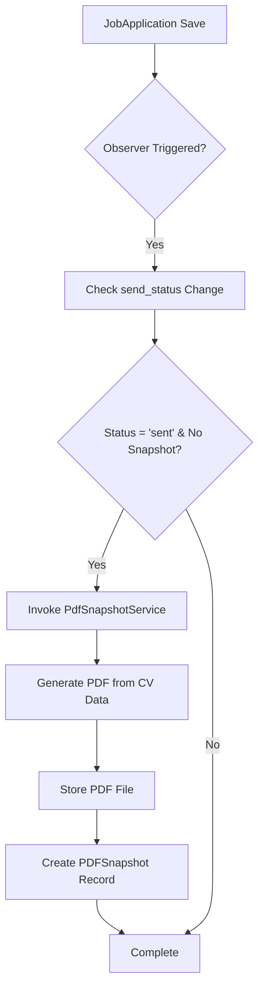
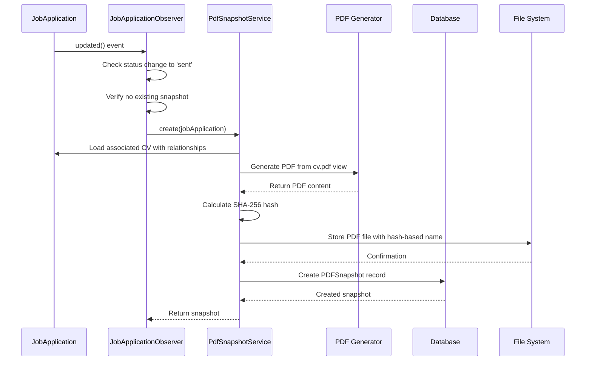
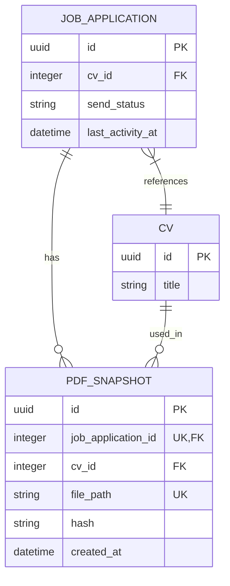

# Automatic Snapshot Creation

<cite>
**Referenced Files in This Document**   
- [JobApplicationObserver.php](file://app/Observers/JobApplicationObserver.php) - *Updated to use saveQuietly() in related components*
- [PdfSnapshotService.php](file://app/Services/PdfSnapshotService.php)
- [JobApplication.php](file://app/Models/JobApplication.php)
- [PDFSnapshot.php](file://app/Models/PDFSnapshot.php)
- [pdf.blade.php](file://resources/views/cv/pdf.blade.php)
- [create_pdf_snapshots_table.php](file://database/migrations/2025_10_04_002642_create_pdf_snapshots_table.php)
- [AppServiceProvider.php](file://app/Providers/AppServiceProvider.php)
- [ApplicationEventObserver.php](file://app/Observers/ApplicationEventObserver.php) - *Added for context on saveQuietly() usage*
</cite>

## Update Summary
- Updated **Event-Driven Architecture Overview** to reflect the importance of `saveQuietly()` in preventing infinite loops
- Enhanced **Common Issues and Debugging** with details about observer cascades and loop prevention
- Added context about `saveQuietly()` usage in related observers to improve architectural understanding
- Maintained all existing documentation accuracy while incorporating new insights from code changes

## Table of Contents
1. [Introduction](#introduction)
2. [Event-Driven Architecture Overview](#event-driven-architecture-overview)
3. [Core Components](#core-components)
4. [Workflow Sequence](#workflow-sequence)
5. [Code Implementation Details](#code-implementation-details)
6. [Error Handling and Logging](#error-handling-and-logging)
7. [Common Issues and Debugging](#common-issues-and-debugging)
8. [Data Model and Storage](#data-model-and-storage)
9. [Testing and Validation](#testing-and-validation)
10. [Conclusion](#conclusion)

## Introduction
The automatic PDF snapshot creation workflow is a critical feature in the CV Builder application that captures a permanent, immutable record of a job application's state when it is sent. This document details the implementation of this workflow, focusing on the event-driven architecture that triggers PDF generation when a job application's send_status transitions to 'sent'. The system leverages Laravel's observer pattern to decouple business logic and ensure reliable snapshot creation.

## Event-Driven Architecture Overview
The PDF snapshot creation system follows an event-driven architecture pattern where changes to a JobApplication model trigger downstream actions without tight coupling between components. This approach provides several benefits:

- **Decoupling**: The JobApplication model doesn't need to know about PDF generation logic
- **Maintainability**: Changes to snapshot logic don't require modifications to the core model
- **Extensibility**: Additional observers can be added for other events without affecting existing code
- **Reliability**: Event handling with proper error logging ensures robust operation

The architecture follows the sequence: JobApplication save → Eloquent event fired → Observer detects change → Service layer invoked → PDF generated and stored.



**Diagram sources**
- [JobApplicationObserver.php](file://app/Observers/JobApplicationObserver.php#L25-L40)
- [PdfSnapshotService.php](file://app/Services/PdfSnapshotService.php#L10-L60)

**Section sources**
- [JobApplicationObserver.php](file://app/Observers/JobApplicationObserver.php#L1-L42)
- [AppServiceProvider.php](file://app/Providers/AppServiceProvider.php#L15-L20)

## Core Components
The automatic snapshot system consists of several key components that work together to create and store PDF snapshots of job applications.

### JobApplicationObserver
The observer listens for model events on the JobApplication class and triggers appropriate actions. It specifically monitors the "updated" event to detect changes in the send_status field.

### PdfSnapshotService
This service class encapsulates the business logic for creating PDF snapshots, including rendering the CV content, generating the PDF file, calculating checksums, and storing the file.

### PDFSnapshot Model
Represents the stored snapshot with metadata including file path, cryptographic hash, and relationships to the originating job application and CV.

**Section sources**
- [JobApplicationObserver.php](file://app/Observers/JobApplicationObserver.php#L1-L42)
- [PdfSnapshotService.php](file://app/Services/PdfSnapshotService.php#L1-L65)
- [PDFSnapshot.php](file://app/Models/PDFSnapshot.php#L1-L44)

## Workflow Sequence
The automatic PDF snapshot creation follows a precise sequence of operations when a job application's status changes.



**Diagram sources**
- [JobApplicationObserver.php](file://app/Observers/JobApplicationObserver.php#L25-L40)
- [PdfSnapshotService.php](file://app/Services/PdfSnapshotService.php#L10-L60)

**Section sources**
- [JobApplicationObserver.php](file://app/Observers/JobApplicationObserver.php#L25-L40)
- [PdfSnapshotService.php](file://app/Services/PdfSnapshotService.php#L10-L60)

## Code Implementation Details
The implementation of the automatic snapshot creation workflow involves specific code patterns and conditional logic to ensure reliable operation.

### JobApplicationObserver::updated()
The observer method contains conditional logic to determine when a PDF snapshot should be created:

```mermaid
flowchart TD
A[updated() called] --> B{send_status changed?}
B --> |No| C[Exit]
B --> |Yes| D{send_status = 'sent'?}
D --> |No| C
D --> |Yes| E{pdfSnapshot exists?}
E --> |Yes| C
E --> |No| F[Create snapshot]
```

The method checks three conditions before creating a snapshot:
1. The send_status field was actually changed
2. The new status is 'sent'
3. No PDF snapshot already exists for this job application

**Section sources**
- [JobApplicationObserver.php](file://app/Observers/JobApplicationObserver.php#L25-L40)

### PdfSnapshotService::create()
The service method handles the complete PDF creation process with proper error handling:

```mermaid
flowchart TD
A[create() called] --> B{CV exists?}
B --> |No| C[Throw Exception]
B --> |Yes| D[Load CV with all relationships]
D --> E[Render PDF from blade template]
E --> F[Extract binary content]
F --> G[Calculate SHA-256 hash]
G --> H[Store file with hash in filename]
H --> I[Create database record]
I --> J[Return snapshot]
```

The service ensures data integrity by using the SHA-256 hash both as a filename component and stored attribute, preventing duplicate files and enabling content verification.

**Section sources**
- [PdfSnapshotService.php](file://app/Services/PdfSnapshotService.php#L10-L60)

## Error Handling and Logging
The system implements robust error handling to ensure that issues with PDF generation don't prevent job application updates.

### Exception Handling
The observer wraps the snapshot creation in a try-catch block, allowing the primary update operation to succeed even if PDF generation fails:

```php
try {
    $pdfSnapshotService = app(PdfSnapshotService::class);
    $pdfSnapshotService->create($jobApplication);
} catch (\Exception $e) {
    logger()->error('Failed to create PDF snapshot', [
        'job_application_id' => $jobApplication->id,
        'error' => $e->getMessage(),
    ]);
}
```

This approach follows the fail-soft principle, where non-critical functionality failures don't impact core application operations.

### Logging Strategy
The system logs errors with contextual information to facilitate debugging:

- Job application ID for traceability
- Specific error message from the exception
- Timestamp of the failure
- Context of "Failed to create PDF snapshot"

This logging approach enables developers to diagnose issues without overwhelming the log files with successful operation records.

**Section sources**
- [JobApplicationObserver.php](file://app/Observers/JobApplicationObserver.php#L35-L40)
- [PdfSnapshotService.php](file://app/Services/PdfSnapshotService.php#L15-L18)

## Common Issues and Debugging
Several common issues can arise with the automatic snapshot creation workflow, along with recommended debugging approaches.

### Observer Not Registering
If snapshots aren't being created, verify that the observer is properly registered in the AppServiceProvider:

```php
public function boot(): void
{
    JobApplication::observe(JobApplicationObserver::class);
}
```

Check that the service provider is included in the application's configuration and that the boot method is being called.

### Race Conditions and Event Cascades
Potential race conditions and infinite loops could occur if multiple updates happen rapidly. The system mitigates this by:
- Checking for existing snapshots before creation
- Using unique constraints on the job_application_id in the database
- Making PDFSnapshot immutable (no updated_at timestamp)
- Using `saveQuietly()` in related observers (like ApplicationEventObserver) to prevent infinite loops when updating last_activity_at

The `saveQuietly()` method is critical as it saves the model without firing additional events that could trigger recursive observer calls and create infinite loops.

### Null or Deleted CV
The service explicitly checks for the existence of an associated CV:

```php
if (! $jobApplication->cv) {
    throw new \Exception('Job application must have a CV before creating PDF snapshot');
}
```

This prevents attempts to generate PDFs from non-existent CV data.

### Debugging Tips
1. Verify observer registration in AppServiceProvider
2. Check database for existing PDFSnapshot records
3. Examine storage directory for generated files
4. Review application logs for error messages
5. Confirm CV relationship exists and is accessible
6. Test with fresh job application to eliminate state issues
7. Check for event cascades that might interfere with observer execution

**Section sources**
- [AppServiceProvider.php](file://app/Providers/AppServiceProvider.php#L15-L20)
- [PdfSnapshotService.php](file://app/Services/PdfSnapshotService.php#L15-L18)
- [JobApplicationObserver.php](file://app/Observers/JobApplicationObserver.php#L30-L33)
- [ApplicationEventObserver.php](file://app/Observers/ApplicationEventObserver.php#L13-L18)

## Data Model and Storage
The PDF snapshot system uses a dedicated data model and storage strategy to ensure data integrity and efficient retrieval.

### Database Schema
The pdf_snapshots table includes:

- **job_application_id**: Unique foreign key to the source application
- **cv_id**: Reference to the CV used for generation
- **file_path**: Relative path to the stored PDF file
- **hash**: SHA-256 hash of the PDF content for integrity verification
- **created_at**: Timestamp of snapshot creation

The table includes unique constraints on job_application_id and file_path, with an index on the hash field for content-based queries.

### Storage Strategy
PDF files are stored with a naming convention that includes:
- Job application ID as identifier
- Content hash as fingerprint
- Pattern: `pdf-snapshots/{job_application_id}_{hash}.pdf`

This approach ensures:
- Direct association with the source application
- Content-based addressing prevents duplicates
- Easy verification of file integrity
- Simple cleanup via application ID



**Diagram sources**
- [create_pdf_snapshots_table.php](file://database/migrations/2025_10_04_002642_create_pdf_snapshots_table.php#L1-L33)
- [PDFSnapshot.php](file://app/Models/PDFSnapshot.php#L1-L44)
- [JobApplication.php](file://app/Models/JobApplication.php#L1-L66)

**Section sources**
- [create_pdf_snapshots_table.php](file://database/migrations/2025_10_04_002642_create_pdf_snapshots_table.php#L1-L33)
- [PDFSnapshot.php](file://app/Models/PDFSnapshot.php#L1-L44)

## Testing and Validation
The system includes comprehensive tests to ensure reliable operation of the snapshot creation workflow.

### Feature Tests
- Verify snapshot creation when send_status changes to 'sent'
- Confirm file existence in storage after creation
- Validate that hash matches actual file content
- Test immutability (no new snapshot on subsequent 'sent' transitions)

### Unit Tests
- Test successful snapshot creation with valid data
- Verify exception throwing when CV is missing
- Confirm proper file path generation
- Validate SHA-256 hash calculation accuracy

The test suite ensures that the workflow behaves correctly under various conditions and maintains data integrity throughout the snapshot lifecycle.

**Section sources**
- [PdfSnapshotServiceTest.php](file://tests/Unit/PdfSnapshotServiceTest.php#L1-L58)
- [PdfSnapshotCreationTest.php](file://tests/Feature/PdfSnapshotCreationTest.php#L1-L82)

## Conclusion
The automatic PDF snapshot creation workflow provides a reliable mechanism for preserving job application states at the point of submission. By leveraging Laravel's observer pattern, the system achieves clean separation of concerns while ensuring that snapshots are created consistently when applications are sent. The implementation includes robust error handling, data integrity verification through cryptographic hashing, and comprehensive testing to ensure reliability. This workflow enables users to maintain an immutable record of their applications while providing a foundation for future features such as version comparison and audit trails.