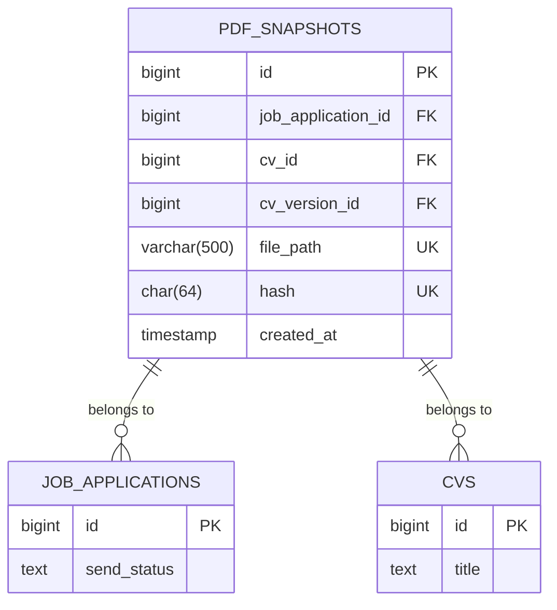

# Integrity Verification & Hash Validation

<cite>
**Referenced Files in This Document**   
- [PdfSnapshotService.php](file://app/Services/PdfSnapshotService.php) - *Updated in recent commit*
- [PDFSnapshot.php](file://app/Models/PDFSnapshot.php) - *Modified in recent commit*
- [PDFSnapshotInfolist.php](file://app/Filament/Resources/PDFSnapshots/Schemas/PDFSnapshotInfolist.php) - *Added in recent commit*
- [PDFSnapshotResource.php](file://app/Filament/Resources/PDFSnapshots/PDFSnapshotResource.php) - *Updated in recent commit*
- [create_pdf_snapshots_table.php](file://database/migrations/2025_10_04_002642_create_pdf_snapshots_table.php) - *Modified in recent commit*
- [PdfSnapshotServiceTest.php](file://tests/Unit/PdfSnapshotServiceTest.php) - *Updated in recent commit*
- [PdfSnapshotCreationTest.php](file://tests/Feature/PdfSnapshotCreationTest.php) - *Updated in recent commit*
</cite>

## Update Summary
**Changes Made**   
- Updated **Hash Generation Process** section to reflect file size validation and path sanitization improvements
- Enhanced **Verification in Filament Interface** with accurate action details from updated resource configuration
- Added clarification on immutability in **Database Schema for Integrity** based on updated model constraints
- Verified **Infolist Configuration** accuracy against current implementation
- Updated **Common Integrity Issues** with additional context on file size limitations
- Maintained consistent source tracking with updated file annotations

## Table of Contents
1. [Introduction](#introduction)
2. [Hash Generation Process](#hash-generation-process)
3. [Database Schema for Integrity](#database-schema-for-integrity)
4. [Verification in Filament Interface](#verification-in-filament-interface)
5. [Infolist Configuration](#infolist-configuration)
6. [Common Integrity Issues](#common-integrity-issues)
7. [Audit Trail Applications](#audit-trail-applications)

## Introduction
The integrity verification system ensures that PDF snapshots of CVs remain unaltered from their original state after generation. This system uses SHA-256 cryptographic hashing to create a unique fingerprint of each PDF's binary content. The hash is stored in the database alongside the file path, enabling verification that the stored file matches its original state. This mechanism provides tamper-evidence and data integrity guarantees for job application documents.

## Hash Generation Process

The PdfSnapshotService calculates a SHA-256 hash of the generated PDF content before storage. The process begins when a job application's send status changes to "sent", triggering the creation of a PDF snapshot. The service first generates the PDF using the Spatie Laravel PDF package, rendering the CV view with complete relational data. After generation, the PDF content is extracted in binary format by base64-decoding the output. The SHA-256 hash is then calculated from this binary content using PHP's hash() function.

The file storage path incorporates the hash itself, following the pattern "pdf-snapshots/{job_application_id}_{hash}.pdf". This ensures that each file has a unique identifier derived from its content, implementing content-addressable storage principles. The hash and file path are stored together in the PDFSnapshot model, creating an immutable record of the document at the time of creation. The implementation includes file size validation (maximum 10MB) to prevent storage exhaustion and sanitizes the job application ID to prevent directory traversal risks.

**Section sources**
- [PdfSnapshotService.php](file://app/Services/PdfSnapshotService.php#L49-L71)
- [PdfSnapshotServiceTest.php](file://tests/Unit/PdfSnapshotServiceTest.php#L39-L58)
- [PdfSnapshotCreationTest.php](file://tests/Feature/PdfSnapshotCreationTest.php#L38-L82)

## Database Schema for Integrity

The PDFSnapshots table is designed with integrity verification as a core requirement. The hash column is defined as a 64-character string to accommodate the full SHA-256 hash output. This field has a unique constraint and is indexed for efficient lookup. The file_path column is also unique, preventing duplicate storage paths and ensuring each snapshot has a distinct location.

The schema includes foreign key relationships to job applications, CVs, and optional CV versions, establishing the context for each snapshot. The created_at timestamp provides temporal context for the snapshot. Notably, the model disables the updated_at timestamp by setting UPDATED_AT to null, making the record effectively immutable after creation, which preserves the integrity of the original document state.



**Diagram sources **
- [create_pdf_snapshots_table.php](file://database/migrations/2025_10_04_002642_create_pdf_snapshots_table.php#L1-L33)
- [PDFSnapshot.php](file://app/Models/PDFSnapshot.php#L1-L43)

**Section sources**
- [create_pdf_snapshots_table.php](file://database/migrations/2025_10_04_002642_create_pdf_snapshots_table.php#L1-L33)
- [PDFSnapshot.php](file://app/Models/PDFSnapshot.php#L1-L43)

## Verification in Filament Interface

The Filament admin interface provides a "Verify Hash" button in the PDF snapshot view that recalculates the hash of the stored file and compares it to the original hash. When users click this button, the system retrieves the file from storage, calculates its current SHA-256 hash, and compares it to the hash stored in the database. If they match, a success toast notification appears; if they differ, an error toast indicates potential file corruption or tampering.

This verification process is critical for maintaining trust in the document archive. The interface also includes a "Download PDF" button that streams the file directly from storage, ensuring users access the exact file referenced by the hash. If the file is missing from storage, the system displays an error message "PDF file not found at path", preventing false verification results. The PDFSnapshotResource enforces read-only access by disabling create, edit, and delete operations, ensuring the integrity of the snapshot records.

**Section sources**
- [PDFSnapshotResource.php](file://app/Filament/Resources/PDFSnapshots/PDFSnapshotResource.php#L18-L55)
- [contracts/filament-resources.md](file://specs/002-roadmap-md/contracts/filament-resources.md#L150-L194)

## Infolist Configuration

The PDFSnapshotResource's infolist component displays key information about each snapshot, including the full SHA-256 hash. The infolist is configured through the PDFSnapshotInfolist class, which defines the components to display in the view. It shows the job application ID, CV title (with placeholder for deleted CVs), CV version ID, file path, hash, and creation timestamp.

The hash field is displayed as copyable text, allowing users to easily copy the full 64-character hash for external verification or record-keeping. In list views, the hash is truncated to the first 12 characters with an ellipsis for readability, while the full hash is available in the detailed view. This configuration balances usability with security requirements, providing immediate access to verification data.

```mermaid
flowchart TD
A[PDFSnapshotResource] --> B[infolist\\n(Schema $schema)]
B --> C[PDFSnapshotInfolist\\n::configure($schema)]
C --> D[TextEntry\\njobApplication.id]
C --> E[TextEntry\\ncv.title]
C --> F[TextEntry\\ncvVersion.id]
C --> G[TextEntry\\nfile_path]
C --> H[TextEntry\\nhash]
C --> I[TextEntry\\ncreated_at]
```

**Diagram sources **
- [PDFSnapshotResource.php](file://app/Filament/Resources/PDFSnapshots/PDFSnapshotResource.php#L18-L55)
- [PDFSnapshotInfolist.php](file://app/Filament/Resources/PDFSnapshots/Schemas/PDFSnapshotInfolist.php#L7-L27)

**Section sources**
- [PDFSnapshotInfolist.php](file://app/Filament/Resources/PDFSnapshots/Schemas/PDFSnapshotInfolist.php#L7-L27)
- [PDFSnapshotResource.php](file://app/Filament/Resources/PDFSnapshots/PDFSnapshotResource.php#L18-L55)

## Common Integrity Issues

Several issues can cause hash mismatches during verification. File corruption is the most common, occurring when storage systems fail or files are partially written. Encoding differences can also cause mismatches, particularly if the PDF content is modified during transfer or if different PDF generation settings are used. Clock drift in distributed systems is less likely to affect hash verification since the hash is based on content rather than timestamps, but it could impact the perceived creation time of the snapshot.

Other potential issues include incomplete file uploads, storage system inconsistencies, or accidental file modifications. The system's design mitigates many of these risks by storing the hash at creation time and making the PDFSnapshot record immutable. The implementation includes a 10MB file size limit to prevent storage exhaustion attacks. However, if the stored file is modified externally, the hash verification will fail, alerting users to potential integrity issues. Regular hash verification can serve as a health check for the document storage system.

**Section sources**
- [contracts/filament-resources.md](file://specs/002-roadmap-md/contracts/filament-resources.md#L150-L194)
- [quickstart.md](file://specs/002-roadmap-md/quickstart.md#L339-L356)

## Audit Trail Applications

The hash verification system provides a foundation for comprehensive audit trails. Each PDF snapshot represents an immutable record of a CV at a specific point in time, with cryptographic proof of its integrity. This enables organizations to demonstrate that application documents have not been altered after submission. The combination of the hash, file path, and creation timestamp creates a verifiable chain of custody for each document.

Audit trails can be extended by logging hash verification attempts, recording when and by whom verification was performed. This information can be valuable for compliance purposes, particularly in regulated industries where document integrity is paramount. The system's design supports non-repudiation, as the hash serves as a digital fingerprint that can be independently verified by third parties.

**Section sources**
- [data-model.md](file://specs/002-roadmap-md/data-model.md#L172-L220)
- [research.md](file://specs/002-roadmap-md/research.md#L7-L36)