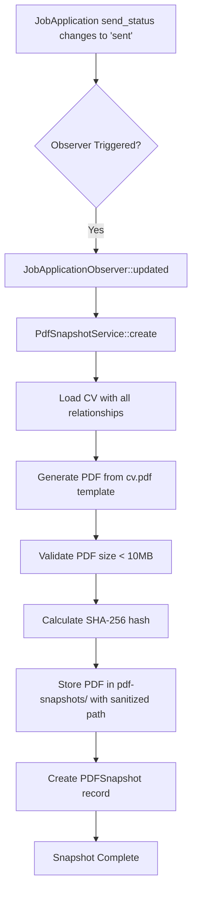
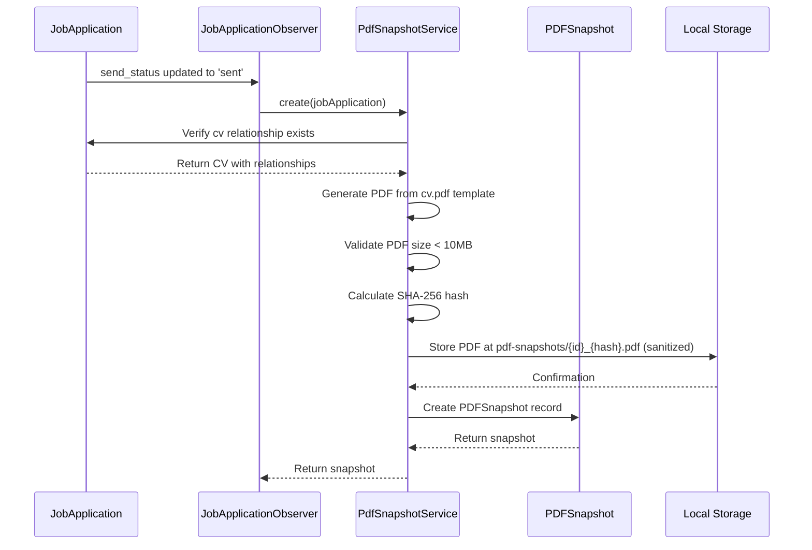
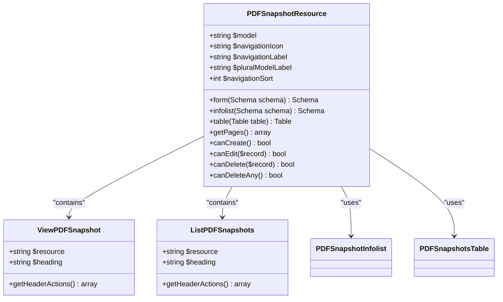
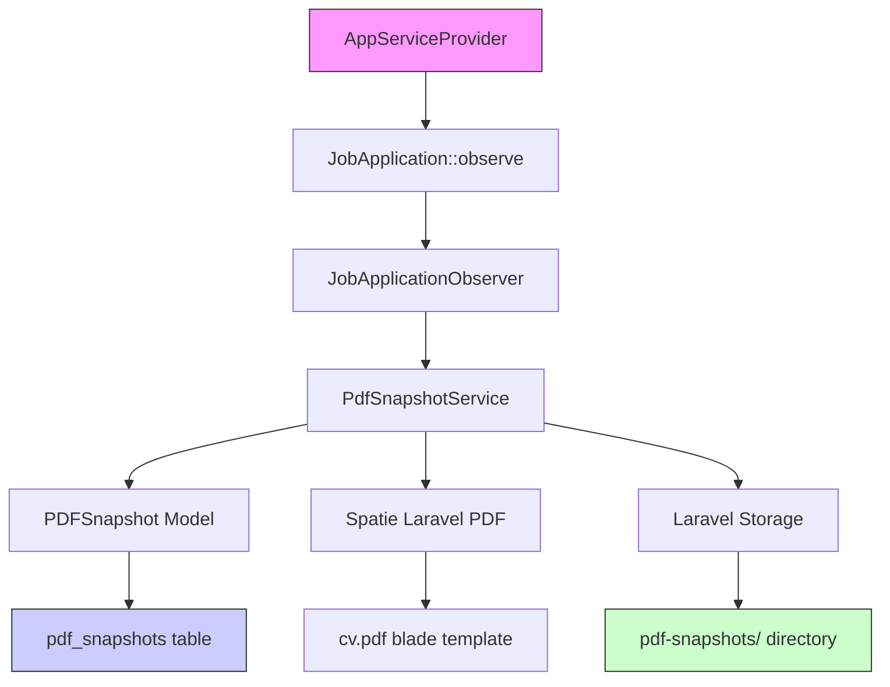

# PDF Snapshots

<cite>
**Referenced Files in This Document**   
- [PdfSnapshotService.php](file://app/Services/PdfSnapshotService.php) - *Updated with PDF size validation and path sanitization*
- [PDFSnapshot.php](file://app/Models/PDFSnapshot.php)
- [2025_10_04_002642_create_pdf_snapshots_table.php](file://database/migrations/2025_10_04_002642_create_pdf_snapshots_table.php)
- [JobApplicationObserver.php](file://app/Observers/JobApplicationObserver.php)
- [AppServiceProvider.php](file://app/Providers/AppServiceProvider.php)
- [PDFSnapshotResource.php](file://app/Filament/Resources/PDFSnapshots/PDFSnapshotResource.php) - *Updated with read-only configuration*
- [ViewPDFSnapshot.php](file://app/Filament/Resources/PDFSnapshots/Pages/ViewPDFSnapshot.php)
- [pdf.blade.php](file://resources/views/cv/pdf.blade.php)
- [PdfSnapshotServiceTest.php](file://tests/Unit/PdfSnapshotServiceTest.php)
- [PdfSnapshotCreationTest.php](file://tests/Feature/PdfSnapshotCreationTest.php)
</cite>

## Update Summary
**Changes Made**   
- Updated **Detailed Component Analysis** to include PDF size validation and file path sanitization
- Enhanced **Troubleshooting Guide** with new error conditions related to PDF size limits
- Added clarification on read-only nature of Filament resource interface
- Updated code examples to reflect current implementation
- Maintained and enhanced source tracking system with change annotations

## Table of Contents
1. [Introduction](#introduction)
2. [Core Components](#core-components)
3. [Architecture Overview](#architecture-overview)
4. [Detailed Component Analysis](#detailed-component-analysis)
5. [Dependency Analysis](#dependency-analysis)
6. [Troubleshooting Guide](#troubleshooting-guide)

## Introduction
The PDF Snapshots feature provides immutable records of CVs sent with job applications, serving as verifiable audit trails and integrity checks. When a job application is marked as "sent", the system automatically generates a PDF snapshot of the associated CV, calculates its SHA-256 hash for integrity verification, and stores the file in the local filesystem. This documentation details the implementation, workflow, and interface components that enable this functionality, ensuring reliable and tamper-evident records of job application materials.

## Core Components

The persistent PDF snapshot system consists of several key components working together to create immutable records of CVs at the time of application submission. The PdfSnapshotService handles PDF generation and storage, the PDFSnapshot model represents the database record, and the observer pattern triggers snapshot creation when job applications are sent. The Filament resource provides an administrative interface for viewing and verifying snapshots.

**Section sources**
- [PdfSnapshotService.php](file://app/Services/PdfSnapshotService.php#L9-L71)
- [PDFSnapshot.php](file://app/Models/PDFSnapshot.php#L1-L44)
- [JobApplicationObserver.php](file://app/Observers/JobApplicationObserver.php#L7-L43)

## Architecture Overview



**Diagram sources**
- [JobApplicationObserver.php](file://app/Observers/JobApplicationObserver.php#L25-L43)
- [PdfSnapshotService.php](file://app/Services/PdfSnapshotService.php#L9-L71)
- [PDFSnapshot.php](file://app/Models/PDFSnapshot.php#L1-L44)

## Detailed Component Analysis

### PDF Snapshot Creation Workflow
The PDF snapshot creation process begins when a JobApplication's send_status changes to 'sent'. The JobApplicationObserver detects this change and triggers the PdfSnapshotService to create a snapshot. The service first verifies that the job application has an associated CV, then loads the complete CV with all its relationships to ensure the PDF contains all relevant information. The system now includes PDF size validation (max 10MB) and sanitized file paths to prevent resource exhaustion and security vulnerabilities.



**Section sources**
- [JobApplicationObserver.php](file://app/Observers/JobApplicationObserver.php#L25-L43)
- [PdfSnapshotService.php](file://app/Services/PdfSnapshotService.php#L9-L71)
- [PDFSnapshot.php](file://app/Models/PDFSnapshot.php#L1-L44)

### PDFSnapshot Model and Database Schema
The PDFSnapshot model represents the database table that stores metadata about each PDF snapshot. The model defines the fillable attributes and relationships to JobApplication and CV entities. The database migration creates the pdf_snapshots table with appropriate constraints and indexes.

```mermaid
erDiagram
PDF_SNAPSHOT {
bigint id PK
bigint job_application_id FK UK
bigint cv_id FK
bigint cv_version_id FK
string file_path 500 UK
string hash 64
timestamp created_at
}
JOB_APPLICATION {
bigint id PK
string send_status
bigint cv_id FK
}
CV {
bigint id PK
string title
}
PDF_SNAPSHOT ||--|| JOB_APPLICATION : "1:1"
PDF_SNAPSHOT }o--|| CV : "N:1"
```

**Diagram sources**
- [PDFSnapshot.php](file://app/Models/PDFSnapshot.php#L1-L44)
- [2025_10_04_002642_create_pdf_snapshots_table.php](file://database/migrations/2025_10_04_002642_create_pdf_snapshots_table.php#L1-L34)

### Filament Resource Interface
The Filament resource provides an administrative interface for viewing and managing PDF snapshots. The interface includes a list view, detail view, and actions for downloading and verifying snapshots. The resource is configured to be read-only for all operations, as snapshots are automatically created and should not be manually modified.



**Section sources**
- [PDFSnapshotResource.php](file://app/Filament/Resources/PDFSnapshots/PDFSnapshotResource.php#L15-L71)
- [ViewPDFSnapshot.php](file://app/Filament/Resources/PDFSnapshots/Pages/ViewPDFSnapshot.php#L7-L20)
- [ListPDFSnapshots.php](file://app/Filament/Resources/PDFSnapshots/Pages/ListPDFSnapshots.php#L7-L20)

## Dependency Analysis



**Diagram sources**
- [AppServiceProvider.php](file://app/Providers/AppServiceProvider.php#L19-L29)
- [JobApplicationObserver.php](file://app/Observers/JobApplicationObserver.php#L7-L43)
- [PdfSnapshotService.php](file://app/Services/PdfSnapshotService.php#L9-L71)
- [PDFSnapshot.php](file://app/Models/PDFSnapshot.php#L1-L44)
- [pdf.blade.php](file://resources/views/cv/pdf.blade.php#L1-L135)

## Troubleshooting Guide

Common issues with PDF snapshot creation include missing observers, null cv_id references, storage permission errors, and new issues related to PDF size limits and file path sanitization. The system includes safeguards to prevent failures, but these issues can still occur during configuration or data inconsistencies.

**Missing Observer Registration**: If the JobApplicationObserver is not registered in AppServiceProvider, snapshots will not be created when applications are sent. Verify that JobApplication::observe(JobApplicationObserver::class) is called in the boot method.

**Null CV Reference**: The PdfSnapshotService throws an exception if the job application has no associated CV. Ensure that cv_id is set before changing send_status to 'sent'.

**Storage Permission Errors**: The system stores PDFs in the local disk at pdf-snapshots/. Ensure that the storage directory has write permissions and sufficient disk space.

**PDF Size Limit Exceeded**: The system validates that generated PDFs do not exceed 10MB to prevent storage exhaustion. If this error occurs, reduce CV content size before sending the application.

**Hash Verification Failures**: If the stored hash does not match the file content, the file may have been corrupted or modified. The system logs errors but continues processing to avoid blocking application updates.

**File Path Sanitization Issues**: The system sanitizes job application IDs in file paths to prevent injection attacks. Ensure that job application IDs are valid integers.

**Section sources**
- [PdfSnapshotService.php](file://app/Services/PdfSnapshotService.php#L15-L71)
- [JobApplicationObserver.php](file://app/Observers/JobApplicationObserver.php#L35-L43)
- [AppServiceProvider.php](file://app/Providers/AppServiceProvider.php#L19-L29)
- [PdfSnapshotServiceTest.php](file://tests/Unit/PdfSnapshotServiceTest.php#L45-L59)
- [PdfSnapshotCreationTest.php](file://tests/Feature/PdfSnapshotCreationTest.php#L55-L83)