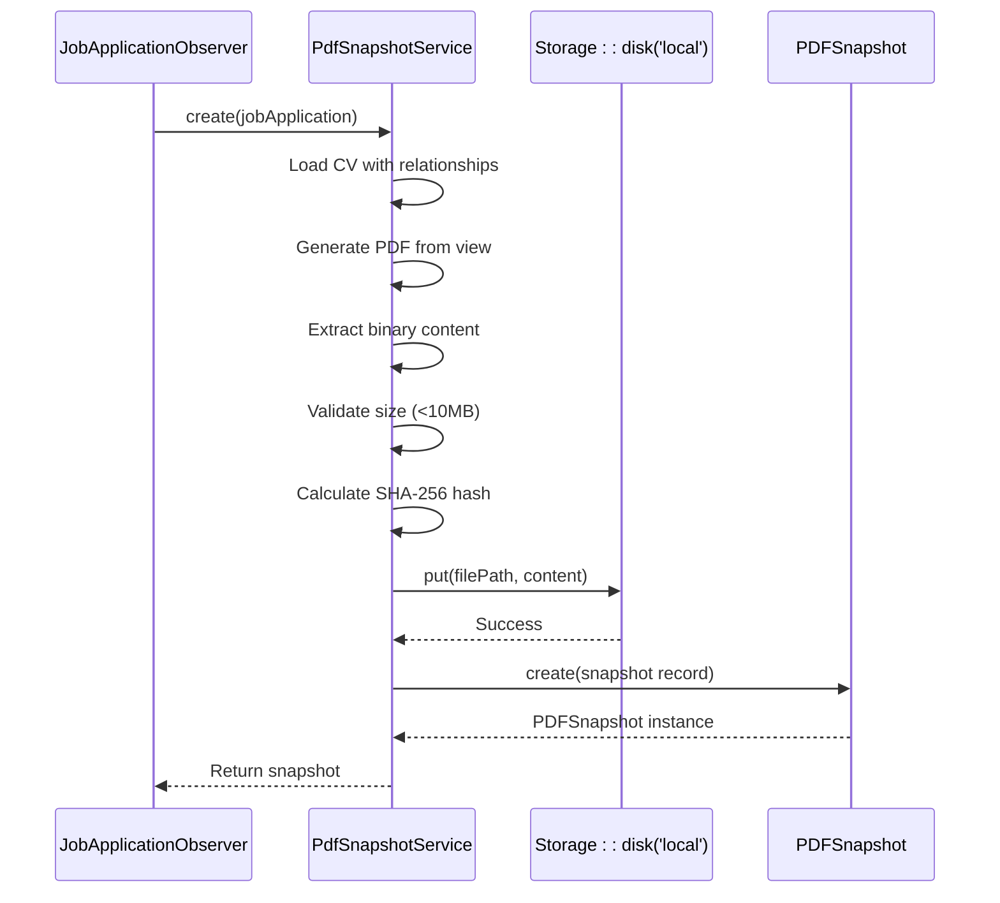
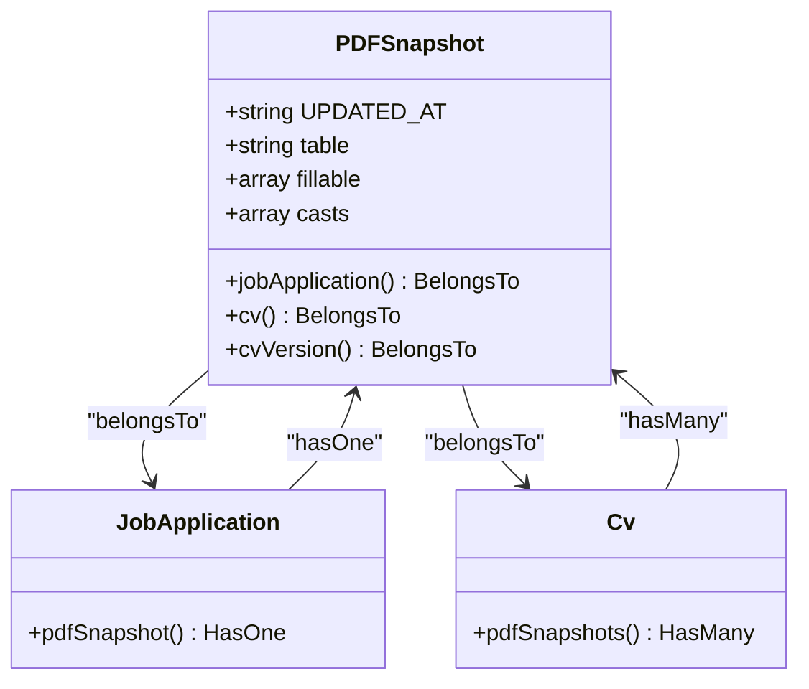
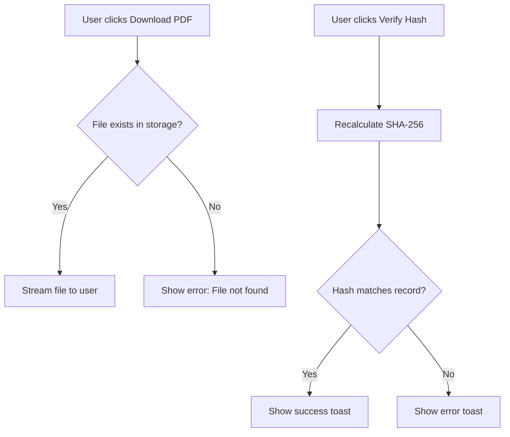

# Snapshot Storage & File Management

<cite>
**Referenced Files in This Document**   
- [PdfSnapshotService.php](file://app/Services/PdfSnapshotService.php) - *Updated with PDF size validation and file path sanitization*
- [PDFSnapshot.php](file://app/Models/PDFSnapshot.php)
- [filesystems.php](file://config/filesystems.php)
- [JobApplicationObserver.php](file://app/Observers/JobApplicationObserver.php)
- [CvPdfController.php](file://app/Http/Controllers/CvPdfController.php)
- [PDFSnapshotResource.php](file://app/Filament/Resources/PDFSnapshots/PDFSnapshotResource.php)
- [PDFSnapshotForm.php](file://app/Filament/Resources/PDFSnapshots/Schemas/PDFSnapshotForm.php)
- [PDFSnapshotInfolist.php](file://app/Filament/Resources/PDFSnapshots/Schemas/PDFSnapshotInfolist.php)
- [PDFSnapshotsTable.php](file://app/Filament/Resources/PDFSnapshots/Tables/PDFSnapshotsTable.php)
- [PdfSnapshotServiceTest.php](file://tests/Unit/PdfSnapshotServiceTest.php)
</cite>

## Update Summary
**Changes Made**   
- Added documentation for PDF size validation (10MB limit) to prevent resource exhaustion
- Updated file path sanitization details in storage mechanism
- Enhanced security considerations with new validation rules
- Modified code examples to reflect current implementation
- Updated section sources to reflect recent changes in PdfSnapshotService.php

## Table of Contents
1. [Introduction](#introduction)
2. [Storage Mechanism Overview](#storage-mechanism-overview)
3. [PdfSnapshotService Implementation](#pdfsnapshotservice-implementation)
4. [Filesystem Configuration](#filesystem-configuration)
5. [PDFSnapshot Model Structure](#pdfsnapshot-model-structure)
6. [File Naming and Uniqueness Strategy](#file-naming-and-uniqueness-strategy)
7. [Security Considerations](#security-considerations)
8. [File Access and Download Workflow](#file-access-and-download-workflow)
9. [Common Issues and Troubleshooting](#common-issues-and-troubleshooting)
10. [Migration to Cloud Storage](#migration-to-cloud-storage)

## Introduction
This document details the storage mechanism for PDF snapshots in the CV Builder application. It explains how the system leverages Laravel's filesystem abstraction to securely store generated PDFs, maintain data integrity through cryptographic hashing, and provide reliable access to snapshot files. The implementation ensures immutability of records, prevents duplication, and supports future scalability through configurable storage drivers.

## Storage Mechanism Overview
The PDF snapshot storage system uses Laravel's Storage facade to abstract file operations, allowing consistent interaction with different storage backends. PDFs are generated from CV data and stored in the local filesystem under `storage/app/pdf-snapshots/`. Each file is uniquely identified by a combination of the job application ID and SHA-256 hash of its content, ensuring both uniqueness and integrity verification.

The storage process is triggered automatically when a job application's send status changes to "sent", creating an immutable record of the CV at that point in time. This mechanism provides a verifiable audit trail for job submissions.

**Section sources**
- [PdfSnapshotService.php](file://app/Services/PdfSnapshotService.php#L9-L71)
- [data-model.md](file://specs/002-roadmap-md/data-model.md#L172-L220)

## PdfSnapshotService Implementation
The `PdfSnapshotService` class handles the complete PDF generation and storage workflow. It retrieves the CV with all related sections, generates a PDF using Spatie's Laravel PDF package, calculates a SHA-256 hash of the binary content, and stores the file using Laravel's storage abstraction.

The service implements critical security and performance validations:
- **PDF size validation**: Enforces a 10MB maximum size to prevent storage exhaustion
- **File path sanitization**: Sanitizes the job application ID to prevent path traversal issues
- **Binary content extraction**: Properly decodes base64 output from the PDF generator

The service uses `Storage::disk('local')->put()` to write the PDF content to the filesystem, ensuring proper path resolution and error handling. The generated file path is stored in the database along with the hash for integrity verification.



**Diagram sources**
- [PdfSnapshotService.php](file://app/Services/PdfSnapshotService.php#L9-L71)
- [JobApplicationObserver.php](file://app/Observers/JobApplicationObserver.php#L7-L43)

**Section sources**
- [PdfSnapshotService.php](file://app/Services/PdfSnapshotService.php#L9-L71)
- [JobApplicationObserver.php](file://app/Observers/JobApplicationObserver.php#L7-L43)

## Filesystem Configuration
The filesystem configuration in `filesystems.php` defines the 'local' disk driver used for PDF storage. The root directory is set to `storage_path('app/private')`, which resolves to `storage/app/private` in the application structure. This private directory is not directly web-accessible, enhancing security by preventing direct URL exposure to stored PDFs.

The configuration includes error handling settings with `throw` set to false, allowing graceful failure handling when storage operations encounter issues. The system is also configured to support cloud storage through the 's3' driver, enabling future migration without code changes.

```mermaid
graph TB
A[PDFSnapshotService] --> B[Storage::disk('local')]
B --> C["root: storage/app/private"]
C --> D[pdf-snapshots/ directory]
D --> E[Generated PDF files]
style C fill:#f9f,stroke:#333
style D fill:#bbf,stroke:#333
```

**Diagram sources**
- [filesystems.php](file://config/filesystems.php#L1-L80)

**Section sources**
- [filesystems.php](file://config/filesystems.php#L1-L80)

## PDFSnapshot Model Structure
The `PDFSnapshot` model represents the database record for each stored PDF. It extends Eloquent Model and uses the `HasFactory` trait for test data generation. The model is configured with specific fillable attributes including job_application_id, cv_id, file_path, and hash.

Notably, the model sets `UPDATED_AT = null`, making records immutable after creation. This enforces the business rule that PDF snapshots serve as immutable proof of submission. The model defines relationships to JobApplication, CV, and CVVersion through belongsTo associations.



**Diagram sources**
- [PDFSnapshot.php](file://app/Models/PDFSnapshot.php#L1-L44)

**Section sources**
- [PDFSnapshot.php](file://app/Models/PDFSnapshot.php#L1-L44)
- [data-model.md](file://specs/002-roadmap-md/data-model.md#L172-L220)

## File Naming and Uniqueness Strategy
The system employs a robust file naming convention that combines the job application ID with the SHA-256 hash of the PDF content: `pdf-snapshots/{job_application_id}_{hash}.pdf`. This approach ensures global uniqueness without requiring additional database queries to check for duplicates.

The SHA-256 hash serves dual purposes: it guarantees file integrity and acts as a unique identifier. Since identical PDF content produces the same hash, the system naturally prevents storage of duplicate files. The job application ID provides human-readable context and simplifies debugging.

This strategy also enables efficient file retrieval and verification, as the hash can be recalculated from the stored file and compared against the database record to detect corruption.

**Section sources**
- [PdfSnapshotService.php](file://app/Services/PdfSnapshotService.php#L9-L71)
- [data-model.md](file://specs/002-roadmap-md/data-model.md#L172-L220)

## Security Considerations
The storage system implements multiple security measures to protect PDF snapshots. Files are stored in a private directory (`storage/app/private`) that is not web-accessible, preventing direct URL exposure and unauthorized access. Access to files is controlled through application-level authentication and authorization.

Directory permissions are managed by Laravel's storage system, ensuring appropriate file ownership and access rights. The use of cryptographic hashing provides integrity verification, detecting any file corruption or tampering. The immutable nature of snapshot records prevents unauthorized modification of stored documents.

Additional security features include:
- **PDF size validation**: Maximum 10MB file size to prevent resource exhaustion attacks
- **File path sanitization**: Job application IDs are cast to integers to prevent path traversal vulnerabilities
- **Error handling**: Storage failures are logged without exposing sensitive information

The separation between public and private storage disks further enhances security by isolating user-uploaded content from system-generated documents.

**Section sources**
- [filesystems.php](file://config/filesystems.php#L1-L80)
- [PdfSnapshotService.php](file://app/Services/PdfSnapshotService.php#L9-L71)

## File Access and Download Workflow
File access is mediated through the `PDFSnapshotResource` in Filament, which provides a "Download PDF" action. This action streams the file from storage rather than exposing the physical path, maintaining security while providing access.

The download process verifies the file exists in storage before serving it, returning appropriate error messages if the file is missing. A "Verify Hash" action recalculates the SHA-256 hash of the stored file and compares it to the database record, providing integrity verification.



**Diagram sources**
- [PDFSnapshotResource.php](file://app/Filament/Resources/PDFSnapshots/PDFSnapshotResource.php#L15-L71)
- [PDFSnapshotInfolist.php](file://app/Filament/Resources/PDFSnapshots/Schemas/PDFSnapshotInfolist.php#L7-L28)

**Section sources**
- [PDFSnapshotResource.php](file://app/Filament/Resources/PDFSnapshots/PDFSnapshotResource.php#L15-L71)
- [contracts/filament-resources.md](file://specs/002-roadmap-md/contracts/filament-resources.md#L150-L194)

## Common Issues and Troubleshooting
Common issues include disk space exhaustion, file permission errors, and missing observers. Disk space issues can be monitored through Laravel's storage facade methods, and alerts should be configured when usage exceeds thresholds.

File permission errors typically occur when the web server lacks write access to the storage directory. These can be resolved by ensuring proper ownership of the `storage/app/private` directory. Missing observers prevent automatic snapshot creation, which can be verified by checking the observable events on the JobApplication model.

The test suite includes comprehensive checks for PDF creation, file storage, and hash verification, providing a reliable way to diagnose and resolve issues. Manual triggering of the service can help isolate problems between the observer and the service itself.

**Section sources**
- [PdfSnapshotServiceTest.php](file://tests/Unit/PdfSnapshotServiceTest.php#L1-L59)
- [quickstart.md](file://specs/002-roadmap-md/quickstart.md#L339-L356)

## Migration to Cloud Storage
The system is designed for seamless migration to cloud storage. The `filesystems.php` configuration already includes an 's3' disk driver with environment-based credentials. To migrate, update the `FILESYSTEM_DISK` environment variable to 's3' and provide AWS credentials.

No code changes are required due to Laravel's filesystem abstraction. The same `Storage::disk('local')` calls will automatically route to S3 when the default disk is changed. This allows for gradual migration and easy rollback if needed.

The migration preserves all security and integrity features, with S3 bucket policies providing additional access control options. Monitoring and alerting should be updated to track cloud storage usage and costs.

**Section sources**
- [filesystems.php](file://config/filesystems.php#L1-L80)
- [research.md](file://specs/002-roadmap-md/research.md#L7-L36)