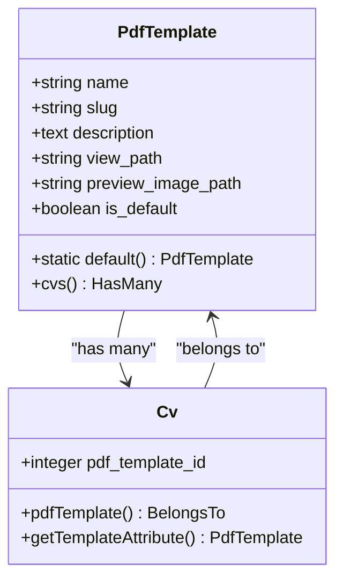
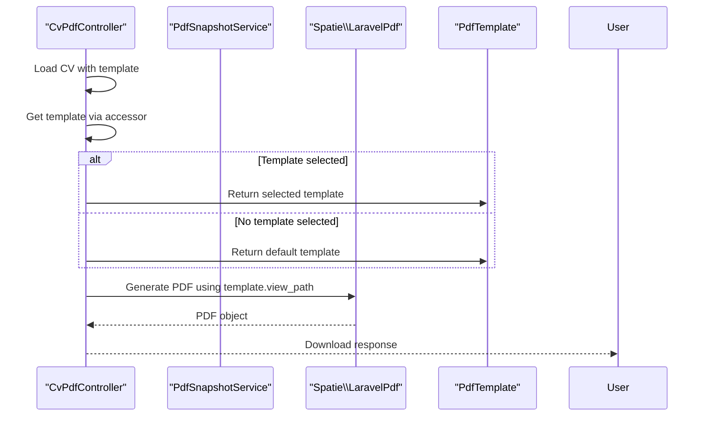

# Template Selection

<cite>
**Referenced Files in This Document**   
- [PdfTemplate.php](file://app/Models/PdfTemplate.php)
- [Cv.php](file://app/Models/Cv.php)
- [CvPdfController.php](file://app/Http/Controllers/CvPdfController.php)
- [PdfSnapshotService.php](file://app/Services/PdfSnapshotService.php)
- [classic.blade.php](file://resources/views/cv/templates/classic.blade.php)
- [modern.blade.php](file://resources/views/cv/templates/modern.blade.php)
- [default.blade.php](file://resources/views/cv/templates/default.blade.php)
- [2025_10_04_205753_create_pdf_templates_table.php](file://database/migrations/2025_10_04_205753_create_pdf_templates_table.php)
- [2025_10_04_205802_add_pdf_template_id_to_cvs.php](file://database/migrations/2025_10_04_205802_add_pdf_template_id_to_cvs.php)
- [PdfTemplateSeeder.php](file://database/seeders/PdfTemplateSeeder.php)
</cite>

## Table of Contents
1. [Introduction](#introduction)
2. [PdfTemplate Model Structure](#pdftemplate-model-structure)
3. [Template Hierarchy and Default Configuration](#template-hierarchy-and-default-configuration)
4. [Template Selection in Filament Admin Interface](#template-selection-in-filament-admin-interface)
5. [PDF Generation with Selected Templates](#pdf-generation-with-selected-templates)
6. [Template Variable Interpolation and Customization](#template-variable-interpolation-and-customization)
7. [Common Issues and Troubleshooting](#common-issues-and-troubleshooting)
8. [Creating Custom Templates](#creating-custom-templates)

## Introduction
This document details the PDF template selection system in the CV Builder application. The system allows users to select from multiple PDF templates when generating their CVs, with support for visual previews and easy template management. The implementation includes a dedicated PdfTemplate model for storing template configurations, integration with the Filament admin interface for template selection, and a fallback mechanism to ensure PDF generation always uses a valid template. The system supports three predefined templates (classic, modern, default) that are rendered through Blade templates located in resources/views/cv/templates/. The PdfSnapshotService uses the selected template during PDF generation, falling back to the default template when no specific template is chosen by the user.

## PdfTemplate Model Structure
The PdfTemplate model serves as the central configuration store for all available PDF templates in the system. It contains essential fields that define each template's properties and behavior. The model includes name and slug fields for identification, a description field for documentation, view_path for specifying the Blade template location, preview_image_path for the visual preview, and is_default to designate the fallback template. The model uses Eloquent relationships to connect with CVs through the hasMany relationship. The static default() method provides a convenient way to retrieve the default template, throwing a RuntimeException if no default is found to prevent system failures during PDF generation.

**Diagram sources**
- [PdfTemplate.php](file://app/Models/PdfTemplate.php#L1-L44)
- [Cv.php](file://app/Models/Cv.php#L1-L367)

**Section sources**
- [PdfTemplate.php](file://app/Models/PdfTemplate.php#L1-L44)
- [2025_10_04_205753_create_pdf_templates_table.php](file://database/migrations/2025_10_04_205753_create_pdf_templates_table.php#L1-L36)

## Template Hierarchy and Default Configuration
The system implements a hierarchical template structure with three predefined templates: classic, modern, and default. These templates are seeded into the database through the PdfTemplateSeeder, which ensures consistent initial configuration across installations. The default template serves as the fallback option when no template is explicitly selected for a CV. Each template is configured with a unique slug and view_path that corresponds to its Blade template file in resources/views/cv/templates/. The is_default flag is set to true only for the default template, ensuring that the system can always resolve a valid template for PDF generation. The template hierarchy is designed to be extensible, allowing administrators to add new templates without code changes by creating new records in the pdf_templates table.

**Section sources**
- [PdfTemplateSeeder.php](file://database/seeders/PdfTemplateSeeder.php#L1-L50)
- [2025_10_04_205753_create_pdf_templates_table.php](file://database/migrations/2025_10_04_205753_create_pdf_templates_table.php#L1-L36)

## Template Selection in Filament Admin Interface
Users can select templates for their CVs through the Filament admin interface, which provides a user-friendly form field for template selection. The interface displays all available templates with their preview images, allowing users to make informed choices based on visual appearance. The template selection is implemented as a relationship field in the CV resource, leveraging Filament's built-in components for seamless integration. When editing a CV, users can switch between templates without losing any CV data, as the template selection is stored separately from the CV content. The system preserves the selected template in the pdf_template_id field of the CV model, which is updated through the admin interface. This design ensures that template changes are non-destructive and can be made at any time during the CV creation process.

**Section sources**
- [Cv.php](file://app/Models/Cv.php#L1-L367)
- [PdfTemplate.php](file://app/Models/PdfTemplate.php#L1-L44)

## PDF Generation with Selected Templates
The PdfSnapshotService and CvPdfController work together to use the selected template during PDF generation, with a fallback mechanism to the default template when no template is chosen. The process begins with loading the CV and its template relationship, then retrieving the template through the getTemplateAttribute accessor method. This accessor returns the selected template if one is specified, or falls back to the default template using the PdfTemplate::default() method. The selected template's view_path is then used to render the PDF through the Spatie Laravel-PDF package. This approach ensures that PDF generation always uses a valid template, preventing errors when templates are missing or incorrectly configured. The service also includes validation for PDF size and content integrity through SHA-256 hashing.

**Diagram sources**
- [CvPdfController.php](file://app/Http/Controllers/CvPdfController.php#L1-L70)
- [PdfSnapshotService.php](file://app/Services/PdfSnapshotService.php#L1-L72)

**Section sources**
- [CvPdfController.php](file://app/Http/Controllers/CvPdfController.php#L1-L70)
- [PdfSnapshotService.php](file://app/Services/PdfSnapshotService.php#L1-L72)

## Template Variable Interpolation and Customization
The Blade templates in resources/views/cv/templates/ support comprehensive variable interpolation, allowing dynamic content rendering based on the CV data. Each template receives the $cv object and related data such as $sections and $skillsWithEvidence, enabling rich content presentation. The templates use standard Blade syntax for variable output ({{ }}), conditional statements (@if), loops (@foreach), and includes. Customization options include profile-specific rendering through the $profileName variable, which modifies the filename and displays focus context in the header. The templates also support conditional content rendering based on the presence of data, such as contact information and social links. This flexible interpolation system allows templates to adapt to varying CV content while maintaining consistent styling and layout.

**Section sources**
- [default.blade.php](file://resources/views/cv/templates/default.blade.php#L1-L280)
- [modern.blade.php](file://resources/views/cv/templates/modern.blade.php#L1-L316)
- [classic.blade.php](file://resources/views/cv/templates/classic.blade.php#L1-L227)

## Common Issues and Troubleshooting
Common issues with the template system include missing template files, incorrect view paths, and missing preview images. When a template file is missing from resources/views/cv/templates/, the system will throw a view not found exception during PDF generation. This can be resolved by ensuring the view_path in the PdfTemplate record matches the actual file location and name. Incorrect view paths should follow the Laravel dot notation (e.g., cv.templates.default) and correspond to the file structure. Missing preview images may cause display issues in the admin interface but do not prevent template selection or PDF generation. The system handles missing preview images gracefully, allowing template functionality to continue while displaying a placeholder. Database consistency issues, such as multiple default templates or orphaned template references, are prevented by application logic and database constraints.

**Section sources**
- [PdfTemplate.php](file://app/Models/PdfTemplate.php#L1-L44)
- [Cv.php](file://app/Models/Cv.php#L1-L367)
- [CvPdfController.php](file://app/Http/Controllers/CvPdfController.php#L1-L70)

## Creating Custom Templates
Creating custom templates involves several steps to ensure proper integration with the system. First, create a new Blade template file in resources/views/cv/templates/ with a descriptive name and .blade.php extension. The template should follow the structure of existing templates, including proper HTML structure, CSS styling for print, and variable interpolation for dynamic content. Next, add a record to the pdf_templates table either through the Filament admin interface or by modifying the PdfTemplateSeeder. The record should include a unique slug, the correct view_path using dot notation, a descriptive name, and a preview image path. The preview image should be placed in the public/template-previews/ directory and linked through the storage:link command. After creating the template, it will automatically appear in the template selection interface and can be used for PDF generation.

**Section sources**
- [PdfTemplateSeeder.php](file://database/seeders/PdfTemplateSeeder.php#L1-L50)
- [default.blade.php](file://resources/views/cv/templates/default.blade.php#L1-L280)
- [2025_10_04_205753_create_pdf_templates_table.php](file://database/migrations/2025_10_04_205753_create_pdf_templates_table.php#L1-L36)