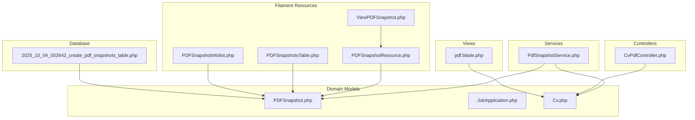
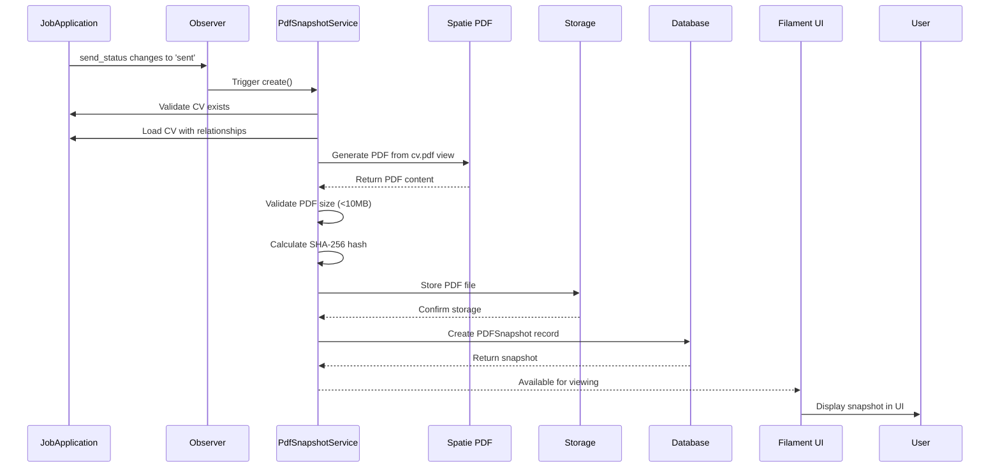
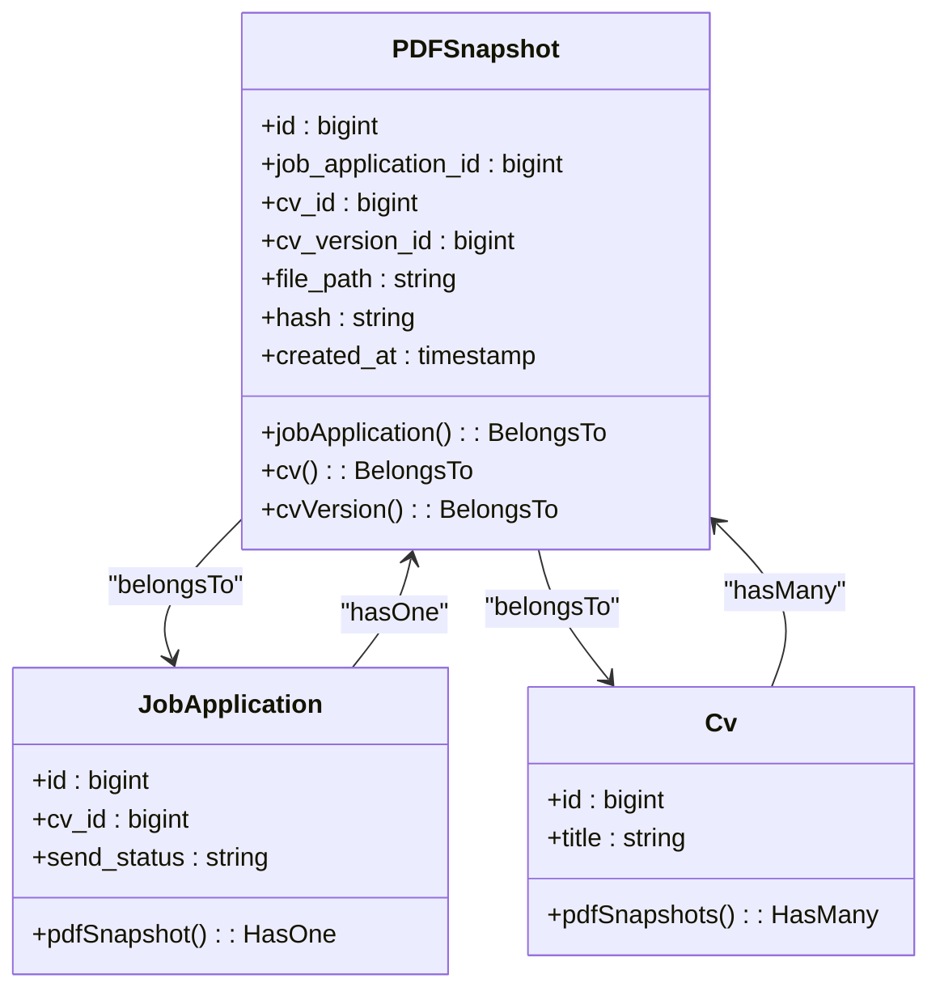
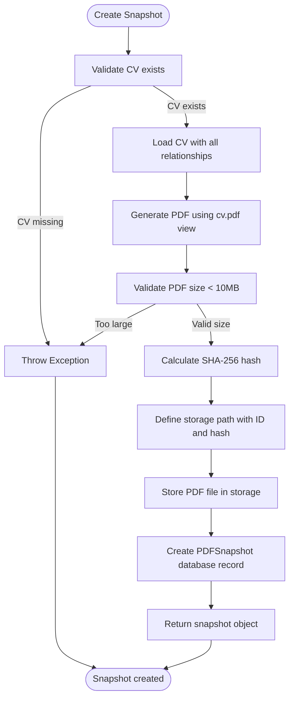
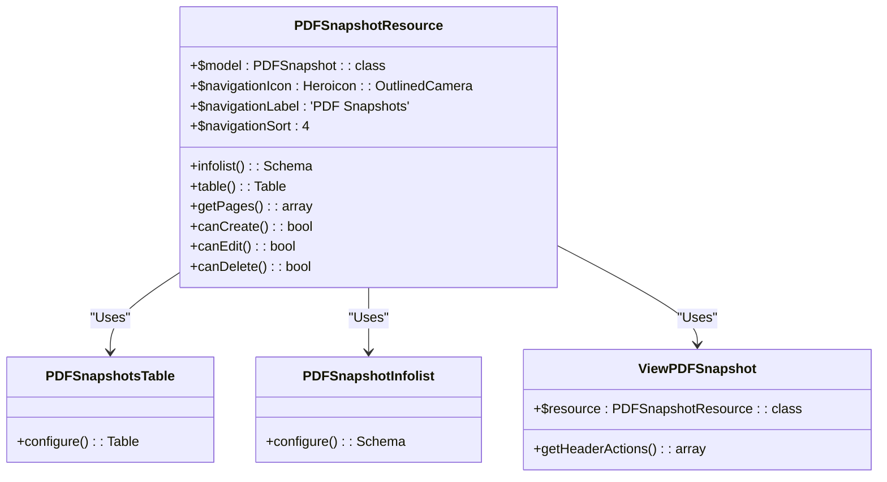
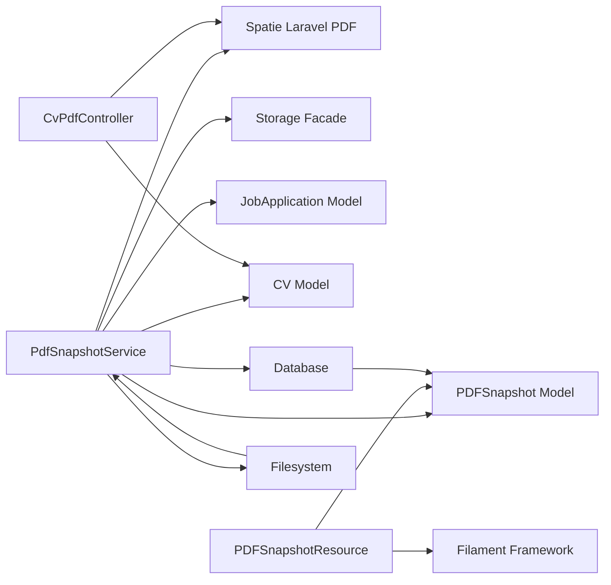

# PDF Snapshots

<cite>
**Referenced Files in This Document**   
- [PDFSnapshot.php](file://app/Models/PDFSnapshot.php)
- [PdfSnapshotService.php](file://app/Services/PdfSnapshotService.php)
- [CvPdfController.php](file://app/Http/Controllers/CvPdfController.php)
- [PDFSnapshotResource.php](file://app/Filament/Resources/PDFSnapshots/PDFSnapshotResource.php)
- [PDFSnapshotsTable.php](file://app/Filament/Resources/PDFSnapshots/Tables/PDFSnapshotsTable.php)
- [PDFSnapshotInfolist.php](file://app/Filament/Resources/PDFSnapshots/Schemas/PDFSnapshotInfolist.php)
- [ViewPDFSnapshot.php](file://app/Filament/Resources/PDFSnapshots/Pages/ViewPDFSnapshot.php)
- [2025_10_04_002642_create_pdf_snapshots_table.php](file://database/migrations/2025_10_04_002642_create_pdf_snapshots_table.php)
- [pdf.blade.php](file://resources/views/cv/pdf.blade.php)
- [JobApplication.php](file://app/Models/JobApplication.php)
- [PdfSnapshotServiceTest.php](file://tests/Unit/PdfSnapshotServiceTest.php)
</cite>

## Table of Contents
1. [Introduction](#introduction)
2. [Project Structure](#project-structure)
3. [Core Components](#core-components)
4. [Architecture Overview](#architecture-overview)
5. [Detailed Component Analysis](#detailed-component-analysis)
6. [Dependency Analysis](#dependency-analysis)
7. [Performance Considerations](#performance-considerations)
8. [Troubleshooting Guide](#troubleshooting-guide)
9. [Conclusion](#conclusion)

## Introduction
The PDF Snapshots system provides immutable, verifiable records of CVs exported as PDFs for job applications. It ensures data integrity through SHA-256 hashing and automatic generation when applications are marked as "sent". This documentation covers the system's purpose, implementation, API interfaces, integration patterns, practical examples, and troubleshooting guidance.

## Project Structure
The PDF Snapshots system is organized within the Laravel application structure, following domain-driven design principles. Key components are located in specific directories based on their responsibilities.



**Diagram sources**
- [PDFSnapshot.php](file://app/Models/PDFSnapshot.php)
- [PdfSnapshotService.php](file://app/Services/PdfSnapshotService.php)
- [CvPdfController.php](file://app/Http/Controllers/CvPdfController.php)
- [PDFSnapshotResource.php](file://app/Filament/Resources/PDFSnapshots/PDFSnapshotResource.php)
- [2025_10_04_002642_create_pdf_snapshots_table.php](file://database/migrations/2025_10_04_002642_create_pdf_snapshots_table.php)
- [pdf.blade.php](file://resources/views/cv/pdf.blade.php)

**Section sources**
- [app/Models/PDFSnapshot.php](file://app/Models/PDFSnapshot.php)
- [app/Services/PdfSnapshotService.php](file://app/Services/PdfSnapshotService.php)
- [app/Http/Controllers/CvPdfController.php](file://app/Http/Controllers/CvPdfController.php)
- [app/Filament/Resources/PDFSnapshots](file://app/Filament/Resources/PDFSnapshots)
- [database/migrations/2025_10_04_002642_create_pdf_snapshots_table.php](file://database/migrations/2025_10_04_002642_create_pdf_snapshots_table.php)
- [resources/views/cv/pdf.blade.php](file://resources/views/cv/pdf.blade.php)

## Core Components
The PDF Snapshots system consists of several core components that work together to create, store, and manage immutable PDF records of CVs. The system automatically generates snapshots when job applications are sent, ensuring a verifiable record of the CV content at the time of submission.

**Section sources**
- [PDFSnapshot.php](file://app/Models/PDFSnapshot.php)
- [PdfSnapshotService.php](file://app/Services/PdfSnapshotService.php)
- [PDFSnapshotResource.php](file://app/Filament/Resources/PDFSnapshots/PDFSnapshotResource.php)

## Architecture Overview
The PDF Snapshots system follows a service-oriented architecture with clear separation of concerns. The system is triggered by changes in job application status and creates immutable records that can be verified for integrity.



**Diagram sources**
- [PdfSnapshotService.php](file://app/Services/PdfSnapshotService.php)
- [PDFSnapshot.php](file://app/Models/PDFSnapshot.php)
- [pdf.blade.php](file://resources/views/cv/pdf.blade.php)

## Detailed Component Analysis

### PDFSnapshot Model Analysis
The PDFSnapshot model represents an immutable record of a CV exported as a PDF for a job application. It contains metadata about the snapshot and references to the associated job application and CV.



**Diagram sources**
- [PDFSnapshot.php](file://app/Models/PDFSnapshot.php#L1-L44)
- [JobApplication.php](file://app/Models/JobApplication.php#L1-L122)
- [Cv.php](file://app/Models/Cv.php#L1-L342)

**Section sources**
- [PDFSnapshot.php](file://app/Models/PDFSnapshot.php#L1-L44)

### PdfSnapshotService Analysis
The PdfSnapshotService handles the core logic of creating PDF snapshots. It orchestrates PDF generation, file storage, hash calculation, and database record creation.



**Diagram sources**
- [PdfSnapshotService.php](file://app/Services/PdfSnapshotService.php#L9-L71)

**Section sources**
- [PdfSnapshotService.php](file://app/Services/PdfSnapshotService.php#L9-L71)

### PDFSnapshotResource Analysis
The PDFSnapshotResource provides the Filament admin interface for viewing PDF snapshots. It is read-only, reflecting the immutable nature of snapshots.



**Diagram sources**
- [PDFSnapshotResource.php](file://app/Filament/Resources/PDFSnapshots/PDFSnapshotResource.php#L15-L71)
- [PDFSnapshotsTable.php](file://app/Filament/Resources/PDFSnapshots/Tables/PDFSnapshotsTable.php)
- [PDFSnapshotInfolist.php](file://app/Filament/Resources/PDFSnapshots/Schemas/PDFSnapshotInfolist.php)
- [ViewPDFSnapshot.php](file://app/Filament/Resources/PDFSnapshots/Pages/ViewPDFSnapshot.php)

**Section sources**
- [PDFSnapshotResource.php](file://app/Filament/Resources/PDFSnapshots/PDFSnapshotResource.php#L15-L71)

## Dependency Analysis
The PDF Snapshots system has well-defined dependencies on other components within the application. These dependencies ensure proper integration with the existing CV and job application systems.



**Diagram sources**
- [PdfSnapshotService.php](file://app/Services/PdfSnapshotService.php)
- [PDFSnapshot.php](file://app/Models/PDFSnapshot.php)
- [JobApplication.php](file://app/Models/JobApplication.php)
- [Cv.php](file://app/Models/Cv.php)
- [CvPdfController.php](file://app/Http/Controllers/CvPdfController.php)

**Section sources**
- [PdfSnapshotService.php](file://app/Services/PdfSnapshotService.php)
- [PDFSnapshot.php](file://app/Models/PDFSnapshot.php)
- [composer.json](file://composer.json)

## Performance Considerations
The PDF Snapshots system includes performance considerations to ensure efficient operation, particularly regarding PDF generation time and file size limitations.

- **PDF Generation**: The system should generate PDFs in under 3 seconds for CVs with up to 10 sections
- **File Size**: Maximum PDF size is limited to 10MB to prevent storage exhaustion
- **Database Indexing**: The hash field is indexed for fast duplicate detection
- **Eager Loading**: CV relationships are eagerly loaded to minimize database queries during PDF generation

**Section sources**
- [PdfSnapshotService.php](file://app/Services/PdfSnapshotService.php#L9-L71)
- [specs/002-roadmap-md/quickstart.md](file://specs/002-roadmap-md/quickstart.md#L325-L329)

## Troubleshooting Guide
This section provides guidance for troubleshooting common issues with the PDF Snapshots system.

### PDF Snapshot Not Created
**Symptom**: Changing send_status to 'sent' doesn't create snapshot

**Debug**:
```php
// Check observer is registered
dd(JobApplication::getObservableEvents());

// Manually trigger
$app = JobApplication::find(1);
app(PdfSnapshotService::class)->create($app);
```

**Common Causes**:
- Observer not registered in AppServiceProvider
- cv_id is null when send_status changed
- Storage disk misconfigured

### PDF File Not Found
**Symptom**: Download PDF action fails with "PDF file not found at path"

**Debug**:
```php
// Verify file exists in storage
$snapshot = PDFSnapshot::find($id);
dd([
    'file_exists' => Storage::exists($snapshot->file_path),
    'file_path' => $snapshot->file_path,
    'hash' => $snapshot->hash,
]);
```

**Common Causes**:
- File was manually deleted from storage
- Storage path configuration changed
- File system permissions issue

### Hash Verification Failure
**Symptom**: Hash verification shows failure toast

**Debug**:
```php
// Recalculate hash and compare
$snapshot = PDFSnapshot::find($id);
$fileContent = Storage::disk('local')->get($snapshot->file_path);
$calculatedHash = hash('sha256', $fileContent);
dd([
    'stored_hash' => $snapshot->hash,
    'calculated_hash' => $calculatedHash,
    'matches' => $snapshot->hash === $calculatedHash,
]);
```

**Common Causes**:
- PDF file has been modified after creation
- File corruption
- Storage system issue

**Section sources**
- [PdfSnapshotService.php](file://app/Services/PdfSnapshotService.php)
- [PDFSnapshotResource.php](file://app/Filament/Resources/PDFSnapshots/PDFSnapshotResource.php)
- [specs/002-roadmap-md/quickstart.md](file://specs/002-roadmap-md/quickstart.md#L339-L356)

## Conclusion
The PDF Snapshots system provides a robust solution for creating immutable, verifiable records of CVs submitted with job applications. By automatically generating snapshots when applications are sent, the system ensures data integrity through SHA-256 hashing and provides a read-only interface for verification. The architecture follows clean separation of concerns with well-defined components for service logic, data modeling, and user interface. The system includes performance optimizations and comprehensive troubleshooting guidance to ensure reliable operation.