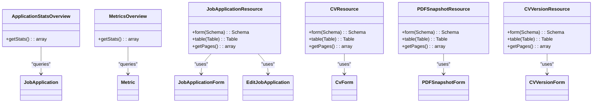

# Project Overview

<cite>
**Referenced Files in This Document**   
- [README.md](file://README.md)
- [CvReviewService.php](file://app/Services/CvReviewService.php)
- [PdfSnapshotService.php](file://app/Services/PdfSnapshotService.php)
- [MetricsCalculationService.php](file://app/Services/MetricsCalculationService.php)
- [JobApplicationResource.php](file://app/Filament/Resources/JobApplications/JobApplicationResource.php)
- [JobApplicationForm.php](file://app/Filament/Resources/JobApplications/Schemas/JobApplicationForm.php)
- [EditJobApplication.php](file://app/Filament/Resources/JobApplications/Pages/EditJobApplication.php)
- [JobApplication.php](file://app/Models/JobApplication.php)
- [ApplicationStatsOverview.php](file://app/Filament/Widgets/ApplicationStatsOverview.php)
- [MetricsOverview.php](file://app/Filament/Widgets/MetricsOverview.php)
- [ai-review-summary.blade.php](file://resources/views/filament/forms/ai-review-summary.blade.php)
- [ai-review-results.blade.php](file://resources/views/filament/forms/ai-review-results.blade.php)
</cite>

## Table of Contents
1. [Introduction](#introduction)
2. [Core Functionality](#core-functionality)
3. [High-Level Architecture](#high-level-architecture)
4. [Key User Workflows](#key-user-workflows)
5. [Admin Interface Overview](#admin-interface-overview)
6. [Component Integration](#component-integration)
7. [Conclusion](#conclusion)

## Introduction
The cv-builder project is a full-stack job application productivity tool built with Laravel 12 and Filament 4. It provides a comprehensive solution for managing the entire job application lifecycle, from CV creation to performance tracking. The application follows KISS (Keep It Simple, Stupid) and YAGNI (You Aren't Gonna Need It) principles, focusing on essential features that have been validated as necessary through real-world usage. The system is designed to help both developers and job seekers streamline their job search process by providing tools for CV management, job application tracking, AI-powered review, PDF generation, and performance metrics.

**Section sources**
- [README.md](file://README.md#L0-L215)

## Core Functionality
The cv-builder application offers several core features that work together to enhance job application productivity. These include CV management with versioning capabilities, comprehensive job application tracking, AI-powered CV review using OpenAI, PDF snapshot generation for sent applications, and detailed performance metrics. The system enables users to create and manage multiple CVs with structured sections including experience, projects, education, and skills. Job applications can be tracked through various statuses from draft to offer or rejection, with support for deadlines and next action dates. The AI review feature analyzes CVs against job descriptions to provide match scores and improvement recommendations. When applications are sent, the system automatically generates PDF snapshots with hash verification for integrity. Performance metrics track application velocity, response rates, and conversion rates over time.

**Section sources**
- [README.md](file://README.md#L0-L215)
- [CvReviewService.php](file://app/Services/CvReviewService.php#L0-L226)
- [PdfSnapshotService.php](file://app/Services/PdfSnapshotService.php#L0-L73)
- [MetricsCalculationService.php](file://app/Services/MetricsCalculationService.php#L0-L172)

## High-Level Architecture
The cv-builder application follows a standard Laravel MVC architecture enhanced with the Filament admin panel framework. The system is organized into models, services, and Filament resources that work together to provide a cohesive user experience. The architecture separates concerns between data management, business logic, and user interface components.

**Diagram sources**
- [JobApplicationResource.php](file://app/Filament/Resources/JobApplications/JobApplicationResource.php#L1-L56)
- [CvReviewService.php](file://app/Services/CvReviewService.php#L0-L226)
- [PdfSnapshotService.php](file://app/Services/PdfSnapshotService.php#L0-L73)
- [MetricsCalculationService.php](file://app/Services/MetricsCalculationService.php#L0-L172)

## Key User Workflows
The cv-builder application supports several key workflows that represent common job application scenarios. These include creating a CV, running an AI review, and tracking application status. When creating a CV, users can add structured sections such as experience, projects, education, and skills through relation managers in the Filament interface. For AI review, users can initiate analysis from the job application edit page when a job description is provided and the application is in draft status. The system estimates the cost based on token usage and queues a background job to process the review. Once completed, the results are displayed with a match score and detailed recommendations across multiple categories. For application tracking, users can monitor the status of their applications through various stages from pending to interviewing to offer or rejection. The system provides widgets that highlight applications needing attention based on next action dates or send status.

### Creating a CV Workflow
The process of creating a CV involves several steps that allow users to build a comprehensive document with structured content.

**Diagram sources**
- [CvResource.php](file://app/Filament/Resources/Cvs/CvResource.php)
- [CvForm.php](file://app/Filament/Resources/Cvs/Schemas/CvForm.php)
- [RelationManagers](file://app/Filament/Resources/Cvs/RelationManagers/)

**Section sources**
- [CvResource.php](file://app/Filament/Resources/Cvs/CvResource.php#L1-L55)
- [CvForm.php](file://app/Filament/Resources/Cvs/Schemas/CvForm.php#L1-L100)

### Running an AI Review Workflow
The AI review process analyzes a CV against a job description to provide actionable feedback and recommendations.

**Diagram sources**
- [CvReviewService.php](file://app/Services/CvReviewService.php#L0-L226)
- [EditJobApplication.php](file://app/Filament/Resources/JobApplications/Pages/EditJobApplication.php#L0-L206)
- [JobApplication.php](file://app/Models/JobApplication.php#L0-L123)

**Section sources**
- [CvReviewService.php](file://app/Services/CvReviewService.php#L0-L226)
- [EditJobApplication.php](file://app/Filament/Resources/JobApplications/Pages/EditJobApplication.php#L0-L206)

### Tracking Application Status Workflow
The application tracking system provides visibility into the job application pipeline and highlights items requiring attention.

**Diagram sources**
- [JobApplication.php](file://app/Models/JobApplication.php#L0-L123)
- [JobApplicationResource.php](file://app/Filament/Resources/JobApplications/JobApplicationResource.php#L1-L56)
- [ApplicationStatsOverview.php](file://app/Filament/Widgets/ApplicationStatsOverview.php#L1-L53)

**Section sources**
- [JobApplication.php](file://app/Models/JobApplication.php#L0-L123)
- [JobApplicationResource.php](file://app/Filament/Resources/JobApplications/JobApplicationResource.php#L1-L56)

## Admin Interface Overview
The admin interface of cv-builder is powered by Filament 4, providing a modern and intuitive user experience for managing job applications and CVs. The interface includes several dashboard widgets that provide at-a-glance insights into application metrics and status. The ApplicationStatsOverview widget displays key statistics including total applications, sent applications, interviewing count, offers received, pending responses, and rejections. The MetricsOverview widget shows calculated performance metrics such as applications per week, response rate, interview conversion rate, offer rate, and median days to first response. The system provides dedicated resources for managing CVs, job applications, PDF snapshots, and CV versions with comprehensive CRUD operations. The JobApplicationResource includes a detailed form with sections for company information, application status, CV selection, job description, and interview details. When an AI review is available, the interface displays a summary with match score and detailed recommendations across multiple categories including skill gaps, section priority, bullet points, language, and skill evidence.

**Diagram sources**
- [ApplicationStatsOverview.php](file://app/Filament/Widgets/ApplicationStatsOverview.php#L1-L53)
- [MetricsOverview.php](file://app/Filament/Widgets/MetricsOverview.php#L1-L72)
- [JobApplicationResource.php](file://app/Filament/Resources/JobApplications/JobApplicationResource.php#L1-L56)
- [CVResource.php](file://app/Filament/Resources/Cvs/CvResource.php#L1-L55)
- [PDFSnapshotResource.php](file://app/Filament/Resources/PDFSnapshots/PDFSnapshotResource.php#L1-L55)
- [CVVersionResource.php](file://app/Filament/Resources/CVVersions/CVVersionResource.php#L1-L62)

**Section sources**
- [ApplicationStatsOverview.php](file://app/Filament/Widgets/ApplicationStatsOverview.php#L1-L53)
- [MetricsOverview.php](file://app/Filament/Widgets/MetricsOverview.php#L1-L72)
- [JobApplicationResource.php](file://app/Filament/Resources/JobApplications/JobApplicationResource.php#L1-L56)

## Component Integration
The major components of the cv-builder application integrate seamlessly to deliver end-to-end functionality for job application management. The integration between CVVersions, JobApplications, and PDFSnapshots ensures that historical states are preserved and verifiable snapshots are created when applications are sent. When a user sends a job application by changing the send_status to "sent", the system automatically triggers the PdfSnapshotService to generate a PDF of the CV, calculate a SHA-256 hash for integrity verification, store the file, and create a PDFSnapshot record linked to the job application. Similarly, when a user requests an AI review of their CV against a job description, the system validates the inputs, dispatches a background job to process the review using OpenAI, and stores the results in the job application's ai_review_data field. The MetricsCalculationService runs on a daily schedule to calculate key performance metrics based on job application data and store them in the metrics table for display in dashboard widgets. These integrations create a cohesive system where data flows naturally between components, providing users with a comprehensive tool for managing their job search.

**Diagram sources**
- [JobApplication.php](file://app/Models/JobApplication.php#L0-L123)
- [Cv.php](file://app/Models/Cv.php)
- [PDFSnapshot.php](file://app/Models/PDFSnapshot.php)
- [CvReviewService.php](file://app/Services/CvReviewService.php#L0-L226)
- [PdfSnapshotService.php](file://app/Services/PdfSnapshotService.php#L0-L73)
- [MetricsCalculationService.php](file://app/Services/MetricsCalculationService.php#L0-L172)
- [JobApplicationObserver.php](file://app/Observers/JobApplicationObserver.php)

**Section sources**
- [JobApplication.php](file://app/Models/JobApplication.php#L0-L123)
- [CvReviewService.php](file://app/Services/CvReviewService.php#L0-L226)
- [PdfSnapshotService.php](file://app/Services/PdfSnapshotService.php#L0-L73)
- [MetricsCalculationService.php](file://app/Services/MetricsCalculationService.php#L0-L172)

## Conclusion
The cv-builder project provides a comprehensive solution for job application management, combining CV creation and versioning with application tracking, AI-powered review, PDF generation, and performance metrics. Built with Laravel 12 and Filament 4, the application offers a modern, intuitive interface for managing the entire job search process. The system's architecture follows best practices with clear separation of concerns between models, services, and UI components. Key features like AI review using OpenAI, automatic PDF snapshot generation, and detailed performance tracking provide significant value to both developers and job seekers. The integration between major components ensures data consistency and provides a seamless user experience. By following KISS and YAGNI principles, the application focuses on essential features that have been validated as necessary, avoiding unnecessary complexity while delivering powerful functionality for optimizing the job application process.