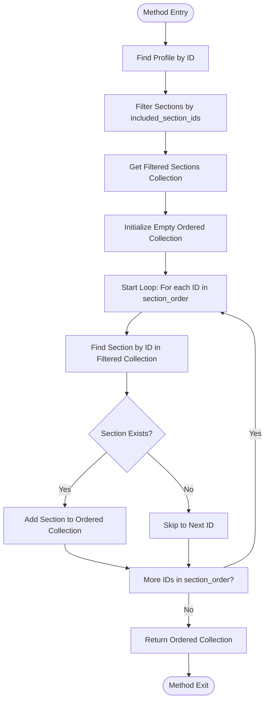
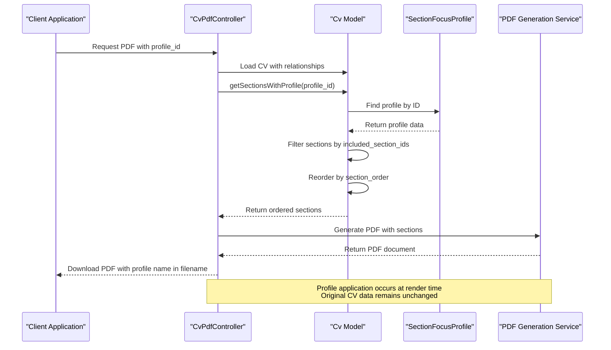

# Applying Profiles

<cite>
**Referenced Files in This Document**   
- [Cv.php](file://app/Models/Cv.php#L148-L175)
- [SectionFocusProfile.php](file://app/Models/SectionFocusProfile.php)
- [CvPdfController.php](file://app/Http/Controllers/CvPdfController.php)
- [section-focus-profiles.md](file://specs/002-roadmap-md/contracts-phase3/section-focus-profiles.md)
- [USER-GUIDE-PHASE3.md](file://specs/002-roadmap-md/USER-GUIDE-PHASE3.md)
</cite>

## Table of Contents
1. [Introduction](#introduction)
2. [Profile Application Overview](#profile-application-overview)
3. [GET /api/cvs/{cv_id}/sections?profile_id={id} Endpoint Behavior](#get-apicvs{cv_id}sectionsprofile_id{id}-endpoint-behavior)
4. [Cv Model: getSectionsWithProfile Method](#cv-model-getsectionswithprofile-method)
5. [Integration with PDF Export Workflow](#integration-with-pdf-export-workflow)
6. [Cover Letter Generation Integration](#cover-letter-generation-integration)
7. [Performance Considerations](#performance-considerations)
8. [Common Issues and Debugging](#common-issues-and-debugging)
9. [Real-World Use Cases](#real-world-use-cases)

## Introduction
Section Focus Profiles provide a non-destructive mechanism for tailoring CV content during rendering operations such as PDF generation and preview. These profiles allow users to create named presets that filter and reorder CV sections without modifying the original data. This document details the implementation, usage, and integration points of Section Focus Profiles, with emphasis on the profile application process during document generation.

## Profile Application Overview
Section Focus Profiles function as render-time filters that modify the presentation of CV content without altering the underlying data structure. When a profile is applied, two operations occur: filtering of sections based on `included_section_ids` and reordering according to the `section_order` array. This approach enables users to generate tailored CV versions for different job applications while maintaining a single source of truth for their professional information.

The profile system follows a playlist metaphor: just as a music library can have multiple playlists with different songs and orders, a CV can have multiple profiles that present different sections in different sequences. This design ensures that updates to the original CV propagate to all profile views automatically.

**Section sources**
- [section-focus-profiles.md](file://specs/002-roadmap-md/contracts-phase3/section-focus-profiles.md)
- [USER-GUIDE-PHASE3.md](file://specs/002-roadmap-md/USER-GUIDE-PHASE3.md#L34-L114)

## GET /api/cvs/{cv_id}/sections?profile_id={id} Endpoint Behavior
The GET /api/cvs/{cv_id}/sections endpoint with the profile_id parameter implements the core profile application logic. When a profile ID is provided, the endpoint returns only the sections specified in the profile's `included_section_ids` array, ordered according to the `section_order` array.

The endpoint processes requests in the following sequence:
1. Validates the existence of the specified CV and profile
2. Filters sections to include only those in the profile's `included_section_ids`
3. Reorders the filtered sections according to the profile's `section_order`
4. Returns the filtered and ordered sections with a profile metadata object

When no profile_id is provided, the endpoint returns all sections in their default order as defined by the `display_order` field in the database. The response includes a `profile` object that identifies which profile was applied, enabling client applications to display the active profile context.

**Section sources**
- [section-focus-profiles.md](file://specs/002-roadmap-md/contracts-phase3/section-focus-profiles.md#L100-L120)
- [Cv.php](file://app/Models/Cv.php#L148-L175)

## Cv Model: getSectionsWithProfile Method
The `getSectionsWithProfile` method in the Cv model implements the core logic for applying Section Focus Profiles. This method takes a profile ID as input and returns a collection of sections filtered and reordered according to the specified profile.



**Diagram sources**
- [Cv.php](file://app/Models/Cv.php#L148-L175)

**Section sources**
- [Cv.php](file://app/Models/Cv.php#L148-L175)
- [SectionFocusProfile.php](file://app/Models/SectionFocusProfile.php)

## Integration with PDF Export Workflow
Section Focus Profiles integrate with the PDF export workflow through the CvPdfController, which applies profiles during the document generation process. When a PDF request includes a profile parameter, the controller uses the `getSectionsWithProfile` method to obtain the filtered and ordered sections before passing them to the PDF generation engine.

The integration follows this sequence:
1. The CvPdfController receives a download request with an optional profile parameter
2. The controller loads the CV with all necessary relationships
3. If a profile is specified, it calls `getSectionsWithProfile` to obtain the filtered section collection
4. If no profile is specified, it retrieves all sections in default order
5. The controller passes the sections to the PDF generation service along with other CV data
6. The PDF is generated using the selected template and downloaded with a filename that includes the profile name

This integration ensures that profile application is seamless and transparent to the end user, with the only visible difference being the content and order of sections in the generated PDF.



**Diagram sources**
- [CvPdfController.php](file://app/Http/Controllers/CvPdfController.php)
- [Cv.php](file://app/Models/Cv.php#L148-L175)

**Section sources**
- [CvPdfController.php](file://app/Http/Controllers/CvPdfController.php)
- [Cv.php](file://app/Models/Cv.php#L148-L175)

## Cover Letter Generation Integration
While the primary integration point for Section Focus Profiles is PDF generation, the concept extends to cover letter generation through shared context. When generating a cover letter for a specific job application, the system can use the same profile to ensure consistency between the CV and cover letter content.

The integration works as follows:
1. The cover letter generation service identifies the profile associated with the job application
2. It retrieves the same filtered and ordered sections that would appear in the CV
3. The cover letter content is tailored to emphasize the skills and experiences highlighted in the profile
4. This creates a cohesive application package where both documents focus on the same aspects of the candidate's background

This approach ensures that the narrative in the cover letter aligns with the section emphasis in the CV, creating a unified and targeted job application.

**Section sources**
- [USER-GUIDE-PHASE3.md](file://specs/002-roadmap-md/USER-GUIDE-PHASE3.md#L34-L114)

## Performance Considerations
Profile application is designed to be a lightweight, O(n) operation where n is the number of sections in the profile. The performance characteristics are favorable because:

1. **Efficient Filtering**: The `whereIn` database query efficiently filters sections based on the `included_section_ids` array
2. **In-Memory Reordering**: Section reordering occurs in memory after the filtered collection is retrieved, avoiding complex database operations
3. **Caching Opportunities**: Profile data can be cached at the application level, reducing database queries for frequently used profiles
4. **Lazy Loading**: The implementation uses Laravel's relationship methods that support lazy loading, allowing the system to load only the necessary data

The render-time application model ensures that profile changes take effect immediately without requiring data migration or background processing. This approach prioritizes responsiveness over pre-computation, aligning with the use case where users want to see profile changes reflected instantly in their PDF previews.

**Section sources**
- [section-focus-profiles.md](file://specs/002-roadmap-md/contracts-phase3/section-focus-profiles.md#L230-L250)
- [Cv.php](file://app/Models/Cv.php#L148-L175)

## Common Issues and Debugging
Several common issues may arise when working with Section Focus Profiles, along with their corresponding debugging approaches:

### Profile Not Displaying Expected Sections
When a profile doesn't show the expected sections, verify the following:
1. The `included_section_ids` array contains the correct section IDs
2. The sections exist and are not soft-deleted
3. The section IDs in `section_order` match those in `included_section_ids`
4. The original CV contains the sections being referenced

Debug using the following code:
```php
$cv->sections; // All sections in original CV
$cv->getSectionsWithProfile($profileId); // Filtered sections
```

### Missing Section Focus Profiles Tab
If the Section Focus Profiles tab is not visible in the UI:
1. Perform a hard refresh of the browser (Cmd+Shift+R / Ctrl+F5)
2. Clear application cache: `php artisan config:clear && php artisan view:clear`
3. Verify you are on the CV edit page, not the create page
4. Check that the relation manager is registered in `CvResource.php`

These issues typically stem from caching or navigation errors rather than data problems, as the profile system is designed to be robust and non-destructive.

**Section sources**
- [USER-GUIDE-PHASE3.md](file://specs/002-roadmap-md/USER-GUIDE-PHASE3.md#L609-L675)
- [Cv.php](file://app/Models/Cv.php#L148-L175)

## Real-World Use Cases
Section Focus Profiles address several practical scenarios in job application workflows:

### Frontend vs Backend Focus
For developers with full-stack experience, separate profiles can emphasize different skill sets:
- **Frontend Focus**: Highlights projects, skills, and experience related to frontend technologies
- **Backend Focus**: Emphasizes server-side experience, database skills, and backend frameworks

### Management vs Technical Roles
Professionals transitioning to management can use profiles to:
- **Management Focus**: Highlights leadership experience, team management, and strategic initiatives
- **Technical Focus**: Emphasizes hands-on coding experience and technical achievements

### Industry-Specific Tailoring
Profiles enable industry-specific customization:
- **Startup Applications**: Emphasizes projects, versatility, and rapid delivery
- **Enterprise Applications**: Highlights formal education, certifications, and structured experience

The user guide recommends creating 3-5 profiles maximum with descriptive names, testing profiles before use, and updating profiles when adding new sections to the CV. This approach balances flexibility with maintainability, ensuring that users can quickly adapt their CVs for different opportunities without creating an unmanageable number of variations.

**Section sources**
- [USER-GUIDE-PHASE3.md](file://specs/002-roadmap-md/USER-GUIDE-PHASE3.md#L34-L114)
- [section-focus-profiles.md](file://specs/002-roadmap-md/contracts-phase3/section-focus-profiles.md#L230-L250)