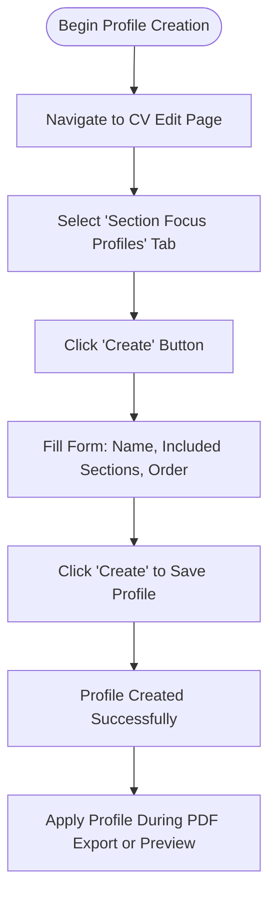
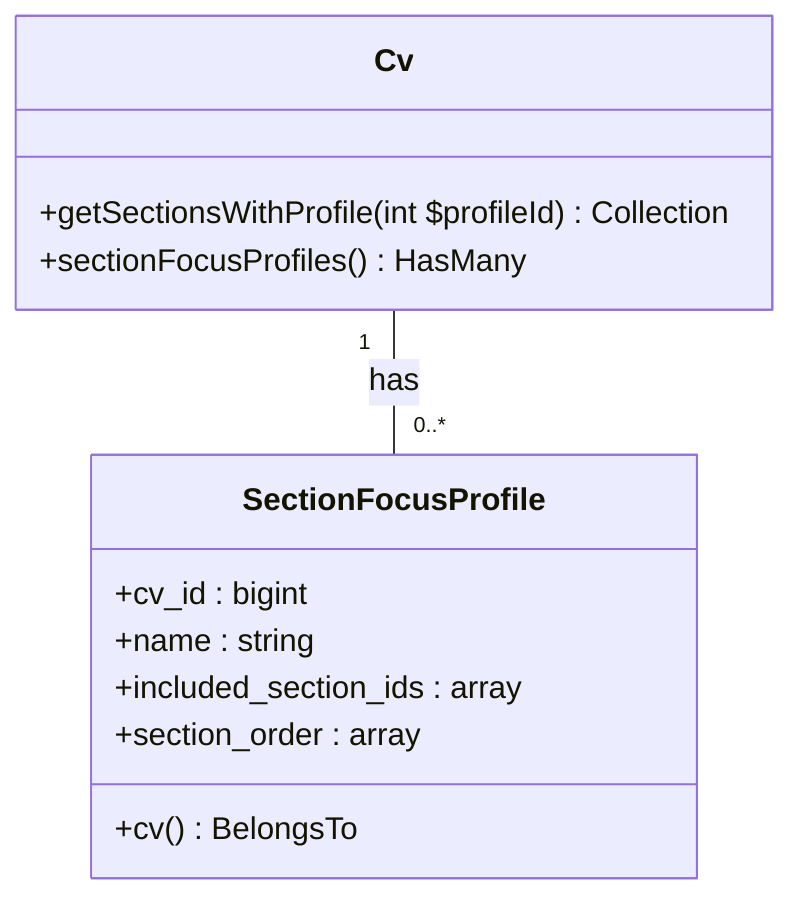
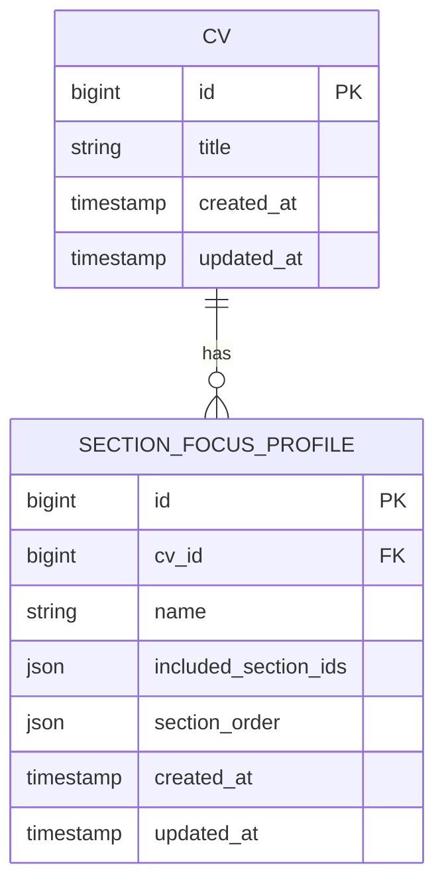

# Creating Profiles

<cite>
**Referenced Files in This Document**   
- [SectionFocusProfile.php](file://app/Models/SectionFocusProfile.php)
- [Cv.php](file://app/Models/Cv.php#L147-L194)
- [SectionFocusProfilesRelationManager.php](file://app/Filament/Resources/Cvs/RelationManagers/SectionFocusProfilesRelationManager.php)
- [2025_10_04_101831_create_section_focus_profiles_table.php](file://database/migrations/2025_10_04_101831_create_section_focus_profiles_table.php)
- [section-focus-profiles.md](file://specs/002-roadmap-md/contracts-phase3/section-focus-profiles.md)
- [data-model-phase3.md](file://specs/002-roadmap-md/data-model-phase3.md)
</cite>

## Table of Contents
1. [Introduction](#introduction)
2. [Creating a Section Focus Profile](#creating-a-section-focus-profile)
3. [Form Fields and Configuration](#form-fields-and-configuration)
4. [Validation Rules](#validation-rules)
5. [API Contract and Examples](#api-contract-and-examples)
6. [Relationship with CV Model](#relationship-with-cv-model)
7. [Relation Manager Integration](#relation-manager-integration)
8. [Common Issues and Troubleshooting](#common-issues-and-troubleshooting)
9. [Database Schema and Constraints](#database-schema-and-constraints)

## Introduction

Section Focus Profiles enable users to create named presets that filter and reorder CV sections for different job applications without modifying the original CV structure. This feature supports non-destructive tailoring, allowing instant switching between views such as "Frontend Focus" or "Leadership Focus" while preserving the integrity of the source data. Profiles are managed through the Filament admin interface and integrated into the CV edit page via a dedicated relation manager.

**Section sources**
- [section-focus-profiles.md](file://specs/002-roadmap-md/contracts-phase3/section-focus-profiles.md)
- [data-model-phase3.md](file://specs/002-roadmap-md/data-model-phase3.md)

## Creating a Section Focus Profile

To create a new Section Focus Profile, navigate to the CV edit page in the Filament admin panel and select the **Section Focus Profiles** tab. Click the **Create** button to open the form. Enter a descriptive name, select the sections to include, and define their display order. Upon saving, the profile becomes available for application during PDF generation or preview.

Profiles operate as render-time filters: they do not alter the underlying `cv_sections` table but instead provide a filtered and reordered view when requested. This ensures that multiple tailored versions can coexist without data duplication or risk of accidental modification.

**Section sources**
- [USER-GUIDE-PHASE3.md](file://specs/002-roadmap-md/USER-GUIDE-PHASE3.md#L34-L114)
- [SectionFocusProfilesRelationManager.php](file://app/Filament/Resources/Cvs/RelationManagers/SectionFocusProfilesRelationManager.php)

## Form Fields and Configuration

The profile creation form includes the following fields:

- **Name**: Required text input (max 255 characters) used to identify the profile. Must be unique per CV.
- **Included Section IDs**: Array of section identifiers to include in the filtered view.
- **Section Order**: Array specifying the display order of included sections.

These fields are configured in the `SectionFocusProfilesRelationManager` class using Filament's form builder. The `included_section_ids` and `section_order` arrays are stored as JSON in the database and cast to PHP arrays for seamless access.



**Diagram sources**
- [SectionFocusProfilesRelationManager.php](file://app/Filament/Resources/Cvs/RelationManagers/SectionFocusProfilesRelationManager.php)
- [section-focus-profiles.md](file://specs/002-roadmap-md/contracts-phase3/section-focus-profiles.md)

## Validation Rules

The system enforces several validation rules to ensure data integrity:

- **Unique Profile Name per CV**: The combination of `cv_id` and `name` must be unique, enforced by a database-level unique constraint.
- **Valid Section References**: All IDs in `included_section_ids` must correspond to existing sections within the parent CV.
- **Consistent Ordering**: The `section_order` array must contain exactly the same IDs as `included_section_ids`, ensuring no orphaned or missing entries.
- **Non-Empty Arrays**: At least one section must be included in the profile.

These validations are applied both at the application level (via model casts and form rules) and at the database level (via constraints), providing robust protection against invalid data.

**Section sources**
- [data-model-phase3.md](file://specs/002-roadmap-md/data-model-phase3.md)
- [2025_10_04_101831_create_section_focus_profiles_table.php](file://database/migrations/2025_10_04_101831_create_section_focus_profiles_table.php)

## API Contract and Examples

Profiles can be managed via RESTful endpoints that follow standard CRUD patterns. The primary operations include creating, listing, applying, updating, and deleting profiles.

### Example: Create Profile Request
```json
{
  "name": "Frontend Focus",
  "included_section_ids": [1, 3, 5, 7],
  "section_order": [7, 3, 5, 1]
}
```

### Example: Successful Response (201 Created)
```json
{
  "id": 42,
  "cv_id": 10,
  "name": "Frontend Focus",
  "included_section_ids": [1, 3, 5, 7],
  "section_order": [7, 3, 5, 1],
  "created_at": "2025-10-04T10:00:00Z",
  "updated_at": "2025-10-04T10:00:00Z"
}
```

### Error Responses
- **400 Bad Request**: Invalid section IDs not found in the CV
- **422 Unprocessable Entity**: Duplicate profile name or missing required fields

The API contract is defined in specification documents and validated through feature tests that assert correct status codes and JSON structure.

**Section sources**
- [section-focus-profiles.md](file://specs/002-roadmap-md/contracts-phase3/section-focus-profiles.md)
- [SectionFocusProfileTest.php](file://tests/Feature/SectionFocusProfileTest.php)

## Relationship with CV Model

The `SectionFocusProfile` model belongs to a `Cv` instance, establishing a one-to-many relationship. This association is implemented via the `cv_id` foreign key, which cascades on delete to maintain referential integrity.

The `Cv` model provides a `getSectionsWithProfile()` method that applies a profile by:
1. Filtering sections using `whereIn('id', $profile->included_section_ids)`
2. Reordering results according to `$profile->section_order`

This method returns a collection of sections in the specified order without modifying the original dataset, ensuring non-destructive operation.



**Diagram sources**
- [Cv.php](file://app/Models/Cv.php#L147-L194)
- [SectionFocusProfile.php](file://app/Models/SectionFocusProfile.php)

## Relation Manager Integration

The `SectionFocusProfilesRelationManager` integrates directly into the CV edit page as a tabbed interface. It displays a table of existing profiles with columns for `name` and `created_at`, and provides header actions for creating new profiles.

Key components:
- **Table Columns**: Name (searchable, sortable), creation timestamp
- **Header Actions**: Create profile
- **Record Actions**: Edit and delete profile
- **Custom Actions**: Preview PDF with profile applied

This integration allows users to manage profiles contextually while editing a CV, streamlining the workflow for creating and testing tailored views.

**Section sources**
- [SectionFocusProfilesRelationManager.php](file://app/Filament/Resources/Cvs/RelationManagers/SectionFocusProfilesRelationManager.php)
- [CvResource.php](file://app/Filament/Resources/Cvs/CvResource.php)

## Common Issues and Troubleshooting

### Issue: "I don't see Section Focus Profiles tab"
**Solutions:**
1. Hard refresh the browser (Cmd+Shift+R / Ctrl+F5)
2. Clear configuration and view caches: `php artisan config:clear && php artisan view:clear`
3. Ensure you are on the CV edit page, not the create page
4. Verify the relation manager is registered in `CvResource.php`

### Issue: "Profile doesn't show all sections"
**Check:**
1. Confirm `included_section_ids` contains the desired section IDs
2. Ensure sections exist and are not soft-deleted
3. Validate that `section_order` contains only IDs from `included_section_ids`
4. Verify the original CV includes those sections

Use the following debug commands:
```php
$cv->sections; // All sections in original CV
$cv->getSectionsWithProfile($profileId); // Filtered sections
```

**Section sources**
- [USER-GUIDE-PHASE3.md](file://specs/002-roadmap-md/USER-GUIDE-PHASE3.md#L609-L675)
- [SectionFocusIntegrationTest.php](file://tests/Feature/SectionFocusIntegrationTest.php)

## Database Schema and Constraints

The `section_focus_profiles` table is defined with the following schema:

| Field | Type | Constraints | Description |
|-------|------|-------------|-------------|
| `id` | bigint | PK, auto-increment | Primary key |
| `cv_id` | bigint | FK → cvs.id, cascadeOnDelete | Parent CV |
| `name` | varchar(255) | NOT NULL | Profile name |
| `included_section_ids` | json | NOT NULL | Array of section IDs to include |
| `section_order` | json | NOT NULL | Array defining display order |
| `created_at` | timestamp | | Creation timestamp |
| `updated_at` | timestamp | | Last modification timestamp |

**Indexes:**
- Primary key on `id`
- Index on `cv_id` (foreign key)
- Unique constraint on `(cv_id, name)`

The migration file `2025_10_04_101831_create_section_focus_profiles_table.php` implements this schema with proper foreign key constraints and indexes to optimize query performance and enforce data integrity.



**Diagram sources**
- [2025_10_04_101831_create_section_focus_profiles_table.php](file://database/migrations/2025_10_04_101831_create_section_focus_profiles_table.php)
- [data-model-phase3.md](file://specs/002-roadmap-md/data-model-phase3.md)