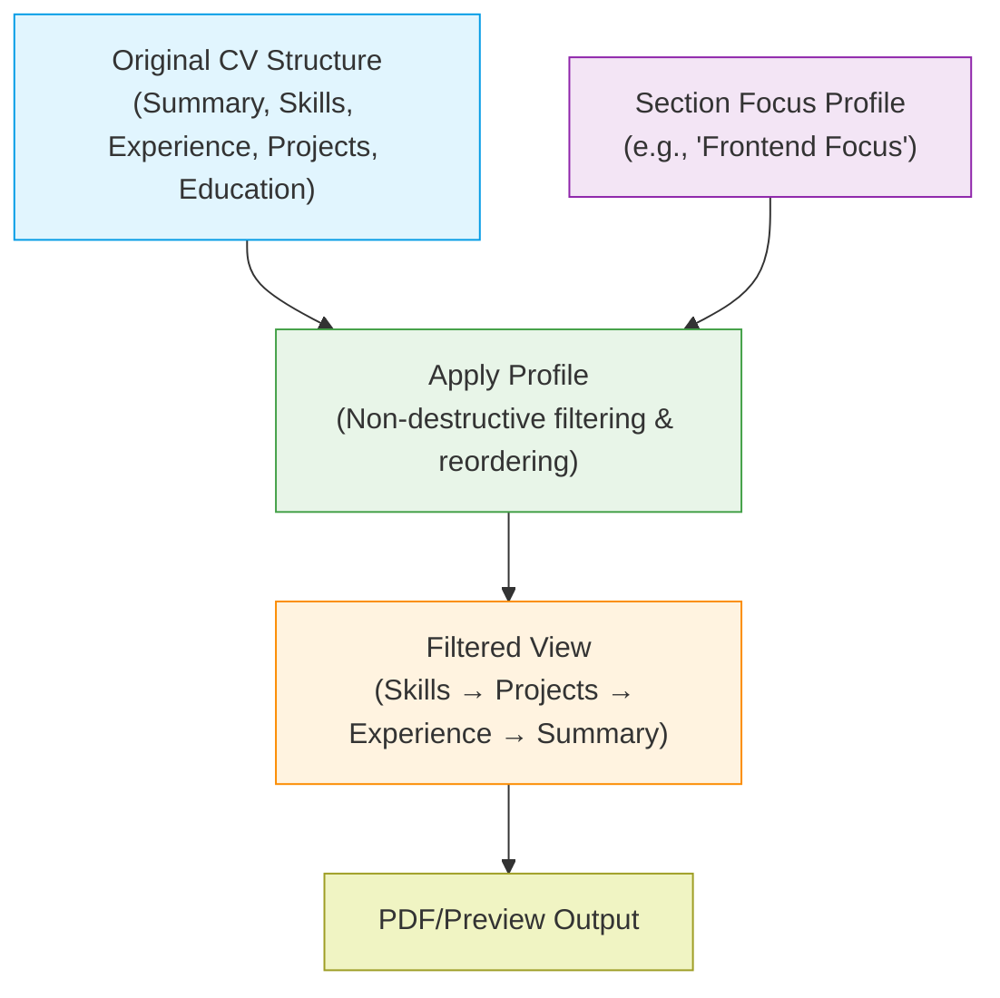
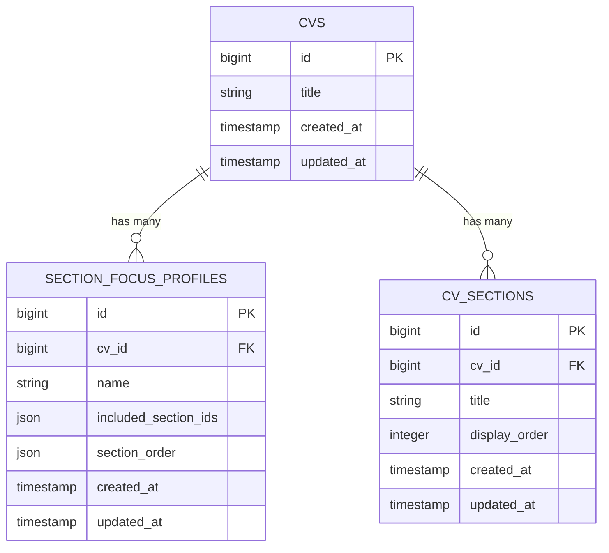
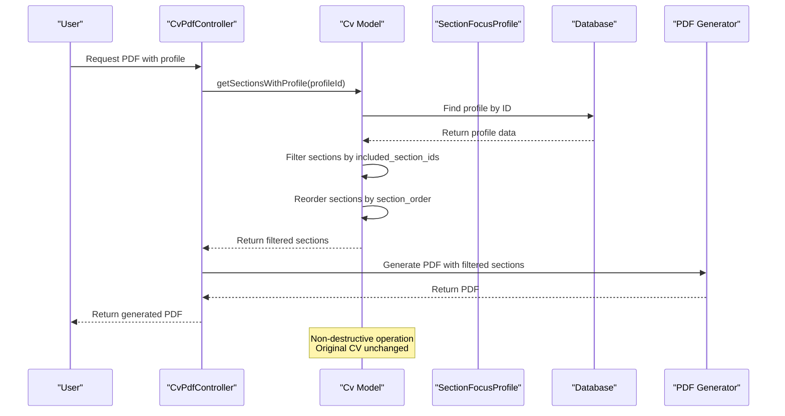
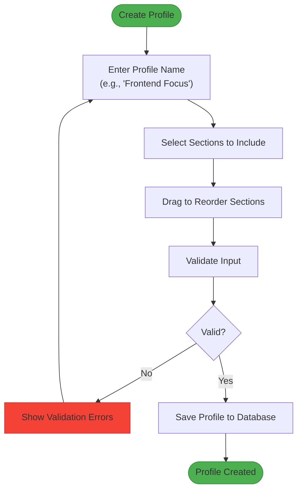
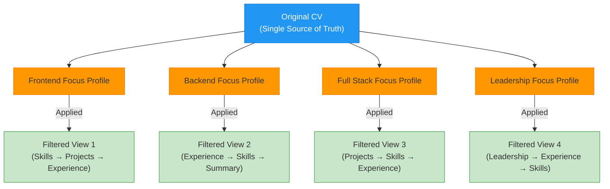
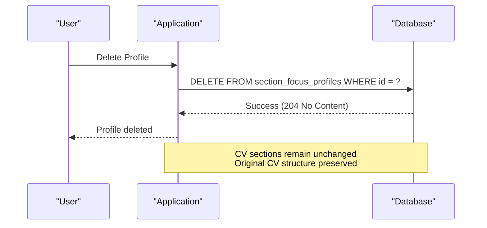
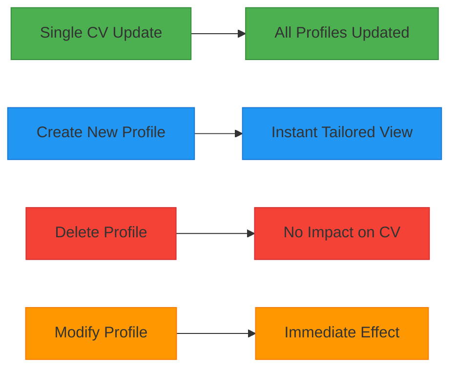

# Non-Destructive Tailoring

<cite>
**Referenced Files in This Document**   
- [SectionFocusProfile.php](file://app/Models/SectionFocusProfile.php)
- [Cv.php](file://app/Models/Cv.php)
- [create_section_focus_profiles_table.php](file://database/migrations/2025_10_04_101831_create_section_focus_profiles_table.php)
- [section-focus-profiles.md](file://specs/002-roadmap-md/contracts-phase3/section-focus-profiles.md)
- [data-model-phase3.md](file://specs/002-roadmap-md/data-model-phase3.md)
- [USER-GUIDE-PHASE3.md](file://specs/002-roadmap-md/USER-GUIDE-PHASE3.md)
- [ProfileSwitchingIntegrationTest.php](file://tests/Feature/ProfileSwitchingIntegrationTest.php)
- [SectionFocusProfileTest.php](file://tests/Feature/SectionFocusProfileTest.php)
</cite>

## Table of Contents
1. [Introduction](#introduction)
2. [Core Concept: Non-Destructive Design](#core-concept-non-destructive-design)
3. [Database Architecture](#database-architecture)
4. [Data Flow and Profile Application](#data-flow-and-profile-application)
5. [Profile Creation and Management](#profile-creation-and-management)
6. [Multiple Profile Coexistence](#multiple-profile-coexistence)
7. [Profile Deletion and Data Integrity](#profile-deletion-and-data-integrity)
8. [Business Benefits](#business-benefits)
9. [Best Practices for Profile Management](#best-practices-for-profile-management)
10. [Troubleshooting Common Concerns](#troubleshooting-common-concerns)

## Introduction
Section Focus Profiles provide a powerful mechanism for tailoring CVs to specific job applications without altering the original document structure. This documentation explains the non-destructive nature of this feature, its implementation details, and the business advantages it provides. The system allows users to create multiple named presets that filter and reorder CV sections, enabling instant switching between different tailored views while maintaining a single source of truth.

## Core Concept: Non-Destructive Design
Section Focus Profiles operate on a non-destructive principle, meaning the original CV structure remains completely unchanged regardless of profile application, modification, or deletion. Profiles function as external filters and sorters that are applied at render time, rather than modifying the underlying CV data.

When a profile is applied, the system:
1. Filters sections based on the profile's `included_section_ids` array
2. Reorders the filtered sections according to the `section_order` array
3. Returns the modified view without altering the original CV

This approach ensures that all original sections, their content, and default ordering remain intact in the database. The non-destructive design prevents accidental data loss and allows users to experiment with different CV configurations risk-free.



**Diagram sources**
- [section-focus-profiles.md](file://specs/002-roadmap-md/contracts-phase3/section-focus-profiles.md#L0-L256)
- [USER-GUIDE-PHASE3.md](file://specs/002-roadmap-md/USER-GUIDE-PHASE3.md#L34-L114)

**Section sources**
- [section-focus-profiles.md](file://specs/002-roadmap-md/contracts-phase3/section-focus-profiles.md#L0-L256)
- [USER-GUIDE-PHASE3.md](file://specs/002-roadmap-md/USER-GUIDE-PHASE3.md#L34-L114)

## Database Architecture
The Section Focus Profile system is implemented with a dedicated database table that stores profile configurations separately from the CV content. This separation is fundamental to the non-destructive design.



**Diagram sources**
- [create_section_focus_profiles_table.php](file://database/migrations/2025_10_04_101831_create_section_focus_profiles_table.php#L0-L33)
- [data-model-phase3.md](file://specs/002-roadmap-md/data-model-phase3.md#L38-L73)

The `section_focus_profiles` table contains:
- **cv_id**: Foreign key linking to the parent CV
- **name**: Descriptive name for the profile (e.g., "Frontend Focus")
- **included_section_ids**: JSON array containing IDs of sections to include
- **section_order**: JSON array defining the display order of included sections

The database enforces a unique constraint on the combination of `cv_id` and `name`, ensuring no duplicate profile names per CV. The foreign key relationship with cascade delete ensures that when a CV is deleted, all associated profiles are automatically removed.

**Section sources**
- [create_section_focus_profiles_table.php](file://database/migrations/2025_10_04_101831_create_section_focus_profiles_table.php#L0-L33)
- [data-model-phase3.md](file://specs/002-roadmap-md/data-model-phase3.md#L38-L73)

## Data Flow and Profile Application
The process of applying a Section Focus Profile involves retrieving the profile configuration and using it to filter and reorder sections at runtime. This operation is performed during PDF generation or preview rendering, ensuring the original CV data remains untouched.



**Diagram sources**
- [Cv.php](file://app/Models/Cv.php#L148-L175)
- [section-focus-profiles.md](file://specs/002-roadmap-md/contracts-phase3/section-focus-profiles.md#L0-L256)

The `getSectionsWithProfile` method in the `Cv` model implements the core logic:

1. Retrieve the specified profile from the database
2. Filter the CV's sections to include only those in the profile's `included_section_ids` array
3. Reorder the filtered sections according to the `section_order` array
4. Return the filtered and ordered collection

This method performs the filtering and reordering in memory, leaving the database records completely unchanged. The operation is efficient with O(n) complexity relative to the number of sections.

**Section sources**
- [Cv.php](file://app/Models/Cv.php#L148-L175)
- [section-focus-profiles.md](file://specs/002-roadmap-md/contracts-phase3/section-focus-profiles.md#L0-L256)

## Profile Creation and Management
Profiles are created and managed through the Filament admin interface, providing a user-friendly experience for configuring section visibility and order. The system validates all profile data to ensure integrity and prevent errors.

When creating a profile, users must specify:
- A unique name within the context of the parent CV
- An array of section IDs to include in the filtered view
- An array specifying the display order of the included sections

The system validates that:
- All section IDs in both arrays exist in the parent CV
- The `included_section_ids` and `section_order` arrays contain the same section IDs (though in potentially different orders)
- At least one section is included in the profile
- The profile name is unique for the parent CV



**Diagram sources**
- [SectionFocusProfilesRelationManager.php](file://app/Filament/Resources/Cvs/RelationManagers/SectionFocusProfilesRelationManager.php#L0-L48)
- [USER-GUIDE-PHASE3.md](file://specs/002-roadmap-md/USER-GUIDE-PHASE3.md#L34-L114)

**Section sources**
- [SectionFocusProfilesRelationManager.php](file://app/Filament/Resources/Cvs/RelationManagers/SectionFocusProfilesRelationManager.php#L0-L48)
- [USER-GUIDE-PHASE3.md](file://specs/002-roadmap-md/USER-GUIDE-PHASE3.md#L34-L114)

## Multiple Profile Coexistence
Multiple Section Focus Profiles can coexist for the same CV, allowing users to maintain different tailored views for various job applications. Each profile operates independently and can be applied instantly without affecting other profiles or the original CV.

For example, a single CV might have:
- **Frontend Focus**: Emphasizes frontend skills, projects, and relevant experience
- **Backend Focus**: Highlights backend technologies, system architecture, and server-side experience
- **Full Stack Focus**: Balances frontend and backend sections with emphasis on integration
- **Leadership Focus**: Prioritizes management experience, team leadership, and strategic initiatives



**Diagram sources**
- [USER-GUIDE-PHASE3.md](file://specs/002-roadmap-md/USER-GUIDE-PHASE3.md#L34-L114)
- [Phase3DemoSeeder.php](file://database/seeders/Phase3DemoSeeder.php#L284-L339)

The coexistence of multiple profiles enables users to:
- Quickly switch between different tailored views for various job applications
- Maintain consistency across applications by updating the single source CV
- Experiment with different section arrangements without risk
- Respond to job opportunities rapidly by applying pre-configured profiles

**Section sources**
- [USER-GUIDE-PHASE3.md](file://specs/002-roadmap-md/USER-GUIDE-PHASE3.md#L34-L114)
- [Phase3DemoSeeder.php](file://database/seeders/Phase3DemoSeeder.php#L284-L339)

## Profile Deletion and Data Integrity
Deleting a Section Focus Profile is a safe operation that does not affect the underlying CV data. When a profile is deleted, only the profile configuration is removed from the database, while all CV sections and their content remain completely intact.

The system ensures data integrity through:
- Foreign key constraints with cascade delete only in the forward direction (CV deletion removes profiles, but profile deletion does not affect the CV)
- Validation that profile application and deletion operations do not modify CV section records
- Comprehensive testing that verifies CV data persistence after profile deletion



**Diagram sources**
- [section-focus-profiles.md](file://specs/002-roadmap-md/contracts-phase3/section-focus-profiles.md#L0-L256)
- [SectionFocusProfileTest.php](file://tests/Feature/SectionFocusProfileTest.php#L41-L74)

The contract test `deleting_profile_does_not_affect_cv` explicitly verifies this behavior:

```php
test('deleting profile does not affect cv', function () {
    $cv = Cv::factory()->create();
    $sectionsCount = CvSection::where('cv_id', $cv->id)->count();

    $profile = SectionFocusProfile::factory()->create(['cv_id' => $cv->id]);

    $this->deleteJson("/api/cvs/{$cv->id}/profiles/{$profile->id}")
        ->assertStatus(204);

    expect(CvSection::where('cv_id', $cv->id)->count())->toBe($sectionsCount);
});
```

This test confirms that the number of CV sections remains unchanged after profile deletion, validating the non-destructive nature of the operation.

**Section sources**
- [section-focus-profiles.md](file://specs/002-roadmap-md/contracts-phase3/section-focus-profiles.md#L0-L256)
- [SectionFocusProfileTest.php](file://tests/Feature/SectionFocusProfileTest.php#L41-L74)

## Business Benefits
The non-destructive design of Section Focus Profiles provides several significant business advantages:

### Single Source of Truth
By maintaining one master CV with multiple profiles, users eliminate the need to manage multiple CV versions. All updates to experience, skills, or projects need only be made once in the original CV, and these changes automatically propagate to all profile views.

### Instant Profile Switching
Switching between different tailored views is instantaneous, as the system only needs to apply different filtering and ordering rules to the same underlying data. This enables rapid response to job opportunities without time-consuming manual editing.

### Risk-Free Experimentation
Users can create and test different profile configurations without fear of data loss or corruption. Profiles can be modified, duplicated, or deleted freely, allowing for experimentation with different CV arrangements.

### Consistency Across Applications
All profile views derive from the same source data, ensuring consistency in content across different job applications. This reduces the risk of discrepancies between different CV versions.

### Efficient Maintenance
Updating the CV requires changes in only one place. When new experience is added or skills are updated, all profiles automatically reflect these changes, reducing maintenance overhead.



**Diagram sources**
- [USER-GUIDE-PHASE3.md](file://specs/002-roadmap-md/USER-GUIDE-PHASE3.md#L34-L114)
- [README.md](file://README.md#L0-L215)

**Section sources**
- [USER-GUIDE-PHASE3.md](file://specs/002-roadmap-md/USER-GUIDE-PHASE3.md#L34-L114)
- [README.md](file://README.md#L0-L215)

## Best Practices for Profile Management
To maximize the benefits of Section Focus Profiles, follow these best practices:

### Profile Naming
- Use descriptive names that clearly indicate the profile's purpose (e.g., "Frontend React Focus" rather than "Profile 1")
- Include the target role or industry in the name when applicable
- Maintain consistency in naming conventions across profiles

### Profile Quantity
- Limit the number of profiles to 3-5 per CV to avoid management overhead
- Focus on major career directions rather than highly specific variations
- Combine similar profiles when possible

### Content Updates
- Always update the original CV when adding new experience or skills
- Review existing profiles after significant CV updates to ensure they remain relevant
- Consider creating new profiles for new career directions rather than modifying existing ones

### Testing
- Generate PDF previews with each profile to verify the output
- Share profile views with trusted colleagues for feedback
- Test profiles with actual job applications to assess effectiveness

### Maintenance
- Periodically review profiles to remove outdated ones
- Update profile configurations when career focus changes
- Document the purpose of each profile for future reference

The system supports these best practices through validation rules that enforce unique profile names per CV and through the non-destructive design that allows for safe experimentation and modification.

**Section sources**
- [USER-GUIDE-PHASE3.md](file://specs/002-roadmap-md/USER-GUIDE-PHASE3.md#L553-L564)
- [SectionFocusProfile.php](file://app/Models/SectionFocusProfile.php#L0-L28)

## Troubleshooting Common Concerns
Users may have concerns about data loss or unexpected behavior when working with Section Focus Profiles. This section addresses common questions and provides troubleshooting guidance.

### Data Loss Concerns
**Concern**: "Will applying a profile delete my hidden sections?"
**Answer**: No. Applying a profile only filters which sections are displayed; it does not delete or modify any CV sections. All sections remain in the database and can be accessed by switching to a different profile or viewing the original CV.

The integration test `scenario 6: non-destructive profile switching preserves original data` verifies this behavior:

```php
// Confirm no data loss - all original sections still exist
$cv->refresh();
expect($cv->sections)->toHaveCount(3)
    ->and($cv->sectionFocusProfiles)->toHaveCount(2);
```

### Profile Application Issues
**Issue**: "My profile isn't showing the expected sections"
**Troubleshooting**:
1. Verify that the `included_section_ids` array contains the correct section IDs
2. Check that the sections exist and are not soft-deleted
3. Ensure that the `section_order` array contains only IDs from `included_section_ids`
4. Confirm that the original CV contains the sections you expect

### Performance Considerations
The profile application process is efficient with O(n) complexity, where n is the number of sections. Even with multiple profiles, switching between views is instantaneous since the operation involves only filtering and reordering in memory, not database queries or complex computations.

### Empty Profiles
The system supports empty profiles (with no included sections), which can be useful for creating minimal CV versions. When an empty profile is applied, no sections are returned, but the original CV sections remain intact.

```php
// Create empty profile (no sections)
$emptyProfile = SectionFocusProfile::create([
    'cv_id' => $cv->id,
    'name' => 'Minimal Profile',
    'included_section_ids' => [],
    'section_order' => [],
]);
```

**Section sources**
- [ProfileSwitchingIntegrationTest.php](file://tests/Feature/ProfileSwitchingIntegrationTest.php#L79-L106)
- [USER-GUIDE-PHASE3.md](file://specs/002-roadmap-md/USER-GUIDE-PHASE3.md#L662-L675)