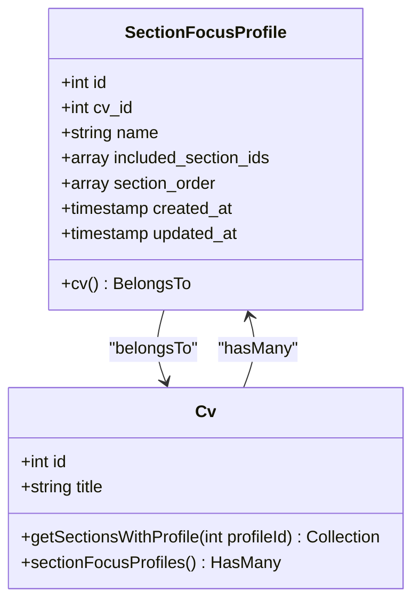
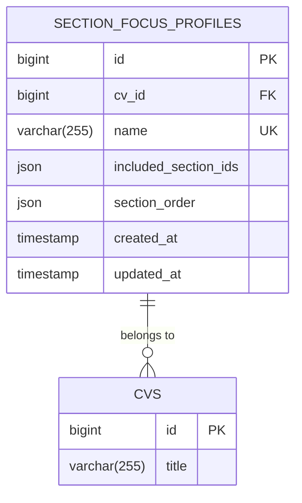
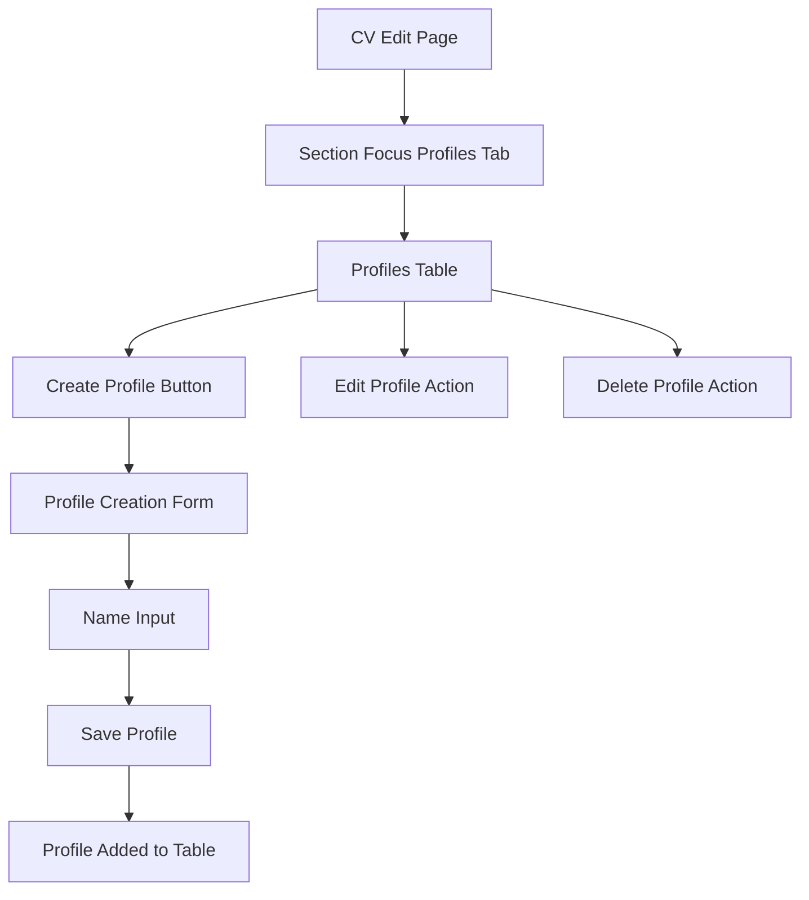
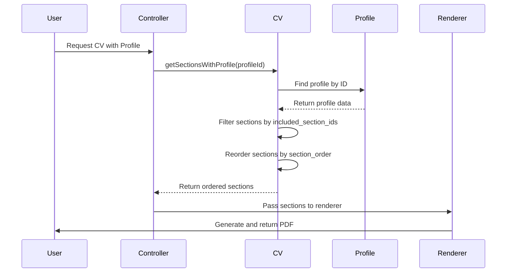

# Section Focus Profiles

<cite>
**Referenced Files in This Document**   
- [SectionFocusProfile.php](file://app/Models/SectionFocusProfile.php)
- [Cv.php](file://app/Models/Cv.php#L148-L175)
- [SectionFocusProfilesRelationManager.php](file://app/Filament/Resources/Cvs/RelationManagers/SectionFocusProfilesRelationManager.php)
- [2025_10_04_101831_create_section_focus_profiles_table.php](file://database/migrations/2025_10_04_101831_create_section_focus_profiles_table.php)
- [section-focus-profiles.md](file://specs/002-roadmap-md/contracts-phase3/section-focus-profiles.md)
- [data-model-phase3.md](file://specs/002-roadmap-md/data-model-phase3.md)
- [USER-GUIDE-PHASE3.md](file://specs/002-roadmap-md/USER-GUIDE-PHASE3.md)
</cite>

## Table of Contents
1. [Introduction](#introduction)
2. [Core Functionality](#core-functionality)
3. [SectionFocusProfile Model](#sectionfocusprofile-model)
4. [Database Schema](#database-schema)
5. [UI and Management in Filament](#ui-and-management-in-filament)
6. [Use Cases and Examples](#use-cases-and-examples)
7. [Profile Application and Rendering](#profile-application-and-rendering)
8. [Validation and Constraints](#validation-and-constraints)

## Introduction
Section Focus Profiles provide a non-destructive method for tailoring CVs to specific job applications by reordering and filtering sections without altering the original CV content. This feature enables users to create named presets that define which sections to include and their display order, allowing for rapid customization of CVs for different roles such as technical, managerial, or full-stack positions. The original CV remains unchanged, ensuring data integrity while enabling flexible presentation options.

## Core Functionality
Section Focus Profiles allow users to create named presets that control the visibility and ordering of CV sections during rendering. This functionality enables non-destructive tailoring of CVs for different job applications. When a profile is applied, the system filters sections based on the included_section_ids array and reorders them according to the section_order array. The original CV structure remains completely unchanged, making this a safe and reversible operation. Profiles can be quickly switched, allowing users to generate different CV variants instantly without maintaining multiple CV copies.

**Section sources**
- [section-focus-profiles.md](file://specs/002-roadmap-md/contracts-phase3/section-focus-profiles.md)
- [USER-GUIDE-PHASE3.md](file://specs/002-roadmap-md/USER-GUIDE-PHASE3.md#L34-L114)

## SectionFocusProfile Model
The SectionFocusProfile model represents a named preset for CV section ordering and visibility. It belongs to a CV and contains configuration for which sections to include and their display order. The model includes a relationship to its parent CV and uses array casting for the included_section_ids and section_order attributes, which are stored as JSON in the database. The model is fillable for cv_id, name, included_section_ids, and section_order fields, enabling mass assignment during creation and updates.

**Diagram sources**
- [SectionFocusProfile.php](file://app/Models/SectionFocusProfile.php)
- [Cv.php](file://app/Models/Cv.php)

**Section sources**
- [SectionFocusProfile.php](file://app/Models/SectionFocusProfile.php)
- [Cv.php](file://app/Models/Cv.php#L148-L175)

## Database Schema
The section_focus_profiles table stores the configuration for each profile. It includes a foreign key to the cvs table with cascade deletion, ensuring profiles are removed when their parent CV is deleted. The name field is constrained to 255 characters and must be unique per CV, preventing duplicate profile names. The included_section_ids and section_order fields are stored as JSON arrays, containing the IDs of sections to include and their desired display order. A composite unique index on (cv_id, name) enforces the uniqueness constraint, while an index on cv_id optimizes queries when retrieving profiles for a specific CV.

**Diagram sources**
- [2025_10_04_101831_create_section_focus_profiles_table.php](file://database/migrations/2025_10_04_101831_create_section_focus_profiles_table.php)

**Section sources**
- [2025_10_04_101831_create_section_focus_profiles_table.php](file://database/migrations/2025_10_04_101831_create_section_focus_profiles_table.php)
- [data-model-phase3.md](file://specs/002-roadmap-md/data-model-phase3.md#L38-L73)

## UI and Management in Filament
Profiles are managed through the SectionFocusProfilesRelationManager in the Filament admin interface, accessible as a tab when editing a CV. The UI provides a table listing all profiles for the CV with columns for name and creation date, along with create, edit, and delete actions. The creation and editing form includes a required text input for the profile name with a maximum length of 255 characters. Users can create multiple profiles for different job types, and the interface allows for quick switching between profiles when generating CV outputs.

**Diagram sources**
- [SectionFocusProfilesRelationManager.php](file://app/Filament/Resources/Cvs/RelationManagers/SectionFocusProfilesRelationManager.php)

**Section sources**
- [SectionFocusProfilesRelationManager.php](file://app/Filament/Resources/Cvs/RelationManagers/SectionFocusProfilesRelationManager.php)
- [USER-GUIDE-PHASE3.md](file://specs/002-roadmap-md/USER-GUIDE-PHASE3.md#L34-L114)

## Use Cases and Examples
Section Focus Profiles enable users to create tailored CV variants for different job applications without modifying the original content. For technical roles, users can create a "Frontend Focus" profile that emphasizes skills, projects, and relevant experience while de-emphasizing less relevant sections. For managerial positions, a "Leadership Focus" profile can highlight management experience, achievements, and soft skills. Users can maintain multiple profiles for different career focuses, such as "Backend Engineer," "Full Stack Developer," or "Technical Lead," and switch between them instantly when applying to different types of positions.

**Section sources**
- [USER-GUIDE-PHASE3.md](file://specs/002-roadmap-md/USER-GUIDE-PHASE3.md#L34-L114)
- [section-focus-profiles.md](file://specs/002-roadmap-md/contracts-phase3/section-focus-profiles.md)

## Profile Application and Rendering
When a profile is applied during CV rendering, the system uses the getSectionsWithProfile method to filter and reorder sections. This method first retrieves the specified profile, then filters the CV's sections to include only those in the included_section_ids array. The filtered sections are then reordered according to the section_order array, creating a new sequence for display. This operation is performed at render time, meaning the original CV data remains completely unchanged. The process is efficient with O(n) complexity relative to the number of sections, allowing for instant profile switching and PDF generation.

**Diagram sources**
- [Cv.php](file://app/Models/Cv.php#L148-L175)

**Section sources**
- [Cv.php](file://app/Models/Cv.php#L148-L175)
- [section-focus-profiles.md](file://specs/002-roadmap-md/contracts-phase3/section-focus-profiles.md)

## Validation and Constraints
The system enforces several validation rules and constraints to ensure data integrity. Profile names must be unique within each CV, enforced by a database unique constraint on (cv_id, name). The name field is limited to 255 characters, and both included_section_ids and section_order must be valid JSON arrays. All section IDs in these arrays must correspond to existing sections in the parent CV. The system validates that at least one section is included in each profile. These constraints prevent duplicate profiles, ensure referential integrity, and maintain data consistency across the application.

**Section sources**
- [data-model-phase3.md](file://specs/002-roadmap-md/data-model-phase3.md#L38-L73)
- [section-focus-profiles.md](file://specs/002-roadmap-md/contracts-phase3/section-focus-profiles.md)