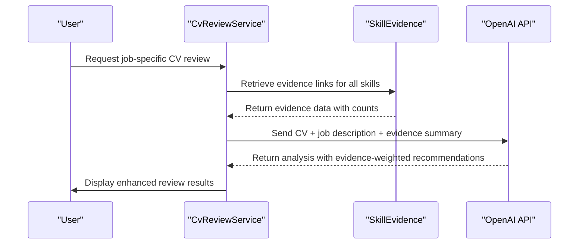
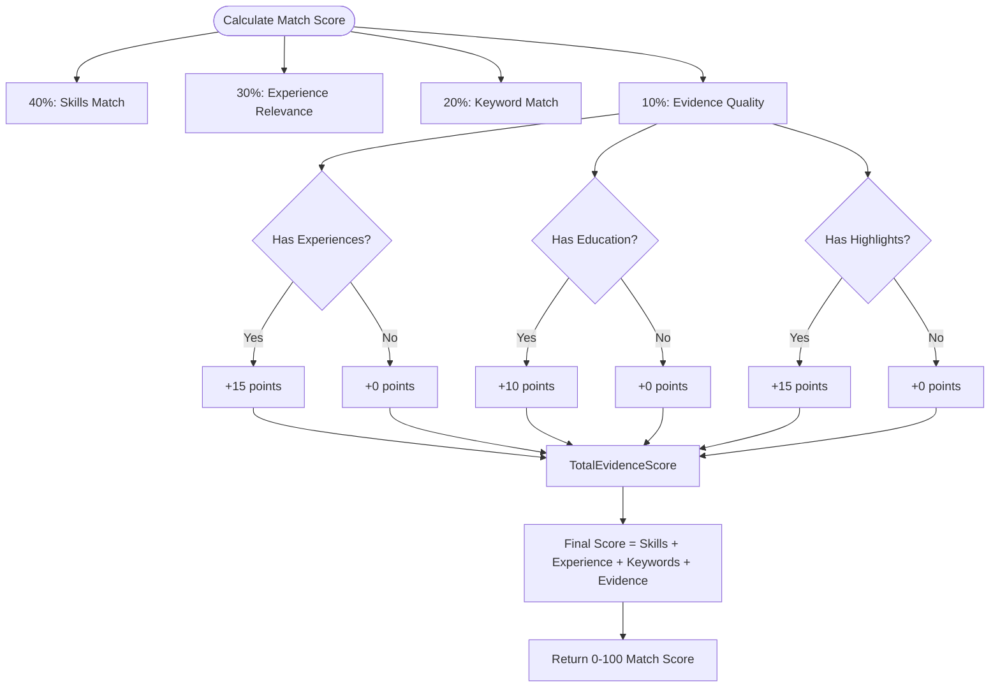
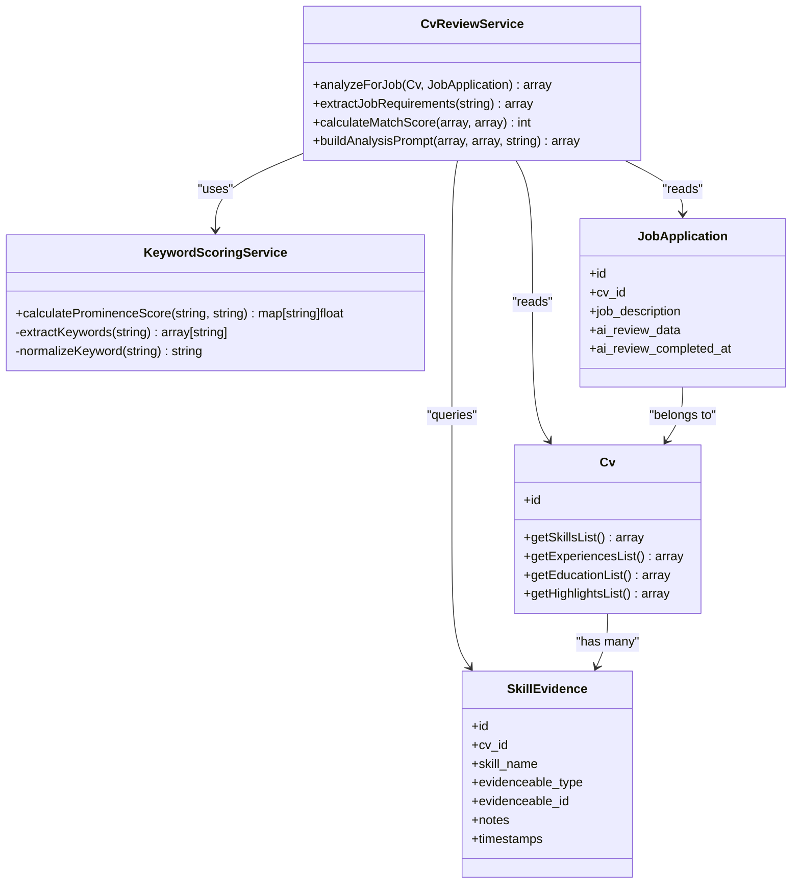
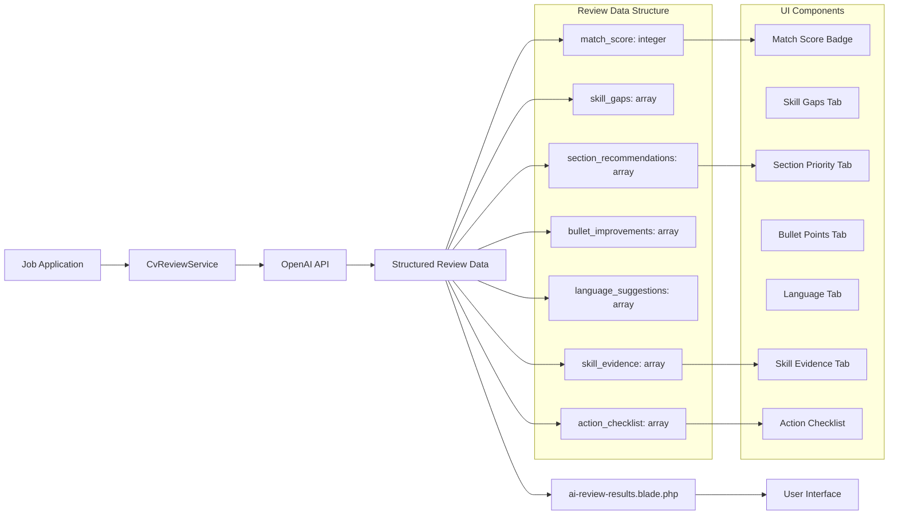

# Alignment Analysis

<cite>
**Referenced Files in This Document**   
- [CvReviewService.php](file://app/Services/CvReviewService.php)
- [KeywordScoringService.php](file://app/Services/KeywordScoringService.php)
- [ai-review-results.blade.php](file://resources/views/filament/forms/ai-review-results.blade.php)
- [skill-evidence.md](file://specs/002-roadmap-md/contracts-phase3/skill-evidence.md)
- [USER-GUIDE-PHASE3.md](file://specs/002-roadmap-md/USER-GUIDE-PHASE3.md)
</cite>

## Table of Contents
1. [Introduction](#introduction)
2. [Core Components](#core-components)
3. [Skill Evidence Integration in AI Review](#skill-evidence-integration-in-ai-review)
4. [Match Scoring with Evidence Weighting](#match-scoring-with-evidence-weighting)
5. [Section Recommendations Based on Evidence](#section-recommendations-based-on-evidence)
6. [Template Integration and Output](#template-integration-and-output)
7. [Future Integration Possibilities](#future-integration-possibilities)
8. [User Best Practices](#user-best-practices)
9. [Conclusion](#conclusion)

## Introduction
The Alignment Analysis feature leverages skill evidence data to enhance job application tailoring through AI-powered recommendations. By connecting claimed skills to concrete experiences, projects, or education entries, the system strengthens the validity and confidence of AI-generated suggestions. This documentation details how the CvReviewService and KeywordScoringService utilize evidence links to improve match scoring, section prioritization, and recommendation quality. The integration enables users to make data-driven decisions when customizing their CVs for specific roles, ensuring stronger alignment with job requirements.

## Core Components

The alignment analysis functionality is built around two primary services: **CvReviewService** and **KeywordScoringService**, both of which interact with the **SkillEvidence** model to assess the strength and relevance of a candidate's qualifications.

The **CvReviewService** serves as the main analysis engine, responsible for processing CV content against job descriptions and generating structured feedback. It performs several key functions including extracting job requirements, calculating match scores, identifying skill gaps, and producing actionable recommendations. A critical aspect of its operation is the inclusion of evidence quality in the overall scoring algorithm.

The **KeywordScoringService** complements this by analyzing the prominence of keywords within job descriptions, assigning weighted scores based on where terms appear (title, introduction, body). This helps prioritize which keywords should be emphasized in the CV based on their contextual importance in the job posting.

Both services integrate with the **SkillEvidence** model, which maintains polymorphic relationships between skills and supporting experiences. This structure allows for flexible linking of skills to various types of evidence (experiences, projects, education) while enabling aggregation and analysis of evidence strength per skill.

**Section sources**
- [CvReviewService.php](file://app/Services/CvReviewService.php#L1-L225)
- [KeywordScoringService.php](file://app/Services/KeywordScoringService.php#L1-L148)
- [skill-evidence.md](file://specs/002-roadmap-md/contracts-phase3/skill-evidence.md#L0-L342)

## Skill Evidence Integration in AI Review

The **CvReviewService** incorporates skill evidence data as a key factor in its analysis workflow. When evaluating a CV for a specific job application, the service assesses not only the presence of required skills but also the quantity and quality of supporting evidence for each skill.

During the review process, the service extracts job requirements using OpenAI to identify relevant skills, competencies, and keywords from the job description. It then compares these against the candidate's CV data, including their listed skills and associated evidence. Skills that are well-supported by multiple evidence sources receive higher confidence ratings in the AI analysis.

For example, if a job posting requires "React" proficiency, the system checks how many evidence links exist for that skill. A candidate with three verified React experiences (two professional roles and one personal project) will receive more confident recommendations than one with only a single mention. The AI uses this information to generate stronger endorsements for including React-related content and may suggest de-emphasizing skills with weak or no evidence.

The evidence assessment also informs gap analysis. If a required skill lacks sufficient evidence, the system generates targeted suggestions such as "Add evidence for React usage in recent projects" rather than simply noting the skill's absence. This provides users with actionable guidance for strengthening their application.

**Diagram sources**
- [CvReviewService.php](file://app/Services/CvReviewService.php#L1-L225)
- [skill-evidence.md](file://specs/002-roadmap-md/contracts-phase3/skill-evidence.md#L0-L342)

**Section sources**
- [CvReviewService.php](file://app/Services/CvReviewService.php#L1-L225)
- [skill-evidence.md](file://specs/002-roadmap-md/contracts-phase3/skill-evidence.md#L0-L342)

## Match Scoring with Evidence Weighting

The match scoring algorithm in **CvReviewService** explicitly incorporates evidence quality as a weighted component of the overall alignment score. According to the implementation, the final match score is calculated using the following distribution:

- **40% Skills Match**: Direct comparison of required vs. possessed skills
- **30% Experience Relevance**: Alignment of experience titles and content with role focus
- **20% Keyword Match**: Presence of important keywords in CV content
- **10% Evidence Quality**: Strength of supporting evidence for claimed skills

The evidence quality component (`calculateEvidenceQuality`) evaluates the completeness of a candidate's profile by checking for the presence of experiences, education, and highlights. Profiles with richer supporting documentation receive higher base scores in this category.

When a skill like "React" has multiple evidence sources (e.g., work experiences, personal projects, educational coursework), it contributes positively to both the skills match percentage and the overall evidence quality score. This dual impact amplifies the benefit of maintaining well-documented skill claims.

For frontend roles requiring React, a candidate with three verified React experiences would receive a significantly higher match score than one with the same skill listed but no linked evidence. The system recognizes that documented experience provides stronger proof of proficiency, leading to more confident AI recommendations about the candidate's suitability for the role.

**Diagram sources**
- [CvReviewService.php](file://app/Services/CvReviewService.php#L1-L225)

**Section sources**
- [CvReviewService.php](file://app/Services/CvReviewService.php#L1-L225)

## Section Recommendations Based on Evidence

The AI review system uses evidence data to inform section prioritization recommendations. When analyzing a job description, the service identifies which skills and experiences are most relevant and then checks the strength of evidence supporting those areas.

Sections containing experiences with strong evidence for in-demand skills are recommended for higher placement in the CV. For example, if a frontend role emphasizes React and the candidate has three well-documented React projects, the system will recommend moving the "Projects" section above less relevant sections.

The **KeywordScoringService** enhances this process by identifying which keywords carry the most weight in the job description based on their location (title, introduction, body). These high-weight keywords are then cross-referenced with the candidate's evidence links to determine which sections contain the strongest proof of relevant competencies.

This evidence-based prioritization ensures that the most substantiated qualifications appear first, increasing the likelihood that hiring managers will quickly recognize the candidate's suitability. The system also suggests adding or expanding sections that could provide additional evidence for critical skills identified in the job description.

**Diagram sources**
- [CvReviewService.php](file://app/Services/CvReviewService.php#L1-L225)
- [KeywordScoringService.php](file://app/Services/KeywordScoringService.php#L1-L148)

**Section sources**
- [CvReviewService.php](file://app/Services/CvReviewService.php#L1-L225)
- [KeywordScoringService.php](file://app/Services/KeywordScoringService.php#L1-L148)

## Template Integration and Output

The AI review results are rendered in the **ai-review-results.blade.php** template, which includes a dedicated tab for "Skill Evidence" alongside other review components like skill gaps and section recommendations.

This template displays the evidence assessment as part of the comprehensive review output, allowing users to see exactly how their documented experiences influence the AI's recommendations. The interface includes a tabbed layout where users can switch between different aspects of the review, with the skill evidence tab showing all linked skills and their supporting documentation.

The template receives structured data from the CvReviewService, including the `skill_evidence` array that contains detailed information about how well each required skill is supported in the CV. This information is presented in a user-friendly format that highlights both strengths (skills with multiple evidence sources) and weaknesses (skills with little or no supporting evidence).

Users can use this feedback to strategically enhance their CV before submission, focusing on adding evidence for critical skills that lack sufficient documentation. The visual presentation of evidence strength helps users make informed decisions about which experiences to emphasize and which skills may need additional supporting details.

**Diagram sources**
- [ai-review-results.blade.php](file://resources/views/filament/forms/ai-review-results.blade.php#L1-L116)
- [CvReviewService.php](file://app/Services/CvReviewService.php#L1-L225)

**Section sources**
- [ai-review-results.blade.php](file://resources/views/filament/forms/ai-review-results.blade.php#L1-L116)

## Future Integration Possibilities

A promising future integration involves leveraging skill evidence data in **cover letter generation**. The system could support template variables such as `{{skill_evidence:React}}` that automatically insert evidence-based statements into cover letters.

For example, when processing `{{skill_evidence:React}}`, the system would query the SkillEvidence model for all entries related to React, then generate a statement like: "I have demonstrated React proficiency in 3 projects including building an e-commerce dashboard at Acme Corp and developing a customer portal at StartupXYZ."

This dynamic content generation would allow for highly personalized cover letters that automatically highlight the most substantiated skills based on available evidence. The CoverLetterService would need to be extended with an interpolation method that recognizes these special variables and formats the evidence into compelling narrative statements.

Additional possibilities include:
- Generating timeline views of skill development based on evidence dates
- Creating skill validation reports for HR systems
- Providing interview talking points based on documented experiences
- Offering evidence-based salary negotiation support

These enhancements would further strengthen the connection between documented experience and application materials, creating a more cohesive and persuasive job application package.

**Section sources**
- [skill-evidence.md](file://specs/002-roadmap-md/contracts-phase3/skill-evidence.md#L0-L342)
- [USER-GUIDE-PHASE3.md](file://specs/002-roadmap-md/USER-GUIDE-PHASE3.md#L115-L197)

## User Best Practices

To maximize alignment through evidence-based tailoring, users should follow these best practices:

1. **Link skills to impactful experiences**: For each key skill, connect it to the most relevant and impressive experiences, projects, or educational achievements. Focus on quality and relevance rather than quantity.

2. **Prioritize high-value skills**: When applying for frontend roles, ensure that critical skills like React have multiple evidence sources. The system will prioritize recommendations for well-documented skills.

3. **Use descriptive notes**: When creating evidence links, include specific details about how the experience demonstrates the skill (e.g., "Built customer dashboard with React hooks and Context API").

4. **Regularly update evidence**: As new experiences are added to the CV, create corresponding evidence links to maintain strong documentation.

5. **Verify evidence coverage**: Before applying to a job, check the skill evidence tab to ensure that all required skills from the job description have adequate supporting documentation.

6. **Address evidence gaps**: If a required skill lacks sufficient evidence, either add new experiences that demonstrate the skill or consider de-emphasizing it in the application.

The user guide provides examples of evidence-based decision making, such as choosing to emphasize React over Vue when applying for frontend positions because React has five evidence sources compared to Vue's single source. This data-driven approach ensures that application materials highlight the candidate's strongest qualifications.

**Section sources**
- [USER-GUIDE-PHASE3.md](file://specs/002-roadmap-md/USER-GUIDE-PHASE3.md#L115-L197)
- [skill-evidence.md](file://specs/002-roadmap-md/contracts-phase3/skill-evidence.md#L0-L342)

## Conclusion
The alignment analysis system effectively leverages skill evidence data to enhance AI-generated recommendations for job applications. By integrating evidence quality into match scoring and section prioritization, the CvReviewService provides more confident and accurate guidance to users. The KeywordScoringService further refines this analysis by identifying the most important keywords in job descriptions. Together, these components create a powerful tool for tailoring applications based on substantiated skills rather than mere claims. Future integrations with cover letter generation promise to extend these benefits across all application materials, creating a comprehensive, evidence-based job application strategy.