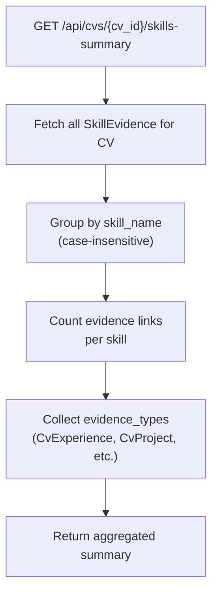
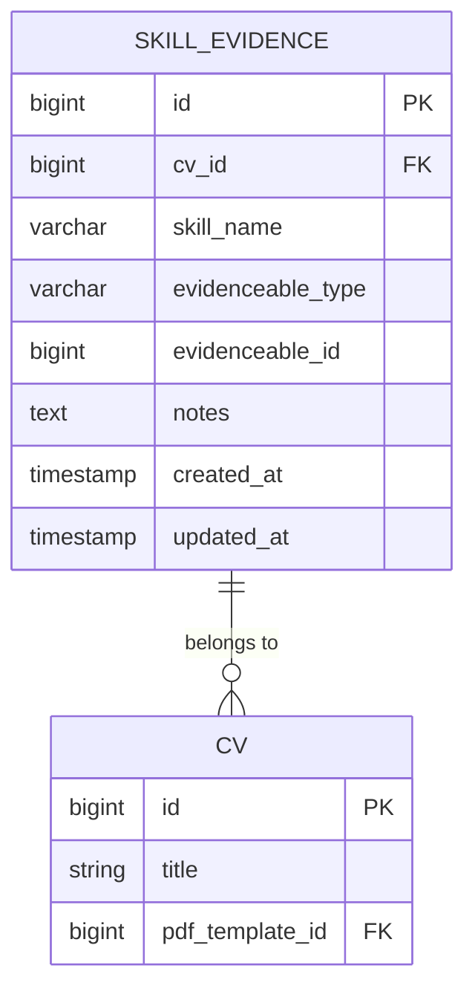
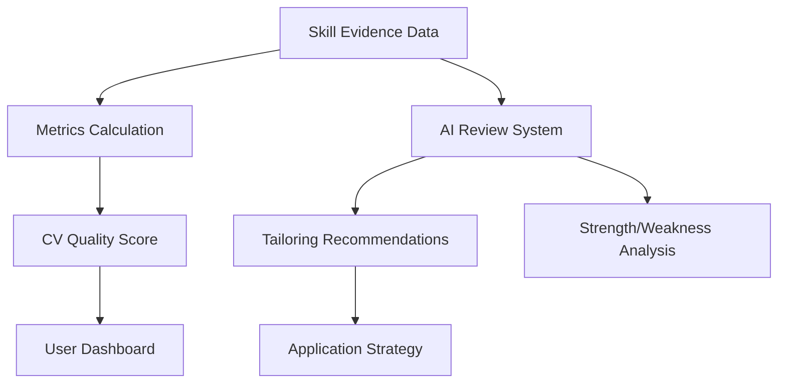

# Evidence Tracking

<cite>
**Referenced Files in This Document**   
- [Cv.php](file://app/Models/Cv.php#L167-L194)
- [SkillEvidence.php](file://app/Models/SkillEvidence.php)
- [skill-evidence.md](file://specs/002-roadmap-md/contracts-phase3/skill-evidence.md)
- [data-model-phase3.md](file://specs/002-roadmap-md/data-model-phase3.md)
- [SkillEvidenceTest.php](file://tests/Feature/SkillEvidenceTest.php)
- [create_skill_evidence_table.php](file://database/migrations/2025_10_04_101842_create_skill_evidence_table.php)
- [skill-evidence.blade.php](file://resources/views/filament/infolists/skill-evidence.blade.php)
</cite>

## Table of Contents
1. [Introduction](#introduction)
2. [Skills Summary Endpoint](#skills-summary-endpoint)
3. [Response Structure](#response-structure)
4. [Database Query Logic](#database-query-logic)
5. [Indexing Strategy](#indexing-strategy)
6. [Use Cases](#use-cases)
7. [Integration with Metrics and AI Review](#integration-with-metrics-and-ai-review)
8. [Testing Considerations](#testing-considerations)
9. [Troubleshooting Guide](#troubleshooting-guide)

## Introduction
The skill evidence tracking system enables users to link claimed skills to specific experiences, projects, or education entries within their CV that demonstrate proficiency. This feature supports strategic tailoring of applications by providing visibility into which skills have strong supporting evidence and which lack sufficient proof. The system is built around the `SkillEvidence` model, which uses a polymorphic relationship to connect skills to various types of evidenceable content.

**Section sources**
- [data-model-phase3.md](file://specs/002-roadmap-md/data-model-phase3.md#L123-L163)
- [USER-GUIDE-PHASE3.md](file://specs/002-roadmap-md/USER-GUIDE-PHASE3.md#L115-L197)

## Skills Summary Endpoint
The `GET /api/cvs/{cv_id}/skills-summary` endpoint aggregates all skills associated with a CV, grouping them by skill name (case-insensitively) and counting the number of evidence links. This endpoint provides a comprehensive overview of skill evidence distribution across the CV.

The aggregation is performed through the `getSkillsWithEvidence()` method in the `Cv` model, which retrieves all `SkillEvidence` records associated with the CV and processes them to count occurrences and track evidence types. The method ensures case-insensitive grouping by treating skill names as case-insensitive during aggregation.



**Diagram sources **
- [Cv.php](file://app/Models/Cv.php#L167-L194)
- [skill-evidence.md](file://specs/002-roadmap-md/contracts-phase3/skill-evidence.md#L92-L126)

**Section sources**
- [Cv.php](file://app/Models/Cv.php#L167-L194)
- [skill-evidence.md](file://specs/002-roadmap-md/contracts-phase3/skill-evidence.md#L92-L126)

## Response Structure
The response from the skills summary endpoint includes three key pieces of information for each unique skill: the skill name, evidence count, and evidence types.

```json
{
  "data": [
    {
      "skill_name": "React",
      "evidence_count": 3,
      "evidence_types": ["CvExperience", "CvProject"]
    },
    {
      "skill_name": "Python",
      "evidence_count": 2,
      "evidence_types": ["CvExperience", "CvEducation"]
    }
  ]
}
```

The `evidence_count` field represents the total number of evidence links for that skill, while `evidence_types` is an array showing the different types of content (e.g., experience, project, education) that serve as evidence. This structure enables clients to quickly assess both the quantity and diversity of evidence for each skill.

**Section sources**
- [skill-evidence.md](file://specs/002-roadmap-md/contracts-phase3/skill-evidence.md#L92-L126)

## Database Query Logic
The aggregation logic is implemented in the `getSkillsWithEvidence()` method of the `Cv` model. This method retrieves all `SkillEvidence` records for a CV and processes them in memory to group by skill name and count evidence links.

The implementation uses Eloquent's relationship methods to fetch `SkillEvidence` records with their associated evidenceable models. It then iterates through these records, normalizing skill names for case-insensitive grouping. For each skill, it maintains a count of evidence links and tracks the unique types of evidenceable models that support the skill.

The method handles case insensitivity by using the skill name as stored in the database without modification, relying on the application layer to ensure consistent input. The grouping is performed in PHP rather than at the database level to maintain flexibility in handling the polymorphic relationships.

**Section sources**
- [Cv.php](file://app/Models/Cv.php#L167-L194)

## Indexing Strategy
The database indexing strategy for the `skill_evidence` table is designed to optimize query performance for the most common access patterns. The table includes several indexes to support efficient retrieval and aggregation of skill evidence data.

A composite unique index on `(cv_id, skill_name, evidenceable_type, evidenceable_id)` prevents duplicate evidence links, ensuring that the same skill cannot be linked to the same evidenceable item multiple times. This constraint enforces data integrity at the database level.

Additional indexes include:
- Index on `cv_id` for efficient retrieval of all evidence for a specific CV
- Index on `skill_name` for searching evidence by skill name
- Composite index on `(evidenceable_type, evidenceable_id)` for polymorphic lookups

These indexes enable efficient execution of the aggregation queries performed by the `getSkillsWithEvidence()` method, particularly when filtering by CV or skill name.



**Diagram sources **
- [create_skill_evidence_table.php](file://database/migrations/2025_10_04_101842_create_skill_evidence_table.php)
- [data-model-phase3.md](file://specs/002-roadmap-md/data-model-phase3.md#L123-L163)

**Section sources**
- [create_skill_evidence_table.php](file://database/migrations/2025_10_04_101842_create_skill_evidence_table.php)
- [data-model-phase3.md](file://specs/002-roadmap-md/data-model-phase3.md#L123-L163)

## Use Cases
The skill evidence tracking system supports several important use cases for CV optimization and application tailoring.

One primary use case is identifying skills with insufficient evidence. Users can quickly identify skills that are claimed in their CV but lack supporting evidence, allowing them to either add relevant experiences or de-emphasize those skills in job applications. This helps prevent overclaiming skills without proof.

Another use case is comparing evidence strength across different skills. By examining the evidence count and types, users can determine which skills have the strongest support and should be emphasized in applications. For example, a skill with multiple experience-based evidence links might be prioritized over one with only a single project reference.

The system also supports strategic tailoring for specific job applications. When applying for a position requiring specific skills, users can verify whether they have sufficient evidence for those skills and make informed decisions about how to present their qualifications.

**Section sources**
- [USER-GUIDE-PHASE3.md](file://specs/002-roadmap-md/USER-GUIDE-PHASE3.md#L115-L197)

## Integration with Metrics and AI Review
The skill evidence data integrates with the system's metrics and AI review components to inform tailoring decisions. The evidence counts and types contribute to overall CV quality metrics, helping identify areas for improvement.

In the AI review system, the evidence data is used to generate suggestions for strengthening the CV. For skills with low evidence counts, the AI might recommend adding relevant experiences or projects. The system can also suggest reordering sections to highlight skills with strong evidence.

The evidence data is displayed in the Filament admin interface through the `skill-evidence.blade.php` view, which shows skill evidence with suggestions for strengthening weak areas. This integration provides users with actionable insights based on the evidence analysis.



**Diagram sources **
- [skill-evidence.blade.php](file://resources/views/filament/infolists/skill-evidence.blade.php)
- [MetricsCalculationService.php](file://app/Services/MetricsCalculationService.php)
- [CvReviewService.php](file://app/Services/CvReviewService.php)

**Section sources**
- [skill-evidence.blade.php](file://resources/views/filament/infolists/skill-evidence.blade.php)

## Testing Considerations
The system includes comprehensive tests in `SkillEvidenceTest.php` that validate key functionality, particularly around case insensitivity and cascade deletion.

The case insensitivity tests verify that skill names are treated as case-insensitive both in storage and retrieval. This ensures that "React", "react", and "REACT" are treated as the same skill when aggregating evidence. The tests confirm that queries for a skill name in any case return the correct evidence records.

Cascade deletion tests verify the relationship between `SkillEvidence` and its parent CV. When a CV is deleted, all associated `SkillEvidence` records are cascaded and removed. However, deleting an individual evidenceable item (like an experience) does not cascade to delete the `SkillEvidence` record, preserving the evidence link even if the source content is removed.

Additional tests validate the prevention of duplicate evidence links, ensuring that the same skill cannot be linked to the same evidenceable item multiple times. This maintains data integrity and prevents inflated evidence counts.

**Section sources**
- [SkillEvidenceTest.php](file://tests/Feature/SkillEvidenceTest.php)

## Troubleshooting Guide
Common issues with the skill evidence tracking system include missing evidence counts and incorrect type mappings.

If evidence counts are missing or incorrect, verify that the `SkillEvidence` records exist in the database and are properly associated with the CV. Check that the `cv_id` foreign key is correctly set and that the records have not been accidentally deleted.

For issues with case sensitivity, ensure that the application is consistently handling skill names. Although the system is designed to be case-insensitive, inconsistent input can lead to apparent duplication of skills. The unique constraint should prevent actual duplicates, but inconsistent display can occur.

If evidence types are not being correctly identified, verify that the `evidenceable_type` field contains the correct fully qualified class name (e.g., "App\Models\CvExperience"). Incorrect type mappings will prevent the polymorphic relationship from resolving properly.

When troubleshooting, also check the database indexes to ensure they are properly created and maintained. Missing or corrupted indexes can significantly impact query performance and aggregation accuracy.

**Section sources**
- [SkillEvidenceTest.php](file://tests/Feature/SkillEvidenceTest.php)
- [SkillEvidence.php](file://app/Models/SkillEvidence.php)
- [Cv.php](file://app/Models/Cv.php#L167-L194)