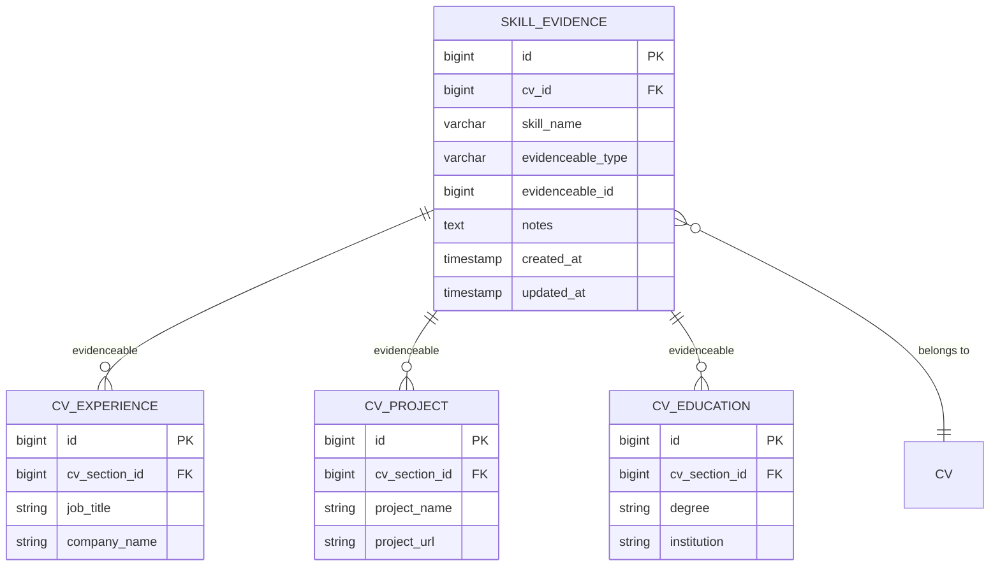
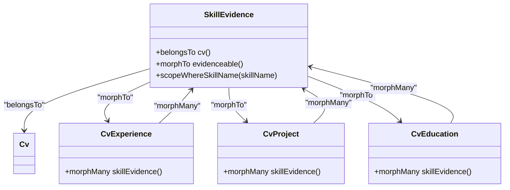
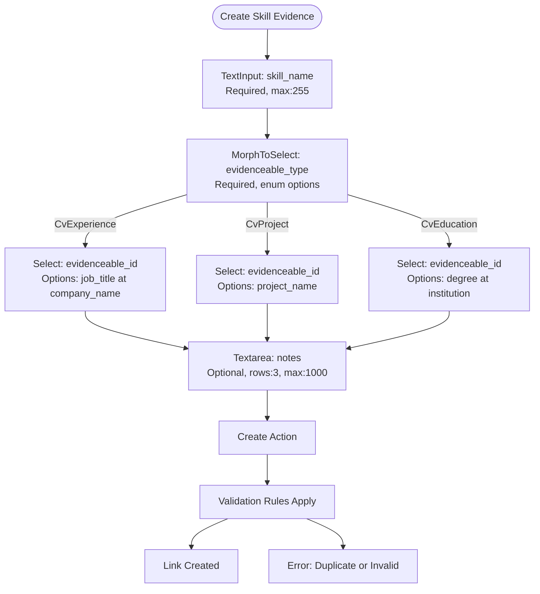
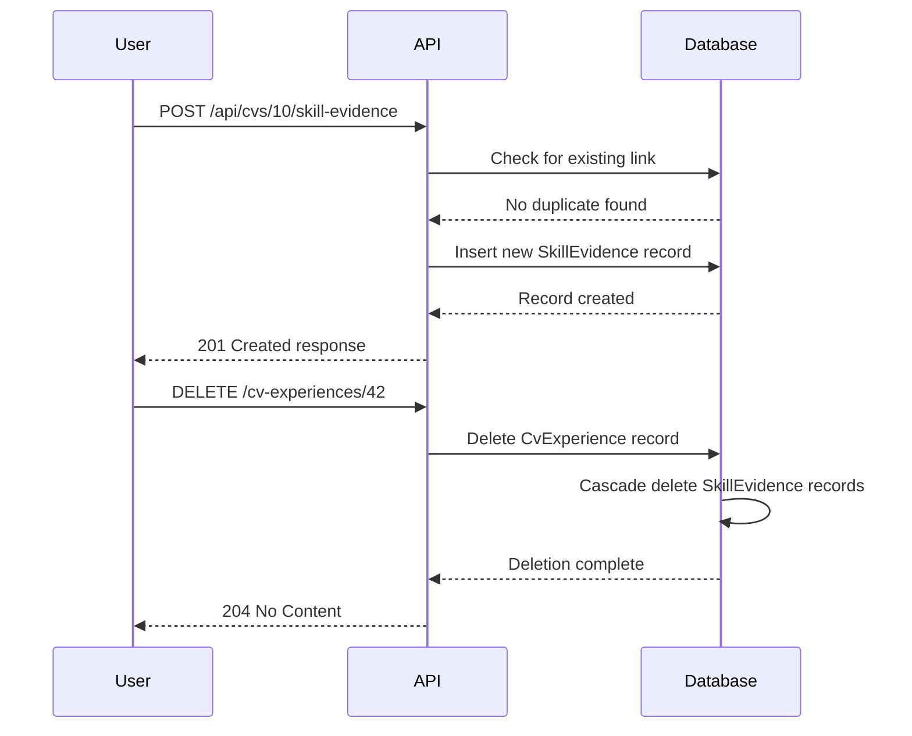

# Linking Skills to Experiences

<cite>
**Referenced Files in This Document**   
- [SkillEvidence.php](file://app/Models/SkillEvidence.php)
- [CvExperience.php](file://app/Models/CvExperience.php)
- [CvProject.php](file://app/Models/CvProject.php)
- [CvEducation.php](file://app/Models/CvEducation.php)
- [SkillEvidenceRelationManager.php](file://app/Filament/Resources/Cvs/RelationManagers/SkillEvidenceRelationManager.php)
- [2025_10_04_101842_create_skill_evidence_table.php](file://database/migrations/2025_10_04_101842_create_skill_evidence_table.php)
- [skill-evidence.md](file://specs/002-roadmap-md/contracts-phase3/skill-evidence.md)
</cite>

## Table of Contents
1. [Introduction](#introduction)
2. [Polymorphic Relationship Architecture](#polymorphic-relationship-architecture)
3. [Model Implementation](#model-implementation)
4. [Filament Relation Manager Interface](#filament-relation-manager-interface)
5. [API Endpoints and Usage](#api-endpoints-and-usage)
6. [Data Integrity and Business Rules](#data-integrity-and-business-rules)
7. [Case-Insensitive Skill Handling](#case-insensitive-skill-handling)
8. [Common Issues and Troubleshooting](#common-issues-and-troubleshooting)
9. [Conclusion](#conclusion)

## Introduction
The skill evidence linking system enables users to connect claimed skills to specific experiences, projects, or education entries that demonstrate proficiency. This feature enhances CV credibility by providing concrete proof of skill claims. The implementation uses Laravel's polymorphic relationships to create flexible connections between skills and various evidenceable models. This document details the architecture, implementation, and usage patterns for this critical functionality.

## Polymorphic Relationship Architecture

The skill evidence system implements a polymorphic many-to-many relationship pattern that allows skills to be linked to multiple types of evidenceable models. This architecture provides maximum flexibility while maintaining referential integrity.



**Diagram sources**
- [2025_10_04_101842_create_skill_evidence_table.php](file://database/migrations/2025_10_04_101842_create_skill_evidence_table.php#L10-L35)
- [skill-evidence.md](file://specs/002-roadmap-md/contracts-phase3/skill-evidence.md#L123-L163)

**Section sources**
- [2025_10_04_101842_create_skill_evidence_table.php](file://database/migrations/2025_10_04_101842_create_skill_evidence_table.php#L10-L35)
- [skill-evidence.md](file://specs/002-roadmap-md/contracts-phase3/skill-evidence.md#L123-L163)

## Model Implementation

The polymorphic relationship is implemented through the SkillEvidence model and its interactions with evidenceable models (CvExperience, CvProject, CvEducation). The morphTo and morphMany relationships enable dynamic linking across different model types.

### SkillEvidence Model
The SkillEvidence model serves as the pivot table for skill-to-evidence relationships, containing the polymorphic type and ID fields that determine the target model.



**Diagram sources**
- [SkillEvidence.php](file://app/Models/SkillEvidence.php#L7-L37)
- [CvExperience.php](file://app/Models/CvExperience.php#L7-L34)
- [CvProject.php](file://app/Models/CvProject.php#L7-L23)
- [CvEducation.php](file://app/Models/CvEducation.php#L7-L24)

**Section sources**
- [SkillEvidence.php](file://app/Models/SkillEvidence.php#L7-L37)
- [CvExperience.php](file://app/Models/CvExperience.php#L7-L34)
- [CvProject.php](file://app/Models/CvProject.php#L7-L23)
- [CvEducation.php](file://app/Models/CvEducation.php#L7-L24)

## Filament Relation Manager Interface

The Filament relation manager provides a user-friendly interface for creating and managing skill evidence links within the CV editing environment. The implementation includes dynamic field behavior and validation rules to ensure data integrity.

### Form Configuration
The form uses MorphToSelect to dynamically present appropriate options based on the selected evidenceable type. This creates a seamless user experience when linking skills to different types of evidence.



**Diagram sources**
- [SkillEvidenceRelationManager.php](file://app/Filament/Resources/Cvs/RelationManagers/SkillEvidenceRelationManager.php#L25-L69)
- [skill-evidence.md](file://specs/002-roadmap-md/contracts-phase3/skill-evidence.md#L250-L280)

**Section sources**
- [SkillEvidenceRelationManager.php](file://app/Filament/Resources/Cvs/RelationManagers/SkillEvidenceRelationManager.php#L25-L69)

## API Endpoints and Usage

The skill evidence system exposes RESTful API endpoints for programmatic access and integration with external systems. These endpoints follow standard HTTP conventions and provide comprehensive error handling.

### Create Skill Evidence Link
The primary endpoint for creating new skill evidence links allows users to connect skills with specific experiences, projects, or education entries.

**Endpoint**: `POST /api/cvs/{cv_id}/skill-evidence`

**Request Example**:
```json
{
  "skill_name": "React",
  "evidenceable_type": "CvExperience",
  "evidenceable_id": 42,
  "notes": "Built e-commerce dashboard with React hooks and Redux"
}
```

**Validation Rules**:
- `skill_name`: required, string, max:255
- `evidenceable_type`: required, enum (CvExperience|CvProject|CvEducation)
- `evidenceable_id`: required, must exist in corresponding table
- `notes`: optional, string, max:1000

**Response (201 Created)**:
```json
{
  "id": 89,
  "cv_id": 10,
  "skill_name": "React",
  "evidenceable_type": "CvExperience",
  "evidenceable_id": 42,
  "evidenceable": {
    "id": 42,
    "company": "Acme Corp",
    "role": "Frontend Developer",
    "highlights": ["Built dashboard", "Improved performance"]
  },
  "notes": "Built e-commerce dashboard with React hooks and Redux",
  "created_at": "2025-10-04T10:00:00Z"
}
```

**Error Cases**:
- 400 Bad Request: evidenceable_id doesn't exist in evidenceable_type table
- 422 Unprocessable Entity: Duplicate link (same skill_name + evidenceable combo)

**Section sources**
- [skill-evidence.md](file://specs/002-roadmap-md/contracts-phase3/skill-evidence.md#L10-L53)

## Data Integrity and Business Rules

The system enforces several business rules to maintain data integrity and provide a consistent user experience across different interaction methods.

### Referential Integrity
The database schema includes foreign key constraints and cascading deletes to maintain referential integrity:

- `cv_id` has a foreign key constraint with cascade on delete to the cvs table
- When a CvExperience, CvProject, or CvEducation record is deleted, all associated SkillEvidence records are automatically removed
- The unique constraint on `(cv_id, skill_name, evidenceable_type, evidenceable_id)` prevents duplicate links

### Business Logic
Key business rules govern the behavior of the skill evidence system:

- Deleting a skill evidence link only removes the connection, not the skill name from the CV
- When an evidenceable record (experience, project, education) is deleted, all associated skill evidence links are cascade deleted
- Users cannot create duplicate links between the same skill and evidenceable item



**Diagram sources**
- [2025_10_04_101842_create_skill_evidence_table.php](file://database/migrations/2025_10_04_101842_create_skill_evidence_table.php#L25-L30)
- [skill-evidence.md](file://specs/002-roadmap-md/contracts-phase3/skill-evidence.md#L143-L153)

**Section sources**
- [2025_10_04_101842_create_skill_evidence_table.php](file://database/migrations/2025_10_04_101842_create_skill_evidence_table.php#L25-L30)
- [skill-evidence.md](file://specs/002-roadmap-md/contracts-phase3/skill-evidence.md#L143-L153)

## Case-Insensitive Skill Handling

The system implements case-insensitive handling of skill names to provide a seamless user experience and prevent fragmentation of skill data due to capitalization differences.

### Implementation Approach
The SkillEvidence model includes a custom scope method `scopeWhereSkillName` that performs case-insensitive comparisons by converting both the query parameter and database field to lowercase:

```php
public function scopeWhereSkillName($query, string $skillName)
{
    return $query->whereRaw('LOWER(skill_name) = ?', [strtolower($skillName)]);
}
```

This approach ensures that:
- "React", "react", and "REACT" are treated as the same skill
- Queries for skill evidence are case-insensitive
- Duplicate prevention works across different capitalizations

### Querying and Display
When retrieving skill evidence, the system normalizes skill names to ensure consistent presentation:

- API responses return skill names in their stored format
- Aggregation endpoints group by lowercase skill names
- Search functionality is case-insensitive
- The skills summary endpoint groups evidence by skill name (case-insensitive) and counts occurrences

**Section sources**
- [SkillEvidence.php](file://app/Models/SkillEvidence.php#L30-L34)
- [skill-evidence.md](file://specs/002-roadmap-md/contracts-phase3/skill-evidence.md#L92-L126)

## Common Issues and Troubleshooting

This section addresses common issues encountered when using the skill evidence linking system and provides solutions for troubleshooting.

### Duplicate Skill Evidence Error
The system prevents duplicate links between the same skill and evidenceable item. This is intentional behavior to maintain data integrity.

**Solutions**:
1. Check if the evidence already exists before creating a new link
2. Use a different evidenceable item (different experience or project)
3. Update the notes on the existing evidence link instead of creating a duplicate

### Missing Evidenceable Options
When the MorphToSelect field does not display expected options:

**Troubleshooting Steps**:
1. Verify the evidenceable model instance exists in the database
2. Check that the user has permission to view the evidenceable item
3. Ensure the CV contains the evidenceable item (experience, project, or education)

### API Error Responses
Common API error scenarios and their resolutions:

| Error Code | Cause | Solution |
|-----------|-------|----------|
| 400 Bad Request | evidenceable_id doesn't exist | Verify the evidenceable_id exists in the specified table |
| 422 Unprocessable Entity | Duplicate skill evidence link | Check for existing link or use different evidenceable item |
| 404 Not Found | CV not found | Verify the cv_id in the URL is correct |

**Section sources**
- [skill-evidence.md](file://specs/002-roadmap-md/contracts-phase3/skill-evidence.md#L50-L53)
- [skill-evidence.md](file://specs/002-roadmap-md/USER-GUIDE-PHASE3.md#L676-L686)

## Conclusion
The skill evidence linking system provides a robust mechanism for connecting claimed skills with concrete examples from a user's experiences, projects, and education. By implementing polymorphic relationships, the system achieves maximum flexibility while maintaining data integrity through proper constraints and validation. The combination of Filament interface components and RESTful API endpoints allows for both user-friendly interaction and programmatic access. Case-insensitive skill handling ensures consistent data representation, while duplicate prevention and cascade deletion rules maintain referential integrity across the system.