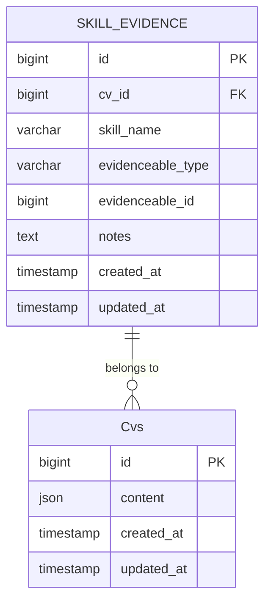
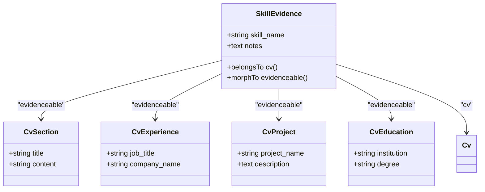
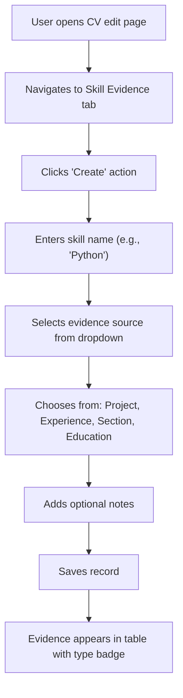
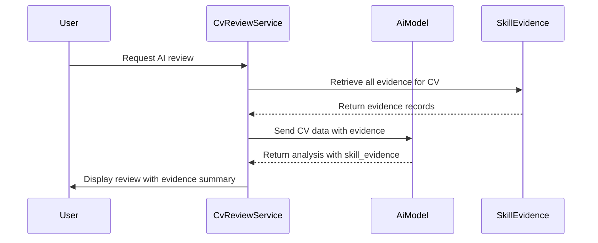

# Skill Evidence Linking

<cite>
**Referenced Files in This Document**   
- [SkillEvidence.php](file://app/Models/SkillEvidence.php)
- [SkillEvidenceRelationManager.php](file://app/Filament/Resources/Cvs/RelationManagers/SkillEvidenceRelationManager.php)
- [create_skill_evidence_table.php](file://database/migrations/2025_10_04_101842_create_skill_evidence_table.php)
- [skill-evidence.blade.php](file://resources/views/filament/infolists/skill-evidence.blade.php)
- [CvReviewService.php](file://app/Services/CvReviewService.php)
- [SkillEvidenceTest.php](file://tests/Feature/SkillEvidenceTest.php)
- [SkillEvidenceLinkingIntegrationTest.php](file://tests/Feature/SkillEvidenceLinkingIntegrationTest.php)
</cite>

## Table of Contents
1. [Introduction](#introduction)
2. [Skill Evidence Model and Database Schema](#skill-evidence-model-and-database-schema)
3. [Polymorphic Relationship Structure](#polymorphic-relationship-structure)
4. [User Interface for Managing Skill Evidence](#user-interface-for-managing-skill-evidence)
5. [Use Cases for Skill Evidence Linking](#use-cases-for-skill-evidence-linking)
6. [Integration with AI Reviews and Metrics Calculation](#integration-with-ai-reviews-and-metrics-calculation)
7. [Examples of Effective Evidence Linking](#examples-of-effective-evidence-linking)
8. [Best Practices for Maximizing Impact](#best-practices-for-maximizing-impact)
9. [Validation Rules and Data Integrity](#validation-rules-and-data-integrity)

## Introduction
The Skill Evidence Linking system enables users to explicitly connect specific skills to concrete experiences, projects, education entries, or custom sections within their CV as demonstrable proof of proficiency. This structured approach enhances the credibility of claimed skills by providing verifiable context and supports AI-driven review processes that assess skill depth and relevance. The system is built around a polymorphic relationship model that allows flexible association between skills and various content types.

**Section sources**
- [SkillEvidence.php](file://app/Models/SkillEvidence.php#L1-L38)
- [SkillEvidenceRelationManager.php](file://app/Filament/Resources/Cvs/RelationManagers/SkillEvidenceRelationManager.php#L1-L70)

## Skill Evidence Model and Database Schema
The `SkillEvidence` model serves as the central entity for storing evidence links. It contains fields for the skill name, a polymorphic reference to the evidence source, optional notes, and timestamps. The database schema ensures referential integrity through a foreign key constraint on the `cv_id` field and enforces uniqueness across the combination of CV, skill name, and evidenceable entity to prevent duplicate entries.

**Diagram sources**
- [create_skill_evidence_table.php](file://database/migrations/2025_10_04_101842_create_skill_evidence_table.php#L10-L35)
- [SkillEvidence.php](file://app/Models/SkillEvidence.php#L1-L38)

**Section sources**
- [create_skill_evidence_table.php](file://database/migrations/2025_10_04_101842_create_skill_evidence_table.php#L1-L38)
- [SkillEvidence.php](file://app/Models/SkillEvidence.php#L1-L38)

## Polymorphic Relationship Structure
The system leverages Laravel's polymorphic relationships to allow a single `SkillEvidence` record to reference multiple types of content. The `evidenceable_type` and `evidenceable_id` fields dynamically point to instances of `CvSection`, `CvExperience`, `CvProject`, or `CvEducation`. This design enables users to link a skill like "React" to a project entry, a work experience, or a dedicated section, depending on where the most compelling evidence resides.

**Diagram sources**
- [SkillEvidence.php](file://app/Models/SkillEvidence.php#L1-L38)
- [SkillEvidenceRelationManager.php](file://app/Filament/Resources/Cvs/RelationManagers/SkillEvidenceRelationManager.php#L1-L70)

**Section sources**
- [SkillEvidence.php](file://app/Models/SkillEvidence.php#L1-L38)
- [SkillEvidenceRelationManager.php](file://app/Filament/Resources/Cvs/RelationManagers/SkillEvidenceRelationManager.php#L1-L70)

## User Interface for Managing Skill Evidence
Within the Filament admin interface, users manage skill evidence through the `SkillEvidenceRelationManager`. This component provides a form with a required text input for the skill name, a polymorphic selector for choosing the evidence source (with formatted labels for each type), and an optional notes field. The table view displays all linked evidence with sortable columns for skill name, evidence type (displayed as a badge), and creation date, along with standard CRUD actions.

**Diagram sources**
- [SkillEvidenceRelationManager.php](file://app/Filament/Resources/Cvs/RelationManagers/SkillEvidenceRelationManager.php#L1-L70)

**Section sources**
- [SkillEvidenceRelationManager.php](file://app/Filament/Resources/Cvs/RelationManagers/SkillEvidenceRelationManager.php#L1-L70)

## Use Cases for Skill Evidence Linking
Common use cases include linking leadership skills to project management experiences (e.g., "Agile Methodology" linked to a project titled "CRM System Overhaul"), technical skills to specific implementations (e.g., "Docker" linked to a deployment task in a work experience), or communication skills to presentations listed in education entries. This contextual linking transforms abstract skill claims into substantiated competencies that can be evaluated for depth and relevance.

**Section sources**
- [SkillEvidenceTest.php](file://tests/Feature/SkillEvidenceTest.php#L77-L106)
- [SkillEvidenceLinkingIntegrationTest.php](file://tests/Feature/SkillEvidenceLinkingIntegrationTest.php#L45-L84)

## Integration with AI Reviews and Metrics Calculation
Skill evidence data is integrated into AI review workflows through the `CvReviewService`, which analyzes the presence and quality of evidence when calculating match scores and identifying skill gaps. The system uses evidence density and distribution across experience types as a factor in the overall evidence quality score, which contributes 10% to the final match calculation. AI-generated feedback highlights skills with strong evidence and suggests improvements for under-supported competencies.

**Diagram sources**
- [CvReviewService.php](file://app/Services/CvReviewService.php#L150-L178)
- [skill-evidence.blade.php](file://resources/views/filament/infolists/skill-evidence.blade.php#L1-L61)

**Section sources**
- [CvReviewService.php](file://app/Services/CvReviewService.php#L150-L178)
- [skill-evidence.blade.php](file://resources/views/filament/infolists/skill-evidence.blade.php#L1-L61)

## Examples of Effective Evidence Linking
An effective example would be linking the skill "Machine Learning" to a project entry describing the development of a predictive analytics model, with notes specifying the algorithms used (e.g., "Implemented Random Forest and XGBoost models"). Another example is linking "Team Leadership" to a work experience where the user managed a cross-functional team, noting specific outcomes like "Led 5-member team to deliver project 2 weeks ahead of schedule."

**Section sources**
- [SkillEvidenceLinkingIntegrationTest.php](file://tests/Feature/SkillEvidenceLinkingIntegrationTest.php#L45-L84)

## Best Practices for Maximizing Impact
To maximize impact, users should link each key skill to the most relevant and substantial piece of evidence, use consistent naming conventions for skills (e.g., always "JavaScript" not "JS"), and provide concise but informative notes that highlight specific contributions or outcomes. It's recommended to have at least one strong evidence link for each skill listed in the CV's skills section, particularly for skills mentioned in job descriptions.

**Section sources**
- [SkillEvidenceTest.php](file://tests/Feature/SkillEvidenceTest.php#L77-L106)
- [SkillEvidenceLinkingIntegrationTest.php](file://tests/Feature/SkillEvidenceLinkingIntegrationTest.php#L45-L84)

## Validation Rules and Data Integrity
The system enforces data integrity through database constraints and application-level validation. A unique constraint prevents duplicate evidence entries for the same skill and source within a CV. The `SkillEvidence` model's fillable attributes restrict mass assignment, and the Filament form requires both skill name and evidence source. The polymorphic relationship is validated at the database level through indexed foreign key pairs, and case-insensitive skill name searches are supported via a custom query scope.

**Section sources**
- [create_skill_evidence_table.php](file://database/migrations/2025_10_04_101842_create_skill_evidence_table.php#L1-L38)
- [SkillEvidence.php](file://app/Models/SkillEvidence.php#L1-L38)
- [SkillEvidenceRelationManager.php](file://app/Filament/Resources/Cvs/RelationManagers/SkillEvidenceRelationManager.php#L1-L70)