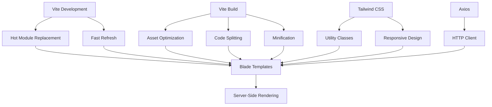
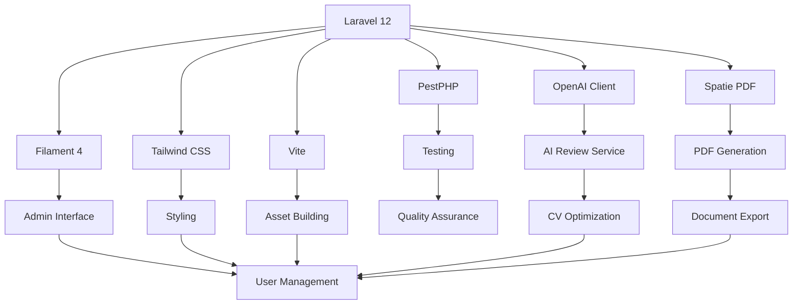

# Technology Stack & Dependencies

<cite>
**Referenced Files in This Document**   
- [composer.json](file://composer.json)
- [package.json](file://package.json)
- [vite.config.js](file://vite.config.js)
- [config/app.php](file://config/app.php)
- [config/services.php](file://config/services.php)
- [app/Providers/AppServiceProvider.php](file://app/Providers/AppServiceProvider.php)
- [app/Providers/Filament/AdminPanelProvider.php](file://app/Providers/Filament/AdminPanelProvider.php)
- [resources/css/app.css](file://resources/css/app.css)
- [resources/js/app.js](file://resources/js/app.js)
- [resources/js/bootstrap.js](file://resources/js/bootstrap.js)
- [tests/Pest.php](file://tests/Pest.php)
</cite>

## Table of Contents
1. [Core Technology Stack](#core-technology-stack)
2. [External Dependencies](#external-dependencies)
3. [Configuration Patterns](#configuration-patterns)
4. [Frontend Build Process](#frontend-build-process)
5. [Testing Infrastructure](#testing-infrastructure)
6. [Technology Integration](#technology-integration)

## Core Technology Stack

The cv-builder application is built on a modern PHP and JavaScript stack, leveraging Laravel 12 as the foundational backend framework. Laravel provides the MVC architecture, routing, Eloquent ORM, and service container that power the application's core functionality. The framework version 12 is specified in composer.json with PHP 8.2+ requirement, ensuring access to modern PHP features and performance improvements.

Filament 4 serves as the admin panel framework, providing a full-featured administrative interface built on top of Laravel. It enables rapid development of CRUD interfaces through its resource system, as evidenced by the extensive Filament\Resources directory structure. The AdminPanelProvider configures the panel with custom branding, navigation, and dashboard widgets that provide application insights.

Tailwind CSS 4 is used for styling, integrated through Vite and configured in the app.css file. The CSS configuration includes custom theme definitions for font families and source directives that ensure proper compilation of Tailwind utilities across Blade templates and JavaScript components. This utility-first CSS framework enables rapid UI development with consistent design tokens.

**Section sources**
- [composer.json](file://composer.json#L10-L11)
- [package.json](file://package.json#L10-L11)
- [resources/css/app.css](file://resources/css/app.css#L1-L11)

## External Dependencies

The application incorporates several key external dependencies to extend its functionality. The openai-php/client library (version 0.17.0) enables AI-powered CV review features, allowing the application to analyze job descriptions and provide optimization suggestions. This integration is configured through environment variables in the services.php configuration file, which specifies the OpenAI API key, model (gpt-4-turbo-preview), and monthly budget constraints.

The spatie/laravel-pdf package (version 1.8) handles PDF generation for CV exports and application snapshots. This dependency works with Laravel's view system to render Blade templates as PDF documents, preserving Tailwind CSS styling. The service is utilized in both on-demand scenarios (CvPdfController) and automated workflows (PdfSnapshotService), ensuring consistent document generation across the application.

Additional development dependencies include fakerphp/faker for test data generation, laravel/pint for code style enforcement, and mockery/mockery for test doubles. These tools support the development workflow while maintaining code quality and test reliability.

**Section sources**
- [composer.json](file://composer.json#L12-L14)
- [config/services.php](file://config/services.php#L35-L41)

## Configuration Patterns

The application follows Laravel's standard configuration patterns, with primary settings defined in config/app.php. This configuration file establishes fundamental application parameters including name, environment, debug mode, URL, timezone, and locale settings. The configuration leverages environment variables through the env() helper function, enabling different settings across development, staging, and production environments.

Service providers play a crucial role in the application's bootstrapping process. The AppServiceProvider registers model observers for JobApplication and ApplicationEvent models, ensuring automated behavior when these models are updated. The AdminPanelProvider configures the Filament admin interface, setting the panel path to '/admin', defining custom branding with amber color scheme, and registering dashboard widgets that provide application metrics.

Middleware configuration in the AdminPanelProvider ensures proper HTTP request handling, including cookie encryption, session management, CSRF protection, and binding substitution. The panel automatically discovers resources, pages, and widgets from their respective directories, following Laravel's convention-over-configuration principle.

**Section sources**
- [config/app.php](file://config/app.php#L1-L126)
- [app/Providers/AppServiceProvider.php](file://app/Providers/AppServiceProvider.php#L8-L25)
- [app/Providers/Filament/AdminPanelProvider.php](file://app/Providers/Filament/AdminPanelProvider.php#L21-L56)

## Frontend Build Process

The frontend asset pipeline is managed by Vite 7, configured through vite.config.js. Vite serves as the build tool for both CSS and JavaScript assets, providing fast development server performance and optimized production builds. The configuration integrates Laravel's Vite plugin, which handles hot module replacement during development and asset manifest generation for production.

The build process is configured to compile two primary entry points: resources/css/app.css and resources/js/app.js. The CSS entry imports Tailwind CSS directives and includes source annotations that ensure proper compilation of utilities used across Blade templates and PHP files. The JavaScript entry follows a modular approach, with app.js importing bootstrap.js, which initializes Axios for HTTP requests and configures default headers.

Development and production scripts are defined in package.json, with "dev" running Vite in development mode and "build" creating optimized production assets. The build process is integrated with Laravel's asset management, ensuring generated assets are properly versioned and accessible through the mix() or vite() helpers in Blade templates.

**Diagram sources**
- [vite.config.js](file://vite.config.js#L1-L13)
- [resources/css/app.css](file://resources/css/app.css#L1-L11)
- [resources/js/app.js](file://resources/js/app.js#L1-L2)
- [resources/js/bootstrap.js](file://resources/js/bootstrap.js#L1-L5)

## Testing Infrastructure

The application employs PestPHP 3.8 as its primary testing framework, providing a clean and expressive syntax for both feature and unit tests. Pest is configured as a drop-in replacement for PHPUnit, extending the base TestCase with additional helpers and macros. The Pest.php configuration file sets up the testing environment, including database refresh between tests and test discovery in both Feature and Unit directories.

Testing dependencies include laravel/pint for code style consistency, mockery/mockery for creating test doubles, and nunomaduro/collision for enhanced error reporting. The test suite is organized into Feature and Unit directories, with Feature tests focusing on HTTP interactions and business workflows, while Unit tests target individual classes and methods.

The application includes comprehensive test coverage for critical functionality, including CV review services, PDF generation, job application workflows, and Filament component behavior. Test files follow a consistent naming convention and are located in the tests directory, with specific tests validating AI review outputs, PDF snapshot creation, and keyword coverage analysis.

**Section sources**
- [composer.json](file://composer.json#L15-L19)
- [tests/Pest.php](file://tests/Pest.php#L1-L47)

## Technology Integration

The various technologies in the cv-builder application work together seamlessly to support its features and scalability. Laravel serves as the central orchestrator, providing the foundation upon which other components are built. Filament leverages Laravel's underlying architecture to create a powerful admin interface without duplicating business logic.

The integration between Vite and Tailwind CSS ensures that frontend assets are efficiently compiled and optimized, while maintaining design consistency across the application. JavaScript modules are properly bundled and versioned, with Axios providing a reliable HTTP client for API interactions.

External dependencies are thoughtfully integrated into the application's service layer. The openai-php/client library is wrapped in the CvReviewService, which abstracts the AI interaction and provides structured analysis of CVs against job descriptions. Similarly, spatie/laravel-pdf is encapsulated in the PdfSnapshotService, which manages the complete workflow of PDF generation, storage, and database recording.

This layered architecture promotes separation of concerns, with clear boundaries between the presentation layer (Filament, Blade, Tailwind), business logic (Laravel services, models), and external integrations (OpenAI, PDF generation). The result is a scalable application that can be extended with new features while maintaining code quality and test coverage.

**Diagram sources**
- [composer.json](file://composer.json#L10-L14)
- [package.json](file://package.json#L10-L11)
- [vite.config.js](file://vite.config.js#L1-L13)
- [app/Services/CvReviewService.php](file://app/Services/CvReviewService.php)
- [app/Services/PdfSnapshotService.php](file://app/Services/PdfSnapshotService.php)