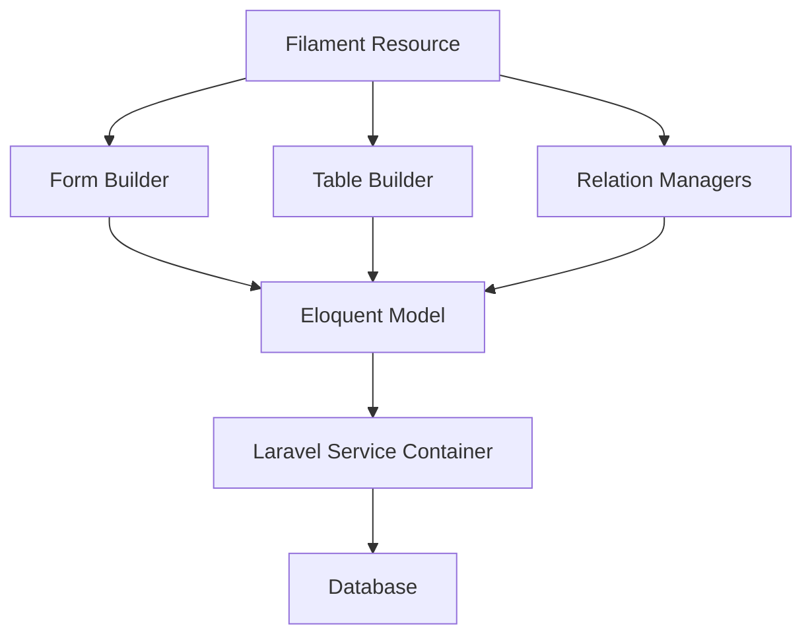
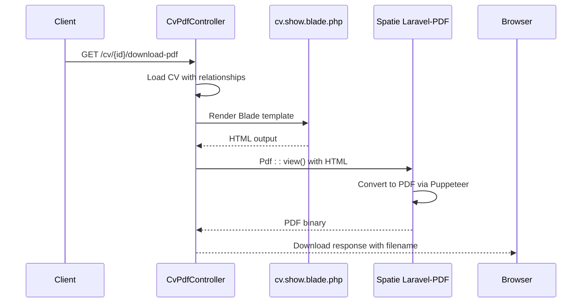
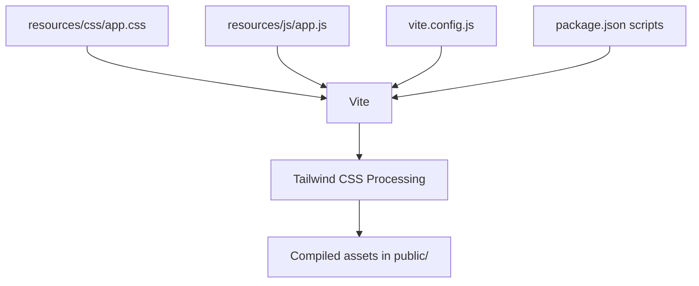
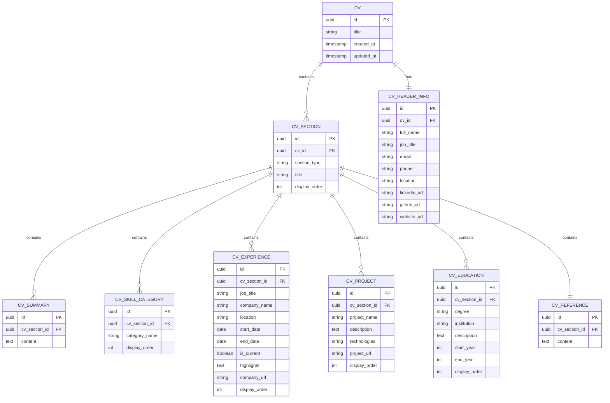
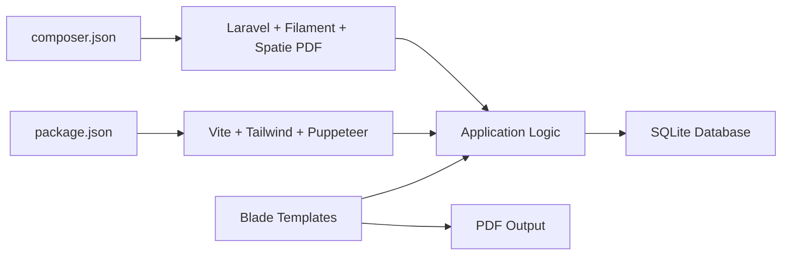

# Technology Stack

<cite>
**Referenced Files in This Document**   
- [composer.json](file://composer.json) - *Updated with Node.js version specification*
- [package.json](file://package.json) - *Development scripts for asset compilation*
- [vite.config.js](file://vite.config.js) - *Vite configuration for Laravel integration*
- [config/database.php](file://config/database.php) - *Database configuration with SQLite default*
- [config/filament.php](file://config/filament.php) - *Filament admin panel configuration*
- [app/Http/Controllers/CvPdfController.php](file://app/Http/Controllers/CvPdfController.php) - *PDF generation controller*
- [resources/views/cv/show.blade.php](file://resources/views/cv/show.blade.php) - *Blade template for CV rendering*
- [.nvmrc](file://.nvmrc) - *Node.js version specification added in recent commit*
- [package-lock.json](file://package-lock.json) - *Added for improved dependency management*
</cite>

## Update Summary
**Changes Made**   
- Updated documentation to reflect addition of `.nvmrc` file specifying Node.js version 22
- Added `package-lock.json` to referenced files and updated dependency management section
- Enhanced Node.js version specification details in Frontend Asset Compilation section
- Updated document sources to include newly added configuration files
- Maintained all existing technical content while incorporating new dependency management practices

## Table of Contents
1. [Introduction](#introduction)
2. [Backend Framework: Laravel v12+](#backend-framework-laravel-v12)
3. [Admin Interface: Filament v4](#admin-interface-filament-v4)
4. [PDF Generation: Spatie Laravel-PDF](#pdf-generation-spatie-laravel-pdf)
5. [Styling: Tailwind CSS](#styling-tailwind-css)
6. [Frontend Asset Compilation: Vite](#frontend-asset-compilation-vite)
7. [Database: SQLite](#database-sqlite)
8. [Integration and Workflow](#integration-and-workflow)
9. [Configuration and Best Practices](#configuration-and-best-practices)
10. [Conclusion](#conclusion)

## Introduction
The CV Builder application leverages a modern, full-stack technology ecosystem built on Laravel and its ecosystem of packages. This document details each component of the stack, their roles, integration patterns, and configuration practices. The stack is designed for rapid development, maintainability, and scalability, combining Laravel’s robust backend capabilities with modern frontend tooling and a powerful admin interface.

## Backend Framework: Laravel v12+
Laravel v12+ serves as the foundational backend framework, providing the MVC architecture, routing, Eloquent ORM, service container, and artisan CLI tools. It orchestrates the entire application flow, from HTTP request handling to database interactions and view rendering.

Laravel’s Eloquent ORM is used extensively for modeling CV data, including relationships between CVs, sections, experiences, education, and skills. The framework’s service container enables dependency injection and inversion of control, supporting clean, testable code.

**Section sources**
- [composer.json](file://composer.json#L10-L13)

## Admin Interface: Filament v4
Filament v4 provides a powerful, low-code admin panel built on top of Laravel and Livewire. It enables rapid development of CRUD interfaces for managing CVs, job applications, and PDF snapshots through resource, form, and table builders.

The application’s admin interface is structured using Filament Resources (e.g., `CvResource`, `JobApplicationResource`) that define forms for data entry and tables for data display. These resources leverage Laravel’s Eloquent models and automatically integrate with the service container for dependency resolution.

Filament’s configuration is managed via `config/filament.php`, which defines asset paths, cache settings, and system route prefixes. The admin panel is accessible under the `/filament` route prefix.

**Diagram sources**
- [config/filament.php](file://config/filament.php#L1-L120)
- [app/Filament/Resources/CvResource.php](file://app/Filament/Resources/Cvs/CvResource.php)

**Section sources**
- [config/filament.php](file://config/filament.php#L1-L120)

## PDF Generation: Spatie Laravel-PDF
Spatie Laravel-PDF enables the generation of styled PDFs from Blade templates, allowing the application to render CVs in print-ready format. It uses Puppeteer under the hood to convert HTML to PDF, preserving CSS styling and layout.

The `CvPdfController` handles PDF downloads by rendering the `cv.show` Blade view with full CV data and passing it to the PDF facade. The generated PDF is formatted as A4 and dynamically named using the CV title and current date.

This integration allows Tailwind CSS styling to be applied directly to the PDF output, ensuring visual consistency between web and print formats.

**Diagram sources**
- [app/Http/Controllers/CvPdfController.php](file://app/Http/Controllers/CvPdfController.php#L8-L33)
- [resources/views/cv/show.blade.php](file://resources/views/cv/show.blade.php#L1-L263)

**Section sources**
- [app/Http/Controllers/CvPdfController.php](file://app/Http/Controllers/CvPdfController.php#L8-L33)
- [composer.json](file://composer.json#L13)

## Styling: Tailwind CSS
Tailwind CSS provides utility-first styling across both the web interface and PDF outputs. It is integrated via CDN in the Blade template for PDF rendering and compiled through Vite for the admin interface.

The `show.blade.php` template includes Tailwind via CDN and configures a custom accent color (`#0369a1`) using Tailwind’s JavaScript configuration. This ensures consistent theming across web and print outputs without requiring separate CSS files.

For the admin panel, Tailwind is processed through Vite, enabling JIT compilation and tree-shaking for optimal performance.

**Section sources**
- [resources/views/cv/show.blade.php](file://resources/views/cv/show.blade.php#L10-L18)

## Frontend Asset Compilation: Vite
Vite is used for frontend asset compilation, handling CSS and JavaScript bundling for the Laravel application. It is configured through `vite.config.js` to process `resources/css/app.css` and `resources/js/app.js`, with Hot Module Replacement (HMR) enabled for development.

The Vite plugin for Laravel (`laravel-vite-plugin`) integrates Vite with Laravel’s asset pipeline, while `@tailwindcss/vite` enables Tailwind CSS processing. This setup allows for fast builds and efficient development workflows.

The `dev` script in `package.json` runs Vite in development mode, while `build` compiles assets for production. The project now includes a `.nvmrc` file specifying Node.js version 22 to ensure consistent development environments across team members.

**Diagram sources**
- [vite.config.js](file://vite.config.js#L1-L13)
- [package.json](file://package.json#L1-L20)
- [.nvmrc](file://.nvmrc#L1) - *Added in recent commit*

**Section sources**
- [vite.config.js](file://vite.config.js#L1-L13)
- [package.json](file://package.json#L1-L20)
- [.nvmrc](file://.nvmrc#L1) - *Added in recent commit*

## Database: SQLite
SQLite is the default database engine, configured in `config/database.php` with the `DB_CONNECTION=sqlite` setting. It uses a single file (`database/database.sqlite`) for storage, making it ideal for development and lightweight deployment.

The database schema includes tables for CVs, sections, experiences, education, projects, job applications, and PDF snapshots, with relationships managed through foreign keys and Laravel’s migration system.

**Diagram sources**
- [config/database.php](file://config/database.php#L25-L45)
- [database/migrations](file://database/migrations)

**Section sources**
- [config/database.php](file://config/database.php#L25-L45)

## Integration and Workflow
The technologies integrate seamlessly:
- **Vite** compiles **Tailwind CSS** and JavaScript, outputting assets consumed by Laravel views.
- **Filament** leverages Laravel’s service container and Eloquent models to build admin interfaces without boilerplate.
- **Spatie Laravel-PDF** renders Blade views (styled with Tailwind) into PDFs using Puppeteer.
- **SQLite** provides persistent storage with zero configuration overhead.

Development workflows are streamlined through Laravel Sail and Vite’s dev server, with hot reloading and real-time feedback. The addition of `package-lock.json` ensures consistent npm dependency installations across environments.

## Configuration and Best Practices
Key configuration patterns include:
- **Laravel Configuration**: Environment-based settings in `.env`, with defaults in `config/*.php`.
- **Package Scripts**: Development and build scripts in `package.json` and `composer.json`.
- **Asset Management**: Vite for frontend assets, Laravel Mix compatibility via plugin.
- **PDF Styling**: Inline Tailwind configuration in Blade templates for print consistency.
- **Node.js Version Management**: `.nvmrc` file specifies Node.js version 22 for consistent development environments.
- **Dependency Locking**: `package-lock.json` added to ensure reproducible npm installations.

Best practices followed:
- Use of Laravel’s resource pattern for RESTful controllers.
- Filament’s form and table builders for rapid admin development.
- Eager loading of relationships in PDF generation to avoid N+1 queries.
- Semantic versioning in `composer.json` and `package.json` for dependency stability.
- Consistent Node.js version enforcement through `.nvmrc`.

**Diagram sources**
- [composer.json](file://composer.json#L1-L82)
- [package.json](file://package.json#L1-L20)
- [.nvmrc](file://.nvmrc#L1) - *Added in recent commit*
- [package-lock.json](file://package-lock.json#L1) - *Added in recent commit*

**Section sources**
- [composer.json](file://composer.json#L1-L82)
- [package.json](file://package.json#L1-L20)
- [.nvmrc](file://.nvmrc#L1) - *Added in recent commit*
- [package-lock.json](file://package-lock.json#L1) - *Added in recent commit*

## Conclusion
The CV Builder application employs a cohesive, modern tech stack centered on Laravel v12+, enhanced by Filament v4 for admin functionality, Spatie Laravel-PDF for document generation, Tailwind CSS for styling, Vite for asset compilation, and SQLite for lightweight data persistence. These components integrate effectively through Laravel’s ecosystem, enabling rapid development, maintainable code, and consistent user and print experiences. The configuration and dependency management practices ensure stability and scalability for future enhancements. Recent updates including the addition of `.nvmrc` for Node.js version specification and `package-lock.json` for dependency management further improve development consistency and reproducibility.