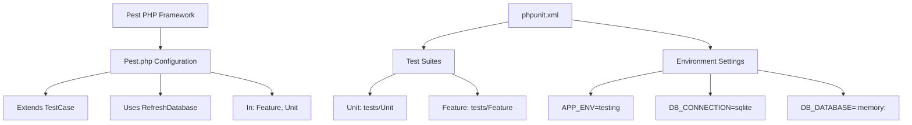
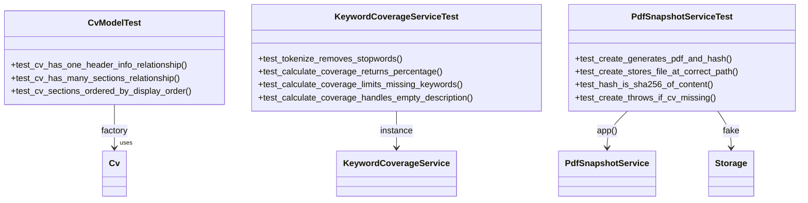
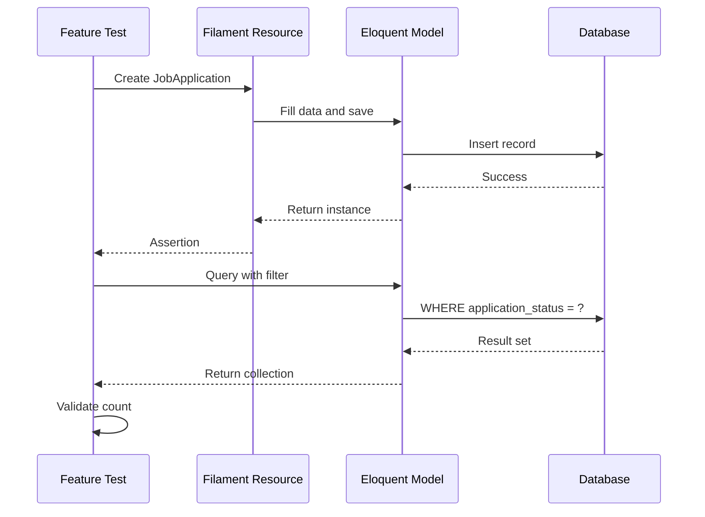
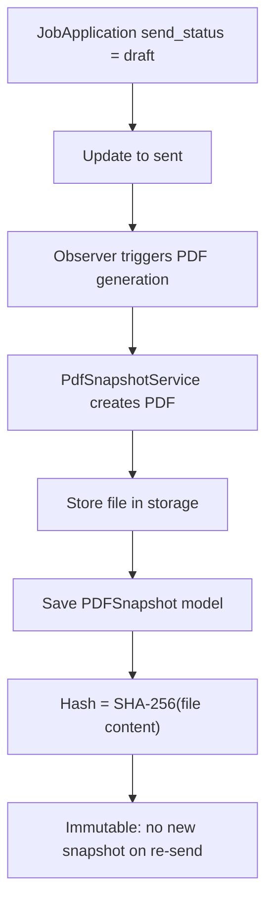

# Testing Strategy

<cite>
**Referenced Files in This Document**   
- [phpunit.xml](file://phpunit.xml)
- [tests/Pest.php](file://tests/Pest.php)
- [tests/TestCase.php](file://tests/TestCase.php)
- [tests/Unit/CvModelTest.php](file://tests/Unit/CvModelTest.php)
- [tests/Unit/KeywordCoverageServiceTest.php](file://tests/Unit/KeywordCoverageServiceTest.php)
- [tests/Unit/PdfSnapshotServiceTest.php](file://tests/Unit/PdfSnapshotServiceTest.php)
- [tests/Feature/JobApplicationCrudTest.php](file://tests/Feature/JobApplicationCrudTest.php)
- [tests/Feature/PdfSnapshotCreationTest.php](file://tests/Feature/PdfSnapshotCreationTest.php)
- [tests/Feature/CvSoftDeleteTest.php](file://tests/Feature/CvSoftDeleteTest.php)
- [tests/Feature/ApplicationEventTest.php](file://tests/Feature/ApplicationEventTest.php) - *Added in recent commit*
- [tests/Feature/MetricsCalculationTest.php](file://tests/Feature/MetricsCalculationTest.php) - *Added in recent commit*
- [app/Models/Cv.php](file://app/Models/Cv.php)
- [app/Models/ApplicationEvent.php](file://app/Models/ApplicationEvent.php) - *New model for event tracking*
- [app/Models/Metric.php](file://app/Models/Metric.php) - *New model for metrics storage*
- [app/Services/KeywordCoverageService.php](file://app/Services/KeywordCoverageService.php)
- [app/Services/MetricsCalculationService.php](file://app/Services/MetricsCalculationService.php) - *Added in recent commit*
- [composer.json](file://composer.json) - *Updated in recent commit*
- [tests/Feature/ExampleTest.php](file://tests/Feature/ExampleTest.php) - *Updated in recent commit*
- [tests/Unit/ExampleTest.php](file://tests/Unit/ExampleTest.php) - *Updated in recent commit*
</cite>

## Table of Contents
1. [Test Pyramid and Strategy](#test-pyramid-and-strategy)
2. [Test Framework and Configuration](#test-framework-and-configuration)
3. [Unit Testing Approach](#unit-testing-approach)
4. [Feature Testing Approach](#feature-testing-approach)
5. [Test Setup and Base Classes](#test-setup-and-base-classes)
6. [Testing Eloquent Relationships](#testing-eloquent-relationships)
7. [Testing Service Classes](#testing-service-classes)
8. [Testing HTTP and Filament Interactions](#testing-http-and-filament-interactions)
9. [Edge Case Testing](#edge-case-testing)
10. [Running and Maintaining Tests](#running-and-maintaining-tests)

## Test Pyramid and Strategy

The application follows a test pyramid approach with a strong foundation of unit tests and a smaller layer of feature tests. This ensures fast feedback for isolated logic while validating end-to-end user flows. Unit tests focus on models and services, verifying business logic in isolation. Feature tests validate HTTP interactions, Filament resource operations, and complex user workflows. This balanced strategy provides comprehensive coverage while maintaining test execution speed.

**Section sources**
- [tests/Unit/CvModelTest.php](file://tests/Unit/CvModelTest.php#L1-L28)
- [tests/Feature/JobApplicationCrudTest.php](file://tests/Feature/JobApplicationCrudTest.php#L1-L73)

## Test Framework and Configuration

The project uses Pest PHP as the primary testing framework, leveraging its clean syntax and Laravel integration. Pest is configured in `Pest.php` to extend the base `TestCase` and automatically apply the `RefreshDatabase` trait for both Unit and Feature test directories. The `phpunit.xml` configuration defines separate test suites for Unit and Feature tests, sets the testing environment, and configures SQLite in-memory database for fast execution. Environment variables are optimized for testing with array-based cache, session, and queue drivers.

**Diagram sources**
- [tests/Pest.php](file://tests/Pest.php#L1-L47)
- [phpunit.xml](file://phpunit.xml#L1-L34)

**Section sources**
- [tests/Pest.php](file://tests/Pest.php#L1-L47)
- [phpunit.xml](file://phpunit.xml#L1-L34)

## Unit Testing Approach

Unit tests are organized in the `tests/Unit` directory and focus on isolated components such as models and services. The `CvModelTest.php` verifies Eloquent relationships and model behavior, ensuring that a CV has one header info and many sections, with sections properly ordered by display order. Service classes like `KeywordCoverageService` and `PdfSnapshotService` are tested in isolation to validate their business logic. Unit tests use factories to create test data and make assertions about return values, object states, and method behavior without involving the HTTP layer.

**Diagram sources**
- [tests/Unit/CvModelTest.php](file://tests/Unit/CvModelTest.php#L1-L28)
- [tests/Unit/KeywordCoverageServiceTest.php](file://tests/Unit/KeywordCoverageServiceTest.php#L1-L59)
- [tests/Unit/PdfSnapshotServiceTest.php](file://tests/Unit/PdfSnapshotServiceTest.php#L1-L59)

**Section sources**
- [tests/Unit/CvModelTest.php](file://tests/Unit/CvModelTest.php#L1-L28)
- [tests/Unit/KeywordCoverageServiceTest.php](file://tests/Unit/KeywordCoverageServiceTest.php#L1-L59)
- [tests/Unit/PdfSnapshotServiceTest.php](file://tests/Unit/PdfSnapshotServiceTest.php#L1-L59)

## Feature Testing Approach

Feature tests in the `tests/Feature` directory validate user-facing functionality and HTTP interactions. These tests cover CRUD operations for Filament resources, complex workflows, and system integration points. The `JobApplicationCrudTest.php` verifies that job applications can be created with all extended fields, validates required fields, and ensures that timestamps like `last_activity_at` are properly updated. Feature tests also validate filtering capabilities and data integrity across related models, providing confidence in the application's end-to-end behavior.

**Diagram sources**
- [tests/Feature/JobApplicationCrudTest.php](file://tests/Feature/JobApplicationCrudTest.php#L1-L73)

**Section sources**
- [tests/Feature/JobApplicationCrudTest.php](file://tests/Feature/JobApplicationCrudTest.php#L1-L73)

## Test Setup and Base Classes

All tests extend the base `TestCase` class located in `tests/TestCase.php`, which in turn extends Laravel's `Illuminate\Foundation\Testing\TestCase`. This provides access to Laravel's testing helpers and application lifecycle management. The `Pest.php` configuration automatically applies the `RefreshDatabase` trait, ensuring a clean database state for each test by migrating before the test suite and rolling back transactions after each test. This setup enables fast, isolated testing without test data pollution.

**Section sources**
- [tests/TestCase.php](file://tests/TestCase.php#L1-L10)
- [tests/Pest.php](file://tests/Pest.php#L1-L47)

## Testing Eloquent Relationships

Model relationships are thoroughly tested to ensure data integrity and proper query behavior. The `CvModelTest.php` verifies that the `Cv` model correctly defines its relationships, including the one-to-one `headerInfo` and one-to-many `sections` relationships. Tests also validate that sections are automatically ordered by `display_order` through the relationship definition. These tests use Eloquent factories to create related models and assert the correct relationship types and ordering behavior.

**Section sources**
- [tests/Unit/CvModelTest.php](file://tests/Unit/CvModelTest.php#L1-L28)
- [app/Models/Cv.php](file://app/Models/Cv.php#L1-L221)

## Testing Service Classes

Service classes encapsulating business logic are tested in isolation to ensure reliability. The `KeywordCoverageServiceTest.php` validates the keyword analysis algorithm, testing that stopwords are properly removed, coverage percentages are accurately calculated, and edge cases like empty job descriptions are handled gracefully. The `PdfSnapshotServiceTest.php` uses Laravel's Storage facade mocking to verify that PDF snapshots are correctly generated, stored with proper paths, and assigned SHA-256 hashes of their content. These tests ensure critical business functionality works as expected.

**Section sources**
- [tests/Unit/KeywordCoverageServiceTest.php](file://tests/Unit/KeywordCoverageServiceTest.php#L1-L59)
- [tests/Unit/PdfSnapshotServiceTest.php](file://tests/Unit/PdfSnapshotServiceTest.php#L1-L59)
- [app/Services/KeywordCoverageService.php](file://app/Services/KeywordCoverageService.php#L1-L57)

## Testing HTTP and Filament Interactions

Feature tests validate the complete HTTP request-response cycle and Filament resource interactions. The `PdfSnapshotCreationTest.php` verifies that PDF snapshots are automatically created when a job application's `send_status` changes to "sent", ensuring the file is stored correctly and the hash matches the content. Tests also confirm that snapshots are immutable—changing the status again does not create duplicate snapshots. These tests use Laravel's testing helpers to simulate HTTP requests and validate database state changes triggered by user actions.

**Diagram sources**
- [tests/Feature/PdfSnapshotCreationTest.php](file://tests/Feature/PdfSnapshotCreationTest.php#L1-L83)

**Section sources**
- [tests/Feature/PdfSnapshotCreationTest.php](file://tests/Feature/PdfSnapshotCreationTest.php#L1-L83)

## Edge Case Testing

The test suite includes comprehensive edge case testing to ensure robustness. The `CvSoftDeleteTest.php` verifies soft delete behavior, confirming that deleted CVs are excluded from default queries but remain accessible with `withTrashed()`. Tests also validate that related data (job applications and PDF snapshots) persists after a CV is soft-deleted, maintaining data integrity. Other edge cases include handling empty job descriptions in keyword analysis and preventing PDF generation when required data (like CV) is missing, ensuring graceful failure modes.

**Section sources**
- [tests/Feature/CvSoftDeleteTest.php](file://tests/Feature/CvSoftDeleteTest.php#L1-L72)

## Running and Maintaining Tests

Tests can be executed using the Pest binary via `vendor/bin/pest`. Developers should aim for high test coverage, particularly for critical business logic in services and models. When writing tests, follow the AAA pattern (Arrange, Act, Assert) and use descriptive test names that clearly communicate the expected behavior. Leverage Laravel's testing helpers like `assertDatabaseHas`, `Storage::fake()`, and model factories to create concise, reliable tests. Regularly run the test suite to catch regressions and maintain confidence in code changes.

**Section sources**
- [phpunit.xml](file://phpunit.xml#L1-L34)
- [tests/Pest.php](file://tests/Pest.php#L1-L47)