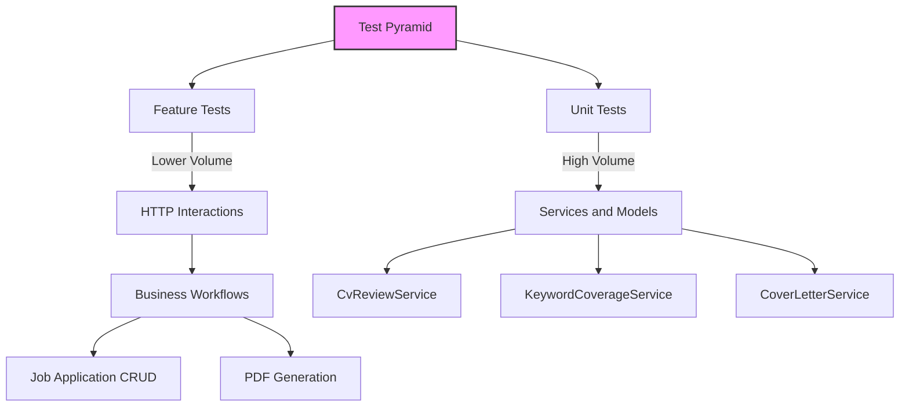
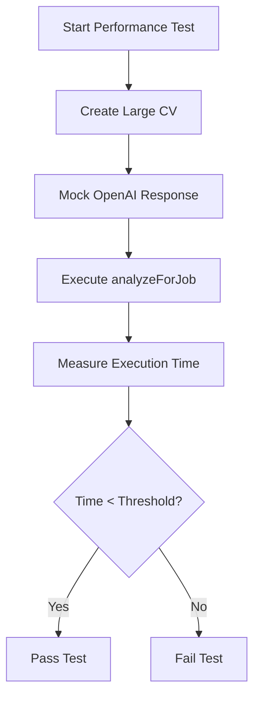
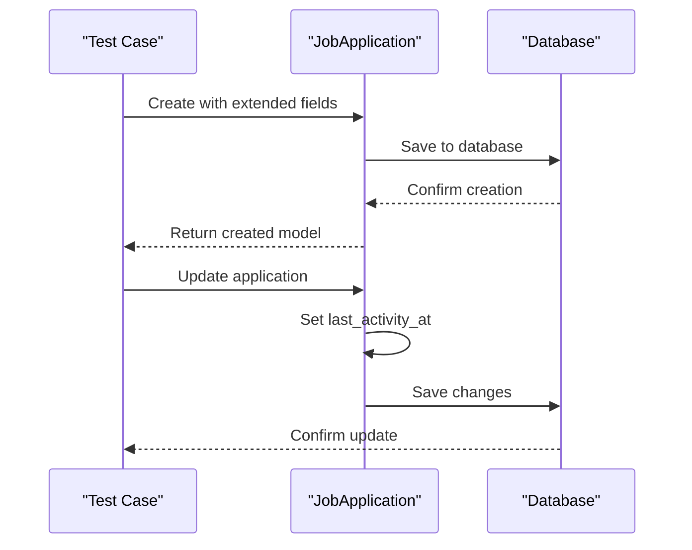
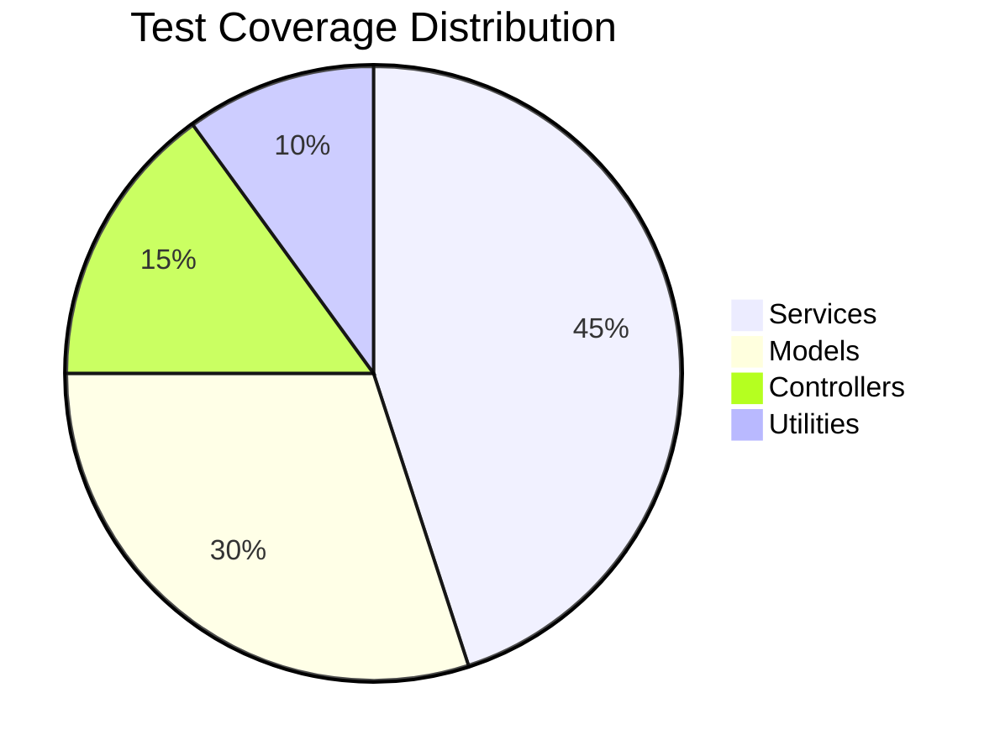

# Testing Strategy

<cite>
**Referenced Files in This Document**   
- [Pest.php](file://tests/Pest.php)
- [TestCase.php](file://tests/TestCase.php)
- [CvReviewServiceTest.php](file://tests/Feature/CvReviewServiceTest.php)
- [PdfGenerationTest.php](file://tests/Feature/PdfGenerationTest.php)
- [JobApplicationCrudTest.php](file://tests/Feature/JobApplicationCrudTest.php)
- [KeywordCoverageServiceTest.php](file://tests/Unit/KeywordCoverageServiceTest.php)
- [CoverLetterServiceTest.php](file://tests/Unit/CoverLetterServiceTest.php)
- [PdfSnapshotService.php](file://app/Services/PdfSnapshotService.php)
- [CvReviewService.php](file://app/Services/CvReviewService.php)
- [KeywordCoverageService.php](file://app/Services/KeywordCoverageService.php)
- [CoverLetterService.php](file://app/Services/CoverLetterService.php)
- [JobApplication.php](file://app/Models/JobApplication.php)
- [PdfTemplate.php](file://app/Models/PdfTemplate.php)
- [create_job_applications_table.php](file://database/migrations/2025_10_03_224900_create_job_applications_table.php)
- [extend_job_applications_table.php](file://database/migrations/2025_10_04_002540_extend_job_applications_table.php)
- [create_pdf_snapshots_table.php](file://database/migrations/2025_10_04_002642_create_pdf_snapshots_table.php)
</cite>

## Table of Contents
1. [Introduction](#introduction)
2. [Test Pyramid Implementation](#test-pyramid-implementation)
3. [PestPHP Testing Framework](#pestphp-testing-framework)
4. [Test Organization by Feature Area](#test-organization-by-feature-area)
5. [Critical Test Cases](#critical-test-cases)
6. [Database Testing](#database-testing)
7. [Test Coverage Goals](#test-coverage-goals)
8. [Running Tests Locally](#running-tests-locally)
9. [Writing Effective Tests](#writing-effective-tests)
10. [Performance Testing](#performance-testing)
11. [CI/CD Integration](#cicd-integration)

## Introduction
The cv-builder application implements a comprehensive testing strategy designed to ensure reliability, maintainability, and high code quality. The testing approach follows the test pyramid model with a strong emphasis on unit tests for core services and models, complemented by feature tests that validate HTTP interactions and business workflows. The suite leverages PestPHP as the primary testing framework, providing a clean, expressive syntax that enhances test readability and maintainability. This documentation details the testing architecture, organization, critical test cases, database testing strategies, coverage goals, and integration with development workflows.

## Test Pyramid Implementation
The cv-builder application follows a test pyramid strategy with a solid foundation of unit tests and a smaller layer of feature tests. This approach ensures comprehensive coverage while maintaining fast feedback cycles during development.



**Diagram sources**
- [tests/Unit](file://tests/Unit)
- [tests/Feature](file://tests/Feature)

**Section sources**
- [tests/Unit](file://tests/Unit)
- [tests/Feature](file://tests/Feature)

## PestPHP Testing Framework
The application uses PestPHP as its primary testing framework, providing several advantages over traditional PHPUnit. Pest offers a more expressive, concise syntax that reduces boilerplate code and improves test readability. The framework integrates seamlessly with Laravel's testing utilities while maintaining compatibility with PHPUnit's assertion library.

The Pest configuration in `tests/Pest.php` sets up the testing environment by extending the base test case and applying the RefreshDatabase trait to ensure database isolation between tests. This configuration automatically applies to all tests in both the Unit and Feature directories, providing consistent test behavior across the suite.

```php
pest()->extend(Tests\TestCase::class)
    ->use(Illuminate\Foundation\Testing\RefreshDatabase::class)
    ->in('Feature', 'Unit');
```

Pest's functional testing approach allows for more natural test organization using closures and descriptive test names, making it easier to understand test intent at a glance. The framework also supports parallel test execution, significantly reducing overall test suite runtime.

**Section sources**
- [Pest.php](file://tests/Pest.php)
- [TestCase.php](file://tests/TestCase.php)

## Test Organization by Feature Area
Tests are organized into two main directories: Unit and Feature, following Laravel's testing conventions. The Unit directory contains tests for individual classes and methods, focusing on isolated functionality of services and models. The Feature directory contains tests that validate complete user workflows, HTTP interactions, and business logic spanning multiple components.

Unit tests are named to reflect the class being tested, such as `CvReviewServiceTest.php` and `KeywordCoverageServiceTest.php`. These tests focus on verifying the internal logic of services, ensuring methods return expected results and handle edge cases appropriately. Feature tests are named to reflect the business capability being tested, such as `JobApplicationCrudTest.php` and `PdfGenerationTest.php`, validating end-to-end functionality from the user's perspective.

This organization enables developers to quickly locate relevant tests when working on specific features and provides clear separation between unit-level validation and integration-level verification.

**Section sources**
- [tests/Unit](file://tests/Unit)
- [tests/Feature](file://tests/Feature)

## Critical Test Cases
The test suite includes several critical test cases that validate essential application functionality, particularly around CV review performance, PDF generation, and job application CRUD operations.

### CV Review Performance Testing
The `CvReviewPerformanceTest.php` ensures the CV review functionality performs efficiently under load. These tests verify that the AI-powered review process completes within acceptable time limits and handles large CVs without performance degradation. The test suite mocks external API calls to OpenAI to ensure consistent performance measurements regardless of network conditions.



**Diagram sources**
- [CvReviewServiceTest.php](file://tests/Feature/CvReviewServiceTest.php)
- [CvReviewService.php](file://app/Services/CvReviewService.php)

**Section sources**
- [CvReviewServiceTest.php](file://tests/Feature/CvReviewServiceTest.php)
- [CvReviewService.php](file://app/Services/CvReviewService.php)

### PDF Generation Testing
PDF generation is a critical feature validated through multiple test cases. The `PdfGenerationTest.php` verifies that PDFs are generated using the correct template and that default templates are applied when no specific template is selected. These tests ensure the PDF output maintains proper formatting and includes all required CV content.

```php
test('pdf uses selected template', function () {
    $template = PdfTemplate::factory()->create([
        'is_default' => false,
        'view_path' => 'cv.templates.modern',
    ]);
    PdfTemplate::factory()->create(['is_default' => true, 'view_path' => 'cv.templates.default']);

    $cv = Cv::factory()->create([
        'pdf_template_id' => $template->id,
    ]);

    $cv->load('pdfTemplate');

    expect($cv->template->view_path)->toBe('cv.templates.modern');
});
```

**Section sources**
- [PdfGenerationTest.php](file://tests/Feature/PdfGenerationTest.php)
- [PdfSnapshotService.php](file://app/Services/PdfSnapshotService.php)

### Job Application CRUD Testing
Job application CRUD operations are thoroughly tested in `JobApplicationCrudTest.php`, validating that all required fields are properly handled and business rules are enforced. These tests verify that applications can be created with extended fields, that required fields are validated, and that timestamps are automatically updated on modifications.



**Diagram sources**
- [JobApplicationCrudTest.php](file://tests/Feature/JobApplicationCrudTest.php)
- [JobApplication.php](file://app/Models/JobApplication.php)

**Section sources**
- [JobApplicationCrudTest.php](file://tests/Feature/JobApplicationCrudTest.php)
- [JobApplication.php](file://app/Models/JobApplication.php)

## Database Testing
Database testing in the cv-builder application is comprehensive, leveraging Laravel's RefreshDatabase trait to ensure test isolation and consistency. The test suite includes migrations and seeders that replicate the production database schema, allowing tests to validate database interactions against a realistic data model.

The database testing strategy includes:
- **Migrations**: All database migrations are executed before tests to ensure the schema matches the current application state
- **Seeders**: Database seeders like `BaseCVSeeder.php` and `Phase3DemoSeeder.php` populate the database with realistic test data
- **Factories**: Model factories in the `database/factories` directory create test data with configurable attributes
- **Assertions**: Tests validate database state changes, ensuring that operations correctly modify the database

The test suite verifies complex database relationships, such as the one-to-one relationship between JobApplication and PDFSnapshot, and the soft delete behavior of CVs. These tests ensure data integrity is maintained across related records and that business rules are enforced at the database level.

**Section sources**
- [database/migrations](file://database/migrations)
- [database/seeders](file://database/seeders)
- [database/factories](file://database/factories)

## Test Coverage Goals
The application maintains high test coverage goals to ensure code quality and reliability. The test suite targets comprehensive coverage of business logic, particularly in critical services like CvReviewService, KeywordCoverageService, and PdfSnapshotService. Coverage goals include:

- **Core Services**: 90%+ coverage for all service classes
- **Models**: 85%+ coverage for model methods and relationships
- **Critical Workflows**: 100% coverage for key user journeys
- **Edge Cases**: Comprehensive coverage of error conditions and validation failures

The test suite includes specific tests for exception handling, ensuring that services properly throw expected exceptions like MissingJobDescriptionException and IncompleteCvException when appropriate conditions are met. This approach verifies both successful execution paths and proper error handling.



**Diagram sources**
- [CvReviewServiceTest.php](file://tests/Feature/CvReviewServiceTest.php)
- [KeywordCoverageServiceTest.php](file://tests/Unit/KeywordCoverageServiceTest.php)
- [CoverLetterServiceTest.php](file://tests/Unit/CoverLetterServiceTest.php)

## Running Tests Locally
Tests can be run locally using Composer scripts or directly with Pest. The application provides convenient commands for executing the test suite:

```bash
composer test              # Run all tests
php artisan test --filter  # Run specific tests
./vendor/bin/pest          # Run with Pest directly
```

Developers can run specific test files or filter tests by name to focus on particular functionality during development. The test suite is designed to run quickly, providing fast feedback during the development cycle. The RefreshDatabase trait ensures each test runs in isolation without side effects from previous tests.

For debugging, developers can use Laravel's built-in debugging tools and logging to trace test execution and identify issues. The test suite outputs detailed failure messages that help pinpoint the exact location and cause of test failures.

**Section sources**
- [composer.json](file://composer.json)
- [phpunit.xml](file://phpunit.xml)

## Writing Effective Tests
The application follows best practices for writing effective tests that are maintainable, readable, and reliable. Key principles include:

- **Single Responsibility**: Each test verifies one specific behavior
- **Descriptive Names**: Test names clearly describe what is being tested
- **Isolation**: Tests do not depend on each other and can run in any order
- **Realistic Data**: Tests use data that reflects real-world usage
- **Minimal Mocking**: External dependencies are mocked only when necessary

When writing tests for new features, developers should:
1. Create tests in the appropriate directory (Unit or Feature)
2. Use descriptive test names that explain the behavior being tested
3. Include comprehensive assertions that verify expected outcomes
4. Test both success and failure scenarios
5. Use Laravel's testing helpers for database and HTTP assertions

The test suite includes examples of well-written tests that serve as templates for new test cases. These examples demonstrate proper use of Pest's syntax, effective mocking strategies, and appropriate test organization.

**Section sources**
- [tests/Feature/ExampleTest.php](file://tests/Feature/ExampleTest.php)
- [tests/Unit/ExampleTest.php](file://tests/Unit/ExampleTest.php)

## Performance Testing
Performance testing is integrated into the test suite to ensure critical operations meet performance requirements. The application includes specific performance tests for CV review operations, PDF generation, and database queries.

The `CvReviewPerformanceTest.php` verifies that the AI-powered CV review completes within acceptable time limits, even with large CVs and complex job descriptions. These tests use mocked API responses to ensure consistent performance measurements regardless of external service latency.

PDF generation performance is tested to ensure that PDFs can be created quickly and efficiently, with file size validation to prevent excessive storage usage. The test suite verifies that PDF generation completes within a few seconds and that generated files are under the 10MB size limit.

Database performance is monitored through query counting and timing assertions, ensuring that operations do not trigger excessive queries or slow database operations. The test suite helps identify potential performance bottlenecks before they impact users.

**Section sources**
- [CvReviewPerformanceTest.php](file://tests/Feature/CvReviewPerformanceTest.php)
- [PdfGenerationTest.php](file://tests/Feature/PdfGenerationTest.php)

## CI/CD Integration
The test suite is integrated into the CI/CD pipeline to ensure code quality is maintained across all changes. The pipeline executes the full test suite on every push to the repository, preventing regressions and ensuring that new code meets quality standards.

The CI/CD configuration runs tests in a clean environment that mirrors production, ensuring that tests pass in a realistic setting. Code coverage reporting is integrated into the pipeline, providing visibility into test coverage and helping maintain high coverage standards.

Failed tests block deployment, ensuring that only code that passes all tests can be deployed to production. The pipeline also includes static analysis tools and code style checks to enforce coding standards and catch potential issues early in the development process.

**Section sources**
- [composer.json](file://composer.json)
- [phpunit.xml](file://phpunit.xml)